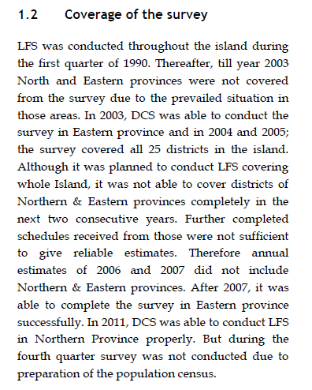
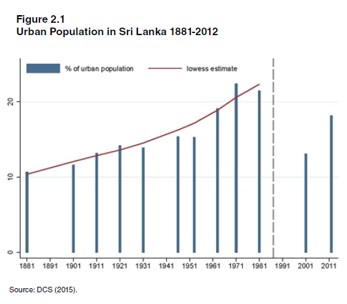
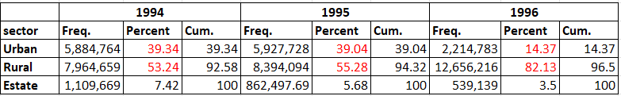
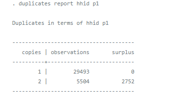
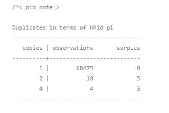
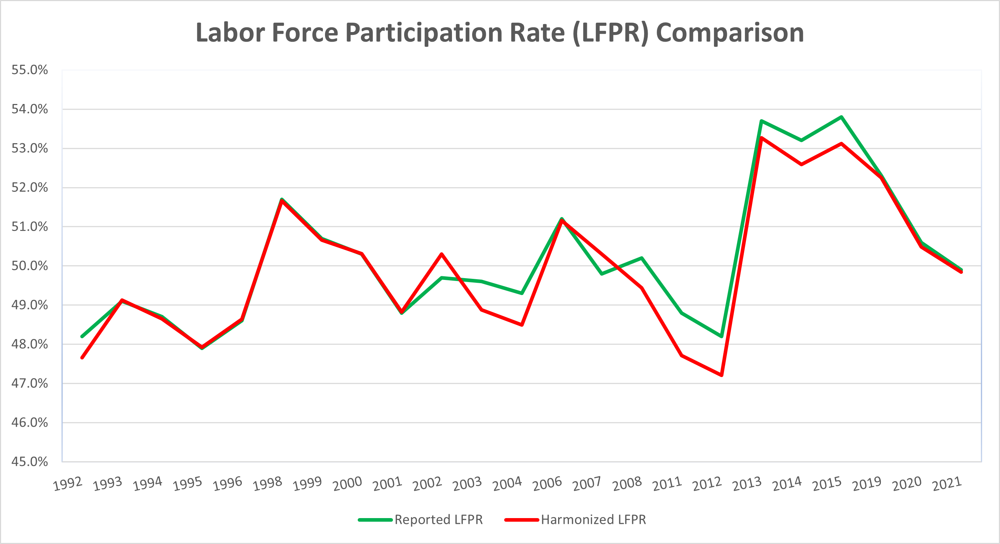

# Introduction to Sri Lanka (LKA) national Labour Force Survey (LFS)

- [What is the LKA LFS](#what-is-the-lka-lfs)
- [What does the LKA LFS cover?](#what-does-the-lka-lfs-cover)
- [Where can the data be found?](#where-can-the-data-be-found)
- [What is the sampling procedure?](#what-is-the-sampling-procedure)
- [What is the geographic significance level?](#what-is-the-geographic-significance-level)
- [Other noteworthy aspects](#other-noteworthy-aspects)

## What is the LKA LFS?

The Sri Lankan Labour Force Survey (LFS) is a household-based sample survey conducted by the Department of Census & Statistics under the National Household Survey Program. Starting in 1990, the LKA LFS has been conducted quarterly every year with the aim to measure the levels and trends of employment, unemployment and labour force in Sri Lanka. 

## What does the LKA LFS cover?

The LKA LFS mainly covers detailed information on demographic details, including age, sex, marital status, and location, education, and labour market activities. Economic activities such as employment status, work hours and payment were collected in two reference periods for years between 1992 and 2004: 1) "current" or "last-7-day" activities and 2) "usual" status or the "past 12-month" reference period. The LKA LFS does not have a specific migration section, though it has a question about birth place. Yet it cannot be sufficiently deemed as an indication of migration.   

GLD harmonization of LKA LFS covers 1992 to 2021, 23 years in total. Years and sample size of LFS harmonized for GLD are:

| **Year**	| **# of Households**	| **# of Individuals**	| **Expanded Population**	| **Officially Reported Sample Size(# HH)**	| **Officially Reported Population (# Individuals)** |
| :------:	| :-------:		| :-------:	 	| :-------:	 	| :-------:	| :-------:	|
| 1992 | 18,828        | 91,624      |  12,067,012  |   10,080   | 12,058,463|
| 1993 | 6,763         | 36,693      |  12,278,057  |   8,000   | 12,278,055|
| 1994 | 6,548         | 34,997      |  12,493,005  |   10,000   | 12,492,850|
| 1995 | 6,511         | 34,148      |  12,736,185  |   N/A      | 12,736,185|
| 1996 | 15,116        | 68,489      |  12,834,145  |   16,000   | 12,831,240|
| 1998 | 13,431        | 60,263      |  12,891,187  |   16,000   | 12,881,790|
| 1999 | 13,402        | 59,480      |  13,171,551  |   16,000   | 13,169,250|
| 2000 | 13,319        | 58,604      |  13,566,897  |   16,000   | 13,564,660|
| 2001 | 10,205        | 44,610      |  13,873,418  |   15,915   | 13,870,479|
| 2002 | 14,161        | 58,680      |  14,201,607  |   16,000   | 14,201,396|
| 2003 | 16,235        | 67,060      |  15,568,945  |   16,000   | 15,651,479   |
| 2004 | 22,579        | 93,252      |  16,727,635  |   20,000   | 16,593,431   |
| 2006 | 17,208        | 68,931      |  14,838,834  |   18,200   | 14,833,802   |
| 2007 | 17,055        | 68,186      |  15,045,605  |   18,390   | 15,047,882   |
| 2008 | 18,596        | 73,489      |  16,327,367  |   20,260   | 16,319,065   |
| 2011 | 14,408        | 56,172      |  17,909,455  |   17,620   | 17,909,743   |
| 2012 | 16,336        | 62,298      |  17,915,383  |   19,420   | 17,915,383   |
| 2013* | 20,785        | 79,347      |  16,527,722  |   25,000   | 16,359,761   |
| 2014* | 21,446        | 81,385      |  15,284,022  |   25,000   | 16,531,768   |
| 2015* | 21,895        | 82,800      |  15,438,706  |   25,000   | 15,281,945   |
| 2019* | 21,696        | 82,800      |  16,424,016  |   25,750   | 16,424,016   |
| 2020* | 21,149        | 77,251      |  16,424,016  |   25,750   | 16,739,396   |
| 2021* | 21,534        | 77,869      |  17,133,659  |   25,750   | 17,133,659   |

Note: 
1) Years before 2013 report population aged 10 and above whereas years since 2013 report 15 and above (years marked with * ). 
2) The annual report of 1995 could not be found so the number of household reported officially for this year is unknown.  

## Where can the data be found?

Through free registration, the data is publicly available for years from 1992 to 2020 on [*Lanka Datta*](http://nada.nso.gov.lk/index.php/home) yet with only a limited sample size of 25% of the full data set. Although Lanka Datta claims that with registration, LFS can be downloaded 100% of the original raw data set, trying to download each year's LFS confirms that only 25% of the original data set can be downloaded.  

All annual reports are available on Lanka Datta and can be downloaded without any restrictions.

## What is the sampling procedure?

The sampling procedure of LKA LFS is a stratified two-stage probability sample design, The primary sampling units (PSU) are census blocks; and the secondary sampling units are the housing units. Although the number of PSU selected per quarter varies through years (i.e. 252 PSUs per quarter in 1992 whereas 2,250 in 2007) depending on the Census of Population and Housing in past years, the survey usually select 10 housing units per PSU per quarter. 

Since LKA LFS is a quarterly survey, it was conducted every three months and would take two months to conduct interviews and collect data. So most of the years, except those without complete four quarters, have 8 categories of "month of interview" variable in the raw dataset: two months for each quarter and four quarters in total. Month 1 and 2 would be coded as `wave 1`, for example.

Four years out of the total 23 years do not cover all four quarters. Among the four years, 2011, 2012 and 2013 did not conduct the fourth quarter as the country's office of statistics was occupied with preparation for the population census. 2001 does not have the third quarter and the reason is not stated. 

## What is the geographic significance level?

The LKA LFS is representative at the urban/rural division of each district level. 

Note that in the raw data the `sector` variable originally has three categories: urban, rural, and estate. An estate sector in Sri Lanka is actually a plantation sector. An estate sector consists of all plantations which are 20 acres or more
in extent and ten or more resident labourers. All areas other than urban and estate comprise the rural sector [(_Sinnathurai, V., Březinová, O., 2012_)](utilities/Sinnathurai_V_Březinová_O_2012.pdf). We classified estate as rural in our harmonization, considering the level of poverty, development, population and housing factors. However, coding urban/rural status in this way resulted a much higher proportion of urban population that is as twice as the numbers in ILO and World Bank Development Indicators (WDI) in 1992-1995 (i.e., 39% in our harmonized data versus 18% in other sources). However, the urbanization rate in our harmonized data drops from 39.04% in 1995 to 14.37% in 1996 and then fluctuates around 16.5% in later years, regardless that we use our urban-rural coding scheme consistently in all years. Additionally, the urbanization statistics in LKA national annual reports range from 21.62% in 1994 to 17.12% in 2021. It is even lower in some years' quarterly report, 16.12% in the fourth quarter of 1999 for example. This mismatch seems to be caused by the ill-defined urban-rural definition. More discussion of urban-rural definition of LKA in the next section "Other noteworthy aspects - Urban/rural definition".        

## Other noteworthy aspects  

### Changes in survey structure 

From 1992 to 2021, LKA LFS has gone through several major changes in terms of questionnaire structure, coding scheme and survey questions. These changes devide all surveys into 5 groups.

**Years with two reference periods**:
 
<ins>1992-1995</ins> The initial questionnaire template. 
 
<ins>1996-2004</ins> Added more categories to the highest educational level attained such as each grade in primary and secondary education, which allows us to code `educat7`. In comparison, earlier years do not have `educat7` and `educat5` due to no distinction between "primary" and "primary unfinished". These years also added current schooling status.
 

**Years with one reference period**:
 
<ins>2006-2012</ins> Only has the past 7-day reference period. Added questions of literacy in terms of Sinhala, Tamil, and English. Training-related questions were expanded to include the name, field and duration of training. 
 
<ins>2013-2015</ins> Questionnaire in this stage is very similar to the last stage. Labor force participation age was changed from 10 to 15.The questionnaire was reformatted to partition questions for people with different labour status, i.e. question section only for employer or self-employed people. Questions concerning income were also rephrased to cater to different income units, i.e. daily wage earners and monthly salary earners. In addition, years starting with 2013 all use Sri Lanka Standard Classification of Occupation 2008 (SLSCO-08, corresponding to ISCO-08) and Sri Lanka Standard Industrial Classification 4 (SLSIC 4, corresponding to ISIC Rev.4) which will be discussed in the following section.
 
<ins>2019-2021</ins> Digital literacy was added, and employers and account owners were separated as a single category when asking income questions.

### Coding of industry and occupation codes

In terms of classifications of industry and occupation, we only have definite information on the national and international versions used for years from 2013 to 2021. As mentioned in the previous section, these years use national classifications SLSCO-08 and SLSIC 4 which are based on ISCO-08 and ISIC rev.4 respectively. For years before 2013, 2002 and 2012 annual reports both claim to use ISCO-88 and ISIC rev.4. However, we were unable to validate this claim and even if we had confirmed it we would not have the corresponding table to map. The original industrial and occupation variables in the raw data sets not only have categories beyond ISIC and ISCO, but also miss a whole industrial group such as "Manufacture of wearing apparel". 

For 2013-2021, we harmonized both industry and occupation at 4-digit level. Detailed corresponding tables and mapping process are in this [separate document](Correspondence_National_International_Classifications.md) . 

### Regional exclusion of Northern and Eastern Provinces

Conflict in Sri Lankan from 1989 to 2009, the majority of which occurred in the north of the island, obstructed survey conduction from 1992 to 2008 in the Northern and Eastern Provinces. All years before 2011 do exclude the Northern Province. Years 2003 and 2008 managed to survey the Eastern Province. And all years since 2011 cover the total 25 districts from 7 provinces.

Below is a screenshot from the 2001 annual report explaining the change in the geographical coverage.

### Urban/rural definition

The urban-rural definition of Sri Lanka has been much debated. Referring to [this publication](utilities/RE-DEFINING-URBAN-AREAS-INSRI-LANKA_ips_E_Book.pdf), the latest statistics such as ILO and WDI (as well as some years in our harmonization) which indicate about 18% of urban population could fail to reflect the true level of urbanization in the country, due to the static definition. 

As argued by the author, the urban sector was defined only by administration. Until 1987, Municipal Councils (MCs), Urban Councils (UCs) and Town Councils (TCs) comprised the urban sector. Meanwhile, rural and estate sectors were governed by the Pradesheeya Sabha (PS). After the enactment of the 13th Amendament in 1987, administrative units were recalibrated and TCs were abolished and merged in to PS. This change significantly cut urban population and increased rural population simultaneously. The urban population was estimated above 20% but it dropped to 13.1% in 2001 mainly because 89 settlements previously defined as urban were classified as rural. Based on the author's dynamic definition refined by population, population density, firewood and well water dependence, about 43.8% of total population are in urban areas. 

Our harmonized data show discontinuity between 1995 and 1996, indicating a change in the definition used in the survey. Note further that the estimates obtained for years before 1995 are much higher than expected, even if an older definition were used. When using the data, kindly be advised to caution the inconsistent urban rural distribution and the definition applied.   

### Duplicates in early years 

In several early years such as 1993-1996, coding household and individual identification using the original survey ID information such as province, block, household number and personal serial number produces duplicates. Below are two examples from the year 1994 and 1996 respectively. 

| **Example 1994**	| **Example 1996**	|
| :------:	| :-------:		|
|  | |

To solve this, [MORE EXPLANATION]

**we ordered people in descending order of their age within each household and assign new individual (in household) ID numbers. These can be used to  which composes their individual identifier.

### Labour force participation and employment statistics comparison with LKA national annual reports

In addition to GLD routine quality checks, we also cross checked with each year's annual report to tap into the rich and comprehensive statistics provided in most of the years. The complete comparison results are in this [excel workbook](utilities/LKA_employment_stats_comparison.xlsx). Below only shows the labour force participation rate comparison, which indicates the closeness of our harmonized results and the official estimates. 

