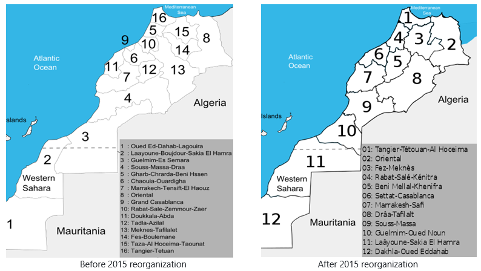
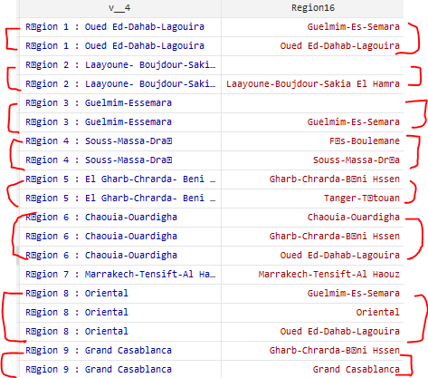

# Geographic Information

## Region changes
In 2015, Morocco underwent a comprehensive reorganization of its regional boundaries, changing from 16 to 12 regions (see maps below). This reorganization was not a mere adjustment of a few regions but a complete overhaul, affecting the entire country with the exception of the *Oued Ed-Dahab-Lagouira* region, which retained its provincial composition but switched its region name to *Ed Dakhla-Oued ed Dahab*. This significant change, proposed by the Commission Consultative de la Régionalisation in 2010, aimed to foster decentralization and enhance regional autonomy across Morocco.

In the Morocco ENE survey data, the region codes have been changed entirely and bear no relation to the prior codes. In the map above, for instance, the region *Ed Dakhla-Oued ed Dahab*, while maintaining the same land area, was recoded from "12" to "1". To ensure comparability over time, users are advised to use the `subnatid1_prev` variable beginning with the 2015 data when the new regional classification was adopted. 

Below is a summary table of the new regions as discussed [here](http://www.statoids.com/uma.html), highlighting their source regions or provinces and the specific changes made:

| New Region               | Source Regions/Provinces                            | Changes Made                                                                                                         |
|--------------------------|-----------------------------------------------------|----------------------------------------------------------------------------------------------------------------------|
| Tanger-Tétouan-Al Hoceima| Tanger-Tétouan, Al Hoceima, Ouezzane                 | Annexed Al Hoceima and Ouezzane provinces to Tanger-Tétouan region.                                                 |
| Oriental                 | Includes Driouch, Guercif                           | Annexed Driouch and Guercif provinces.                                                                               |
| Fès-Meknès               | Fès-Boulemane, Part of Meknès-Tafilalet, Taounate, Taza | Merged Fès-Boulemane region with the northern part of Meknès-Tafilalet region and annexed Taounate and Taza provinces.|
| Rabat-Salé-Kénitra       | Parts of Fès-Boulemane and Meknès-Tafilalet          | Formed by merging parts of Fès-Boulemane and Meknès-Tafilalet regions.                                               |
| Béni Mellal-Khénifra     | Tadla-Azilal, Fqih Ben Salah, Khouribga, Part of Khénifra | Annexed Fqih Ben Salah, Khouribga, and part of Khénifra provinces to Tadla-Azilal region.                             |
| Casablanca-Settat        | Grand Casablanca, Chaouia-Ouardigha, El Jadida      | Merged Grand Casablanca and Chaouia-Ouardigha regions and annexed El Jadida province.                                |
| Marrakech-Safi           | Marrakech-Tensift-Al Haouz, Safi                    | Annexed Safi province to Marrakech-Tensift-Al Haouz region.                                                          |
| Drâa-Tafilalet           | Errachidia, Ouarzazate, Zagora, Part of Khénifra    | Formed from provinces taken from Meknès-Tafilalet and Souss-Massa-Draâ regions, and part of Khénifra province.       |
| Souss-Massa              | Souss-Massa-Draâ, Tata                              | Annexed Tata province to Souss-Massa-Draâ region.                                                                    |
| Guelmim-Oued Noun        | Guelmim-Es-Semara, Sidi Ifni                        | Annexed Sidi Ifni province to Guelmim-Es-Semara region.                                                              |
| Laâyoune-Saguia al Hamra | Laâyoune-Boujdour-Sakia El Hamra, Es-Semara          | Annexed Es-Semara province to Laâyoune-Boujdour-Sakia El Hamra region.                                               |
| Ed Dakhla-Oued ed Dahab  | Equivalent to former Oued Ed-Dahab-Lagouira region   | No change, equivalent to the former Oued Ed-Dahab-Lagouira region.                                                   |

## Constructing region variable (`subnatid1`) in the dataset
The region variable is not available in all the raw survey data we received. We used a set of separate datasets that map each primary sampling unit (PSU) to their respective regions. With the PSU information available in all the raw survey data, merging this PSU-level data to the raw dataset allowed us to construct the region variable. 

With sampling frames changing over time, an important step in our approach involved identifying the correct sampling frame used for each survey round. Each sampling frame is characterized by a unique set of Primary Sampling Unit (PSU) codes. We leveraged this uniqueness by comparing the PSU codes in each survey round against the list of PSU codes of each sampling frame. This comparison allowed us to determine which sampling frame was utilized for a given survey, as outlined in the table below:

| Survey Years            | Sampling Frame Year                          |
|-------------------------|----------------------------------------------|
| 2000 - 2005             | 1995 Sampling Frame                          |
| 2006 - 2016             | 2005 Sampling Frame                          |
| 2016 - 2018             | 2015 Sampling Frame                          |

However, it's important to note that the regions identified through this PSU-based process might not always align with the region variable available in the select years. This discrepancy is highlighted in the screenshot below, taken from the 2007 ENE, as an example. Since our goal was to provide region information using a consistent source in as many surveys as possible, we decided to retain the information from the PSU-level data. 

