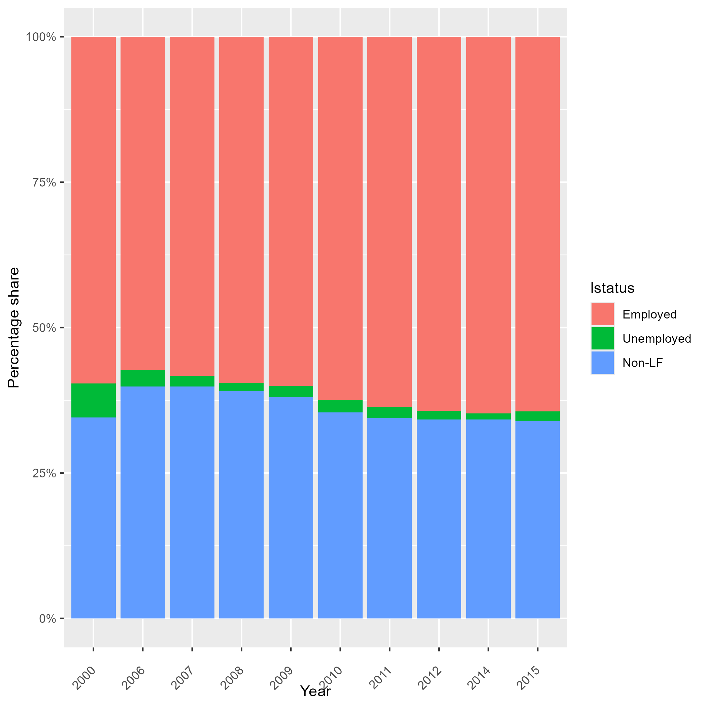
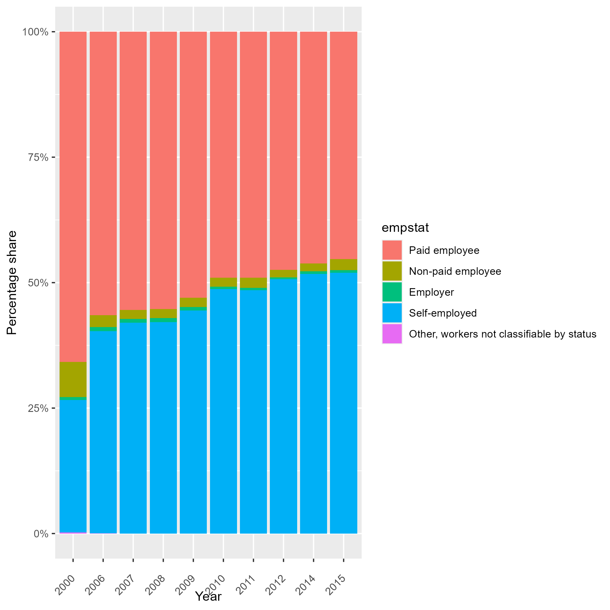

# Introduction to Serbia Labour Force Survey (MDA LFS)

- [What is the MDA LFS?](#what-is-the-mda-lfs)
- [What does the MDA LFS cover?](#what-does-the-mda-lfs-cover)
- [Where can the data be found?](#where-can-the-data-be-found)
- [What is the sampling procedure?](#what-is-the-sampling-procedure)
- [What is the geographic significance level?](#what-is-the-geographic-significance-level)
- [Other noteworthy aspects](#other-noteworthy-aspects)

## What is the MDA LFS?
The Moldova  Labour Force Survey (LFS) is a modern, household-based statistical survey designed to measure labour market dynamics. It serves as a key source of intercensal information on the labour force. Since the fourth quarter of 1998, the survey has been conducted quarterly as a continuous survey, enabling the production of timely and seasonally sensitive labour market statistics.

## What does the SRB LFS cover?
The survey collects detailed information on labour market status during the reference period, distinguishing between employment, unemployment, and inactivity. It provides comprehensive data on the size and structure of the labour force, including demographic and socio-economic characteristics. The Global Labor Database (GLD) includes harmonized information for the following survey years:

| **Year** | **# of Households** | **# of Individuals** | **Expanded Population** | **Officially Reported Sample Size (# HH)** |
|:--------:|:------------------:|:-------------------:|:----------------------:|:------------------------------------------:|
| 2000 | 28,313 | 83,119  | 3,646,987 | Not available |
| 2006 | 38,288 | 111,510 | 3,589,936 | Not available |
| 2007 | 38,916 | 111,540 | 3,581,111 | Not available |
| 2008 | 39,821 | 111,153 | 3,574,805 | Not available |
| 2009 | 39,999 | 111,418 | 3,567,512 | Not available |
| 2010 | 39,429 | 107,968 | 3,563,695 | Not available |
| 2011 | 39,389 | 105,556 | 3,560,430 | Not available |
| 2012 | 38,301 | 100,466 | 3,559,541 | Not available |
| 2014 | 37,767 | 97,723  | 3,557,634 | Not available |
| 2015 | 11,472 | 29,568  | 1,777,579 | Not available |

For the 2015 survey, the GLD only contains information for the first six months of the year. As a result, the number of households and individuals in the harmonized dataset is lower than in previous years. This should be considered when comparing results across years.

## Where can the data be found?
The datasets are not accessible to the public and researchers have to request the data from the National Statistical Office. The World Bank has been granted access to the datasets, if you work or are part of the World Bank Group, kindly contact the Jobs Group with a formal request for access to gld@worldbank.org

## What is the sampling procedure?
The Moldova LFS applies a probabilistic, multi-stage sampling design. During the initial phase (1998–2005), the NBS implemented the LFS as a continuous quarterly survey using a two-stage probabilistic sample. In the first stage, it selected primary sampling units based on electoral lists; in the second stage, it selected dwellings. The survey followed a 2-2-2 rotation scheme: interviewers surveyed each household for two consecutive quarters, removed it from the sample for two quarters, reintroduced it for another two quarters, and then excluded it permanently. Starting in 2000, the continuous survey covered approximately 8,200 dwellings distributed across primary sampling units.

In 2006, the NBS introduced a redesigned sampling plan, a new rotation scheme, and updated questionnaires to strengthen harmonization with international and European standards. In 2008, it began rotating primary sampling units every two years. Since 2015, the survey has applied a 1-(2)-1-(8)-1 household rotation scheme to improve data quality and collection efficiency.

For more detailed information, please consult the official LFS [methodological documentation.](utilities/Metodology_AFM.pdf)

## What is the significance level?
The survey produces statistically representative estimates at the national level, with standard disaggregations by region and urban/rural 

## Other noteworthy aspects

### Methodological changes and comparability over time

The methodology of the Moldova LFS underwent an important redesign in 2006. The revision introduced changes to both the sampling design and the conceptual framework used to classify labour market status, with the objective of improving harmonization with international standards and European statistical practices.

One of the main changes concerned the definition and measurement of employment. Starting in 2006, the survey adopted definitions consistent with recommendations from the International Labour Organization (ILO). Under this framework, a person is classified as employed if they performed at least one hour of work during the reference week for pay, profit, or family gain. This definition also includes individuals who were temporarily absent from work but maintained a formal attachment to their job, for example due to vacation, sickness, maternity leave, training, temporary suspension of work, or other short-term absences. The revised methodology also clarified the treatment of several employment situations, including unpaid family workers, individuals engaged in informal activities, and persons temporarily absent from work.

In addition to these conceptual adjustments, the 2006 redesign implemented a new sampling plan and an updated sampling frame based on more recent population information. These changes were introduced to improve the representativeness and statistical quality of the survey results.

As a consequence of these methodological revisions, key labour market indicators—particularly employment, unemployment, and inactivity—are not fully comparable with estimates produced under the previous methodology used in earlier survey rounds. Figure 1 and 2 illustrates this structural break in the series, where a noticeable shift appears between the estimates for 2000 and those from 2006 onwards.

*Figure 1. Distribution of labour market status*

*Figure 2. Distribution of employment by status in employment*

Due to the limited methodological documentation available for the 2000 survey round in the data accessible to the Global Labor Database (GLD), it is not possible to fully reconstruct or harmonize the earlier data to match the post-2006 methodology. Therefore, comparisons between the 2000 round and later years should be interpreted with caution.

### Employment definition and harmonization

The definition of employment used in the Moldova LFS differs slightly from the standard international definition recommended by the International Labour Organization (ILO). 

To ensure cross-country comparability, the Global Labor Database (GLD) applies harmonization procedures that align the survey definitions as closely as possible with international standards. 

For a detailed description of the differences between the original survey definition and the harmonized GLD definition, as well as the specific adjustments applied during the harmonization process, please refer to this [document](Employment Definition.md).

### Education system in Moldava

This section describes how education levels are recorded in the Moldova LFS and how they are harmonized in the Global Labor Database (GLD). The structure of the education variable in the LFS changed slightly over time, with different classifications used before and after 2011. Therefore, both versions of the survey coding must be considered when harmonizing education variables.

This information is essential for constructing the variable `educy`, which measures the total number of years spent in education, and `educat7`, which classifies the highest level of education attained into seven internationally comparable categories.

The table below summarizes the correspondence between the education levels reported in the LFS (before and after 2011), the typical duration of each level in years, and the resulting GLD harmonization into `educat7`.

| Level in LFS (until 2010)                                   | Level in LFS (from 2011)                 | Years | educat7 harmonization                      |
|--------------------------------------------------------------|-------------------------------------------|------:|---------------------------------------------|
| Pre-school education or no primary education                 | No education                              |     0 | No education                                |
| Primary education                                            | Primary education                         |     4 | Primary complete                            |
| Gymnasium education                                          | Gymnasium education                       |     9 | Secondary incomplete                        |
| General secondary education                                  | High school, secondary general            |    11 | Secondary complete                          |
| Secondary vocational education                               | Secondary vocational education            |    12 | Secondary complete                          |
| Short term higher education                                  | Secondary professional education          |    13 | Higher than secondary but not university    |
| Higher university education                                  | Higher education                          |    16 | University incomplete or complete           |
|                                                              | Master's degrees                          |    18 | University incomplete or complete           |
|                                                              | Doctoral studies                          |    21 | University incomplete or complete           |
