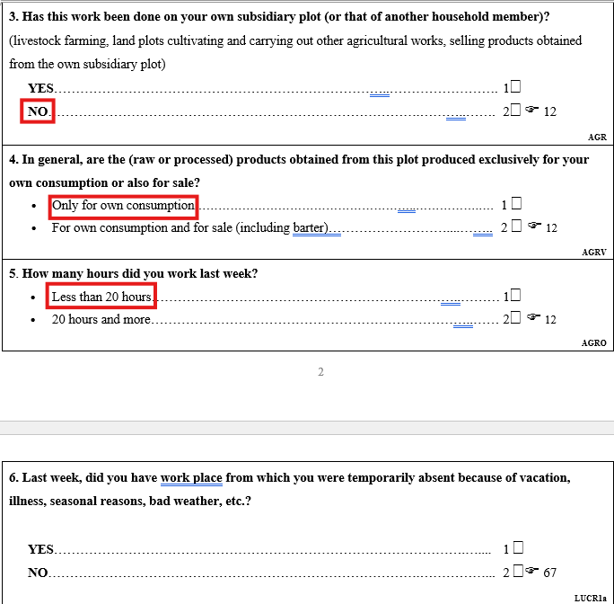

# Introduction

The Moldova LFS uses a definition of employment that is broadly consistent with the standards established by the 13th International Conference of Labour Statisticians (ICLS-13). However, some differences exist between the survey???s operational definition and the international standard.

In this section, we describe these differences and explain how GLD harmonizes the original survey variables to align them with the ICLS-13 definition of employment. We also document how users can recover the original employment definition used in the survey, as well as how to construct employment variables consistent with the more recent standards adopted by the 19th International Conference of Labour Statisticians (ICLS-19).

It is important to note that this discussion applies to the Moldova LFS rounds from **2006 onwards**, for which detailed questionnaire information is available. For the **2000 survey round**, the documentation available to GLD does not provide sufficient information on the questionnaire structure and employment classification rules, and therefore the analysis presented in this section does not apply to that round.

### Differences between the Moldova LFS definition and the ICLS-13 employment definition

The definition of employment used in the Moldova LFS is broadly aligned with the standard recommended by the 13th International Conference of Labour Statisticians (ICLS-13). Under the ICLS-13 framework, a person is considered employed if they performed at least **one hour of work during the reference week** producing goods or services for pay, profit, or family gain. This definition also includes self-employed workers engaged in the production of goods, including agricultural production. More details on the ICLS-13 definition can be found in the official [documentation](https://webapps.ilo.org/public/libdoc/ilo/1982/82B09_438_engl.pdf) 


However, the Moldova LFS applies an additional condition when identifying employment in household agricultural production. The questionnaire distinguishes whether the products obtained from the household plot are intended exclusively for own consumption or also for sale (including barter).

When the production activity is carried out exclusively for household consumption, the survey requires that the individual worked **20 hours or more during the reference week** in that activity for it to be considered employment. Individuals who worked fewer than 20 hours in such activities may therefore not be classified as employed in the original survey classification.

This requirement differs from the ICLS-13 standard, under which individuals producing goods for own use may still be considered employed if they performed at least one hour of work during the reference week. As a result, the survey definition may exclude some individuals who would be classified as employed under the international standard.

The relevant section of the questionnaire illustrating this distinction is shown below.

<p align="center">

</p>

### GLD harmonization strategy

To ensure consistency with the ICLS-13 employment definition, GLD applies a harmonization adjustment to the treatment of individuals engaged in production on their own subsidiary plot.

As discussed above, the Moldova LFS requires that individuals producing goods exclusively for own consumption worked **20 hours or more during the reference week** in order to be classified as employed. This restriction is not part of the ICLS-13 definition, which considers individuals employed if they performed **at least one hour of work** producing goods or services.

To align the survey with the ICLS-13 framework, GLD classifies individuals engaged in own-plot production as employed regardless of the number of hours worked and regardless of whether the production was intended for sale or only for own consumption. In practice, this implies assigning employment status to individuals identified as working on an own subsidiary plot whenever they were not already classified in another labour market status.

The harmonization is implemented in the GLD code as follows:

```
// Include self-employed workers, regardless of the number of hours worked and market interaction
replace lstatus = 1 if inlist(agrv,1,2) & missing(lstatus)
```
For individuals added to employment through this harmonization step, GLD assigns the remaining employment characteristics using consistent assumptions based on the nature of the activity reported in the questionnaire.

```
* assume self-employed
replace empstat = 4 if agrv == 1 & missing(empstat)

* assume work in private sector
replace ocusec = 2 if agrv == 1

*assume work in agricultural sector
replace industrycat_isic = "A" if agrv == 1 & missing(industrycat_isic)
replace industrycat10 = 1 if industrycat_isic == "A"

*assume work in skilled agricultural occupations
replace occup_isco = "6000" if agrv == 1 & missing(occup_isco)
replace occup = 6 if occup_isco == "6000" & missing(occup)
```

### Recovering the original survey employment definition

Users who wish to reproduce the original employment definition used in the Moldova LFS can do so by not applying the harmonization adjustments described above.

In practice, this means skipping the sections of the harmonization code that classify individuals engaged in own-plot production as employed regardless of hours worked or market interaction. By leaving these steps out, the employment classification will follow the original survey rule, which requires a **minimum of 20 hours of work** in the reference week for activities carried out exclusively for own consumption.

### Constructing employment according to the ICLS-19 definition

At the 19th International Conference of Labour Statisticians (ICLS-19) in 2013, an important conceptual revision was introduced with the adoption of the [Resolution concerning statistics of work, employment, and labour underutilization](https://www.ilo.org/resource/resolution-concerning-statistics-work-employment-and-labour). This resolution changed the concept of employment relative to the framework used under ICLS-13.

Under ICLS-19, employment is defined exclusively as work performed for pay or profit. Activities that do not generate remuneration???such as production of goods for own consumption, volunteer work, and unpaid trainee work???are no longer classified as employment but instead fall under other forms of work.

Therefore, to make the Moldova LFS comparable with surveys that follow the ICLS-19 framework, it is necessary to adjust the coding of the labour status variable `lstatus` using the information available in the questionnaire.

In practice, this requires removing the harmonization step described above that classifies individuals engaged in own-plot production as employed. Instead, individuals whose production activities are carried out **exclusively for own consumption** should not be classified as employed unless their activity involves production for sale or exchange.

These assumptions should be removed. In practice, this means deleting the following block from the harmonization code:

```     
* Drop assumptions introduced for ICLS-13 harmonization

* assume self-employed
replace empstat = 4 if agrv == 1 & missing(empstat)

* assume work in private sector
replace ocusec = 2 if agrv == 1

*assume work in agricultural sector
replace industrycat_isic = "A" if agrv == 1 & missing(industrycat_isic)
replace industrycat10 = 1 if industrycat_isic == "A"

*assume work in skilled agricultural occupations
replace occup_isco = "6000" if agrv == 1 & missing(occup_isco)
replace occup = 6 if occup_isco == "6000" & missing(occup)
```


After removing the assumptions introduced for the ICLS-13 harmonization, it is necessary to modify the labour status classification so that individuals engaged exclusively in own-consumption agricultural production are not classified as employed.

```     
  *Create an indicator "emp_diff" that identifies the difference between definitions (emp_diff)
	 gen emp_diff = 0
	*Add those in non market farming
	 replace emp_diff = 1 if emp_diff == 0 & inlist(agrv,1) & !missing(stap)
  
  * Use emp_diff to generate ICLS-19 definition
	replace lstatus = . if emp_diff == 1
	
	replace lstatus = . if age < minlaborag
```

We can go further an try to overwrite the employment status, occupation sector, industry and occupation of those that we assume would have - under the new definition - been recorded with their own consumption definition under the new employment definition.

```     
	replace empstat = . if emp_diff == 1
	replace industrycat10 = . if emp_diff == 1
	replace occup = . if emp_diff == 1
```
Finally, do the last bits of cleaning up to ensure the other labour variables are in line with what could be expected for own-consumption workers.

```
  
  * WHOURS (send to missing)
  replace whours = . if emp_diff == 1 
  
  * CONTRACT (send to missing)
  replace contract = . if emp_diff == 1 
  
  * SOCIAL SECURITY (send to missing)
  replace socialsec = . if emp_diff == 1
  
  * UNION (send to missing)
  replace union = . if emp_diff == 1 
  
  * FIRMSIZE (send to missing)
  replace firmsize_l = . if emp_diff == 1 
  replace firmsize_u = . if emp_diff == 1
```


