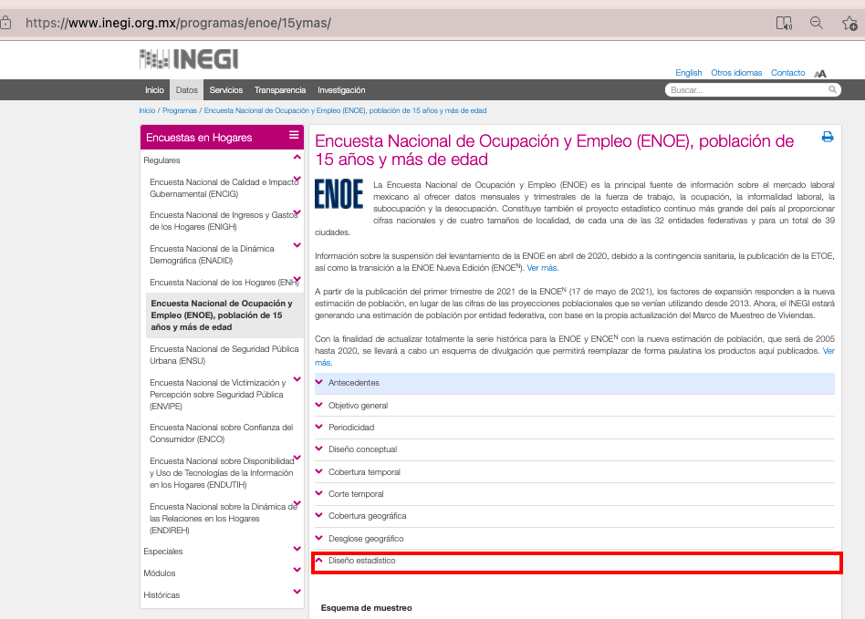

Introduction to the Mexican Labour Force Survey (ENOE)
================

- [What is the MEX ENOE?](#what-is-the-mex-enoe)
- [What does the MEX ENOE cover?](#what-does-the-mex-enoe-cover)
- [Where can the data be found?](#where-can-the-data-be-found)
- [What is the sampling procedure?](#what-is-the-sampling-procedure)
- [What is the geographic significance level?](#what-is-the-geographic-significance-level)
- [Other noteworthy aspects](#other-noteworthy-aspects)

## What is the MEX ENOE?

The Mexican Labour Force and Unemployment Survey (ENOE) is the Mexican Labour Force Survey run as part of Mexico’s National Surveys series from 2005 to 2020.

## What does the MEX ENOE cover?

The Mexican ENOE is a labour force survey collecting information on demographic details (age, sex, location), education (academic), social security, labour market activities over the past quarter, as well as time use and activities over the previous 7 days. The years and sample size of ENOE harmonized for GLD are:

| Year	| # of Households	| # of Individuals	|
| :-------	| :--------		| :--------	 	|
| 2005	| 100,776	| 402,186	|
| 2006	| 104,857	| 411,737	|
| 2007	| 105,567	| 410,185	|
| 2008	| 104,113	| 402,253	|
| 2009	| 102,068	| 392,497	|
| 2010	| 102,489	| 392,674	|
| 2011	| 102,588	| 389,038	|
| 2012	| 102,963	| 388,114	|
| 2013	| 101,382	| 379,010	|
| 2014	| 103,998	| 389,926	|
| 2015	| 105,628	| 390,565	|
| 2016	| 104,809	| 383,381	|
| 2017	| 104,558	| 377,929 |
| 2018	| 104,348	| 375,481 |
| 2019	| 109,335	| 390,018 |
| 2020	| 113,634	| 400,971 |

## Where can the data be found?

The microdata is free and publicly available on the National Institute of Statistics and Geography (INEGI). INEGI created a [dedicated website](https://www.inegi.org.mx/programas/enoe/15ymas/#Microdatos) that records ENOE and all previous versions, besides it contains complete information to understand the framework of the ENOE. Data from 2019 onwards can only be circulated within the World Bank. For further information kindly get in touch with the World Bank Jobs Group. 

## What is the sampling procedure?

The ENOE uses a stratified two-stage design. The introductory section of ENOE provides ample detail on the breakdown and goals of the process. Below we share a sequence of images that will allow the user to access the information in the ENOE webpage. The text is in Spanish. Yet, we did a short summary in english at the bottom of this section to give the user a general idea of the information.  

Image 1. Steps to find the information in the webpage
  

  

  
  

  
Reference: Screenshots from ENOE- INEGI webapage. Further details in *Encuesta Nacional de Ocupación y Empleo* under the ["recent version"](https://www.inegi.org.mx/programas/enoe/15ymas/) 

[Summarized Translation from the original version]

    The sampling is probabilistic, two-stage, stratified by conglomerates.

    Observation unit: The House.
    Sampling unit: The private home.
    Analysis unit: The home and the residents of the dwelling. [...]

    Sampling frame : The sampling frame used for the ENOE is INEGI's 2012 National Housing Framework, built from the cartographic and demographic information obtained during the 2010 Population and Housing Census, which is updated with each new census survey. [...]

## What is the geographic significance level?

The results are at national, state, and *cities of interest* levels as well as for certain size categories of localities. The cities of interest and sizes of cities, however, may vary over time. It is thus important to check the individual methodology reports. The information on the 2019 ENOE can be found under section 3.3 (page 39/40) of [that year's report](https://www.inegi.org.mx/app/biblioteca/ficha.html?upc=702825190613).

## Other Noteworthy Aspects 

### Evolution of the ENOE questionnaires

In the past fifteen years, the Mexican national statistics institute
(INEGI) published five updates (Table 1) of the labor force questionnaire or
ENOE. The ENOE has two versions: the extended version and the basic
version. Every quarter, the INEGI conducts labor surveys using either
version.

Figure 1. Type of questionnaire used in ENOE
  

  
Note.- Image taken from ["Conociendo la base de datos de la ENOE"](https://www.inegi.org.mx/contenidos/programas/enoe/15ymas/doc/con_basedatos_proy2010.pdf) by INEGI

Table 1. ENOE questionnaire revision by year

| Year         | Version Q1                                                                                            |
| ------------ | ----------------------------------------------------------------------------------------------------- |
| 2005 to 2006 | [First Extended Version](https://www.inegi.org.mx/contenidos/programas/enoe/15ymas/doc/c_amp_v1.pdf)  |
| 2007         | [First Basic Version](https://www.inegi.org.mx/contenidos/programas/enoe/15ymas/doc/c_bas_v1.pdf)     |
| 2008         | [Second Basic Version](https://www.inegi.org.mx/contenidos/programas/enoe/15ymas/doc/c_bas_v2.pdf)    |
| 2009         | [Second Extended Version](https://www.inegi.org.mx/contenidos/programas/enoe/15ymas/doc/c_amp_v2.pdf) |
| 2010 to 2012 | [Third Extended Version](https://www.inegi.org.mx/contenidos/programas/enoe/15ymas/doc/c_amp_v3.pdf)  |
| 2013 to 2015 | [Fourth Extended Version](https://www.inegi.org.mx/contenidos/programas/enoe/15ymas/doc/c_amp_v4.pdf) |
| 2016 to 2020 | [Fifth Extended Version](https://www.inegi.org.mx/contenidos/programas/enoe/15ymas/doc/c_amp_v5.pdf)  |

— [Author made. based on ENOE
Questionnaires](https://www.inegi.org.mx/programas/enoe/15ymas/)

### Information used in the GLD harmonization

Since ENOE reports quarterly results using different questionnaires, the 
harmonization team choose between annualizing quarterly results or choosing 
one quarter with mostly similar questionnaire questions. The fact that there 
is no unique questionnaire for the entire year introduces seasonality in 
the input, which could impact the process of data analysis for the user.

Annualizing data means that the results from extended and basic version 
questionnaires would merge which may cause lose of information. In table 2. 
the team summarized the list of absent topics in the extended and 
the basic questionnaire versions.

| Extended Version                                                                               | Basic Version                                                                                                                    |
| ---------------------------------------------------------------------------------------------- | -------------------------------------------------------------------------------------------------------------------------------- |
| Questions about situation after losing a job and the length of unemployment or job inactivity. | Questions about migration and additional labor opportunities (second job).                                                       |
|                                                                                                | Questions on financial, social and economic support such as syndicate enrollment, public social welfare benefits, and insurance. |

### Coding of industry and occupation codes

The ENOE codes occupation based on the "Mexican Classification of Occupations" (Clasificación Mexicana de Ocupaciones - CMO) from 2005 to 2012 and from 2013 to 2020 on the "National System of Classification of Occupations" (Sistema Nacional de Clasificación de Ocupaciones - SINCO). These are mapped to ISCO-08. 

On the industry side, ENOE codifies industry over the years based on four different versions of the North American System of Industrial Classification (Sistema de Clasificación Industrial de América del Norte - SCIAN), namely the 2007 versions, all data is mapped to ISIC-4. 

The table below provides an overview of the different versions underlying the survey as well as what version they have been mapped to. The precise details of how the mapping was done is covered [here in a separate document on occupations](Correspondence_occup_ISCO.md) as well as [here on industry classification](Correspondence_NAICS_ISIC.md).

| Year of survey	| National occup version	| ISCO version	| National industry version	| ISIC version	|
| :----:		| :----:			| :----:	| :----:			| :----:	|
| 2005			| CMO 				| ISCO-08	| SCIAN 2007			| ISIC-4	|
| 2006			| CMO				| ISCO-08	| SCIAN 2007			| ISIC-4	|
| 2007			| CMO				| ISCO-08	| SCIAN 2007			| ISIC-4	|
| 2008			| CMO				| ISCO-08	| SCIAN 2007			| ISIC-4	|
| 2009			| CMO				| ISCO-08	| SCIAN 2007			| ISIC-4	|
| 2010			| CMO				| ISCO-08	| SCIAN 2007			| ISIC-4	|
| 2011			| CMO				| ISCO-08	| SCIAN 2007			| ISIC-4	|
| 2012			| CMO				| ISCO-08	| SCIAN 2007			| ISIC-4	|
| 2013			| SINCO 2011			| ISCO-08	| SCIAN 2007			| ISIC-4	|
| 2014			| SINCO 2011			| ISCO-08	| SCIAN 2007			| ISIC-4	|
| 2015			| SINCO 2011			| ISCO-08	| SCIAN 2007			| ISIC-4	|
| 2016			| SINCO 2011			| ISCO-08	| SCIAN 2007			| ISIC-4	|
| 2017			| SINCO 2011			| ISCO-08	| SCIAN 2007			| ISIC-4	|
| 2018			| SINCO 2011			| ISCO-08	| SCIAN 2007			| ISIC-4	|
| 2019			| SINCO 2011			| ISCO-08	| SCIAN 2007			| ISIC-4	|
| 2020			| SINCO 2011			| ISCO-08	| SCIAN 2007			| ISIC-4	|

## Relevant information from INEGI on the ISIC codes used by ENOE

Please check the following [document](https://github.com/worldbank/gld/blob/1ff9697fbfe571a1b95c6d10c4f8ce5e0d6a7568/Support/B%20-%20Country%20Survey%20Details/MEX/ENOE/utilities/Comentario%20aplicado%20a%20la%20versi%C3%B3n%202(spa-eng).pdf) to get more insight on the ENOE SCIAN codes and the meaning of the digits used in the raw data. 

Further information or questions about the microdata in this webpage can be directed to [World Bank GLD Focal Point](mailto:gld@worldbank.org).
