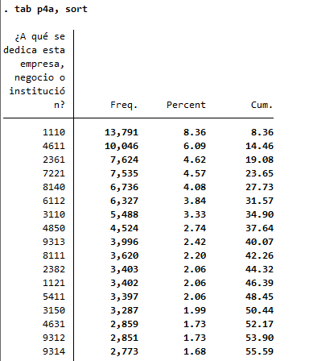
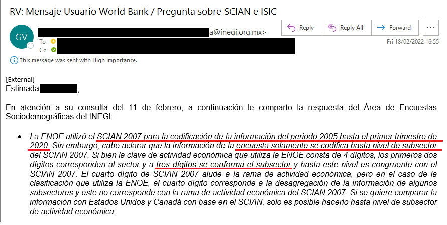
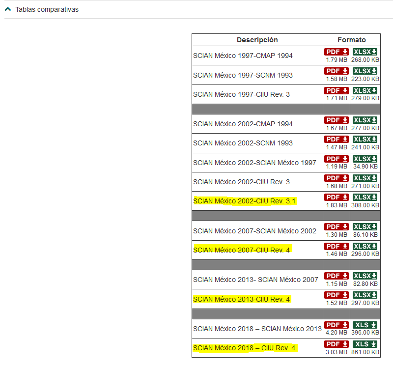
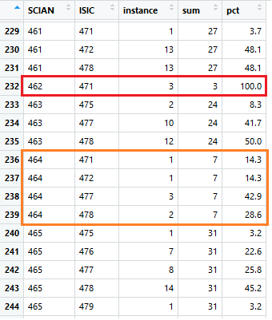
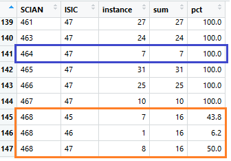
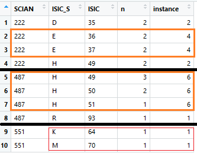
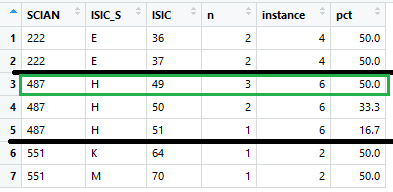
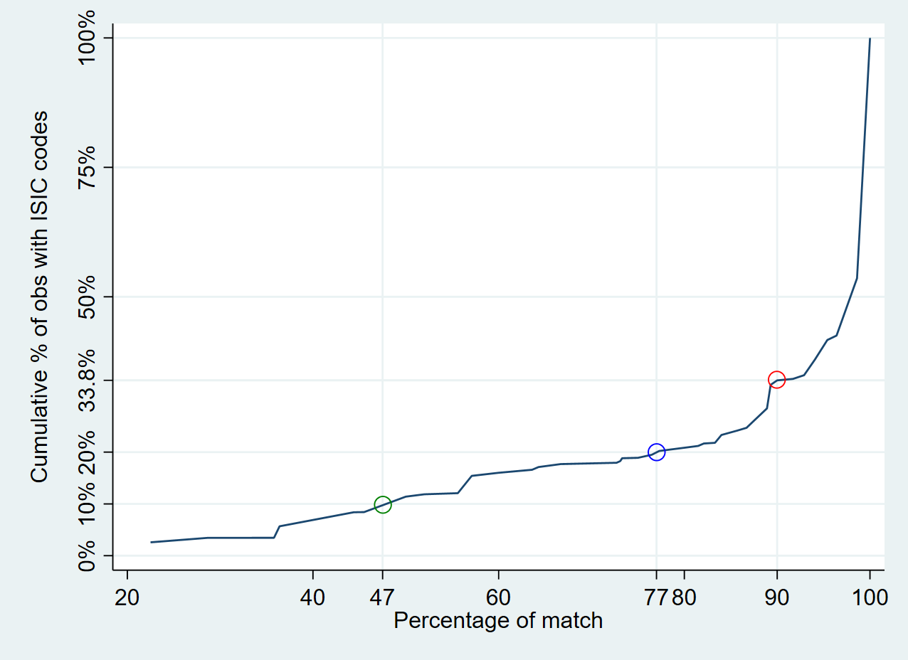

# Correspondence between NAICS Mexico and ISIC

Information regarding the industry respondents are employed in is coded in the Encuesta Nacional de Ocupación y Empleo (ENOE) using the codes of the [North American Industry Classification System](http://en.www.inegi.org.mx/app/scian/) (shortened as NAICS in English and SCIAN in Spanish).

This document first describes the logic of the process and then provides users with the underlying conversions tables, conversion algorithms, as well as the generated `dta` files used in the harmonization codes.

## Data as present in survey raw data

The image below shows the answers to the relevant question (`p4a1` asks for the industry the company the respondent works for is in) for the dataset from the first quarter of 2005:

  

  

All years from 2005 to 2020 (in the first quarter) use the 2007 SCIAN version and in all year `p4a` is a four-digit code while SCIAN is a six-digit code. However, the information contained is actually only useable at three digits, as the ENOE coding uses the three digits (to the level of subsector) and uses the fourth digit not to designate the next level (industry group) but rather is a subsector disaggregation not in line with SCIAN, as the email below from the Mexican Statistics Institute INEGI shows (in Spanish).

  

  

## Correspondance information available

INEGI has [website dedicated to NAICS](https://www.inegi.org.mx/app/scian/) where it stores general information in the classificaiton and - most importantly for concordance purposes -  comparative tables between the different SCIAN versions and the different ISCO versions. The image below shows the available comparisons in March 2022:  

  

  

The information is available as both a PDF and an Excel File. The image below shows the first lines of the first sheet of the 2007 to ISIC 4 Excel document:

  

  

Note how the first sheet contains the SCIAN to ISIC mapping, while the second sheet maps the inverse relation. Note further that SCIAN codes are all at 6 digit level in the comparison tables provided by the National Statistics Office (NSO) while the ISIC codes are just at 4 digits.

The last piece of information to understand before proceeding with creating a mapping `.dta` that can be used in the harmonization is the fact that mapping is not perfect in the correspondence tables provided by the NSO. In the above image this is the case (e.g., 111121 maps to 0111) but this is not always so. The image below shows how SCIAN code 111410 maps to five (!) different and distinct ISIC codes.

  

  

## Creating a map between NAICS and ISIC

### Overall mapping logic

The overall mapping is done in two steps. The first step is to create an `R` code that reads in the Excel file from the NSO, cleans it (note in the image how there are empty lines between two SCIAN codes) and equates three-digit SCIAN codes (since information in ENOE is useable at three-digits, as per the email) to an ISIC code. The code generates a `.dta` file that lists all possible unique SCIAN codes and provides the corresponding ISIC code.

The second step is to use the `.dta` created in the first step in the harmonization. That is to merge in the correspondance table when harmonizing and use matched ISIC codes to generate the GLD `industrycat_isic` variable.

### Generating the `R` code and resulting `.dta` file

The mapping of NAICS to ISIC codes is performed by a user written `R` code. It reads from the relevant NSO correpsondence Excel file stored under `MEX_[YYYY]_ENOE\MEX_[YYYY]_ENOE_v01_M\Doc` and writes the comparison `.dta` file merged in the harmonization under `MEX_[YYYY]_ENOE\MEX_[YYYY]_ENOE_v[##]_M\Data\Stata`. The corresponding `R` itself is stored under `MEX_[YYYY]_ENOE\MEX_[YYYY]_ENOE_v[##]_M\Programs`. Note that the actual files are stored on a World Bank server - the conversion files are, however, availabe [in the utilities folder here](utilities/Additional%20Data).

The first step in the process is to reduce the NSO correspondece six-digit system to the three digits covered in the ENOE. This creates duplicates as the, for example, 14 codes between `461110` and `46122` that can be reduced to the three-digit `461` maps to 27 distinct ISIC codes. There are 94 unique three-digit codes in SCIAN 2007.

The second step is to compare the correspondence of SCIAN three-digit codes to ISIC three-digit codes and count the number of total cases and the number of matches to each code. The image below shows this process for some of the first codes:

  

  

In the above image the aforementioned code `461` has a total of 27 mappings, one of which starts with ISIC code `471`, and 13 cases each start with `472` and `478`. In the case of SCIAN `462` all three cases map directly to ISIC `471` (red box in the above image). In the case of SCIAN `464` the seven total cases are much more spread out (orange box in the above image).

At this stage of the algorithm, only perfect matches are map from three-digit SCIAN codes to three-digit ISIC codes. This applies to 17 of the 94 unique SCIAN three-digit codes, leaving 77 yet to map.

The third step matches each three-digit NAICS code to the reduced two-digit ISIC equivalent. This is exemplified in the snapshot below:

  

  

In the case of SCIAN `464` (blue box in the above image) the mapping is now at 100%, meaning that all seven ISIC codes start with codes `47`. In the case of SCIAN `468` (orange box in the above image), the options are more evenly split even though there is a majority option. In the case of the SCIAN `222` each of the four ISIC codes has the same number of mappings - no clear assignment can be made.

At this third step assignments SCIAN to ISIC two-digits are made if there is a single option with >50% cases assigned to it. In the case above SCIAN `468` would not be assigned at this stage. This is because there may be two mappings with each 50.0% each, which would lead to a non-unique assignment. This logic maps a further 60 unique codes, leaving 17 codes still to match.

The fourth step looks at all steps without an absolute majority. This step itself involves two sub-steps. This is best illustrated looking at the codes for SCIAN `222`, `487`, and `551` below.

  

  

The overall idea at this step is to select a mapping based on simple majority – and chose randomly in the case of a tie. For code `487` this is mapping to ISIC code `49` as this is the mapping category in 3 out of 7 possible mappings (sum the number of possible mappings denoted in column `n`).

For `222` there is no single best category, but, if we look at the Sections the codes belong to – the top level ISIC aggregations – two of the codes are section `E` (Water supply; sewerage, waste management and remediation activities) while each one is from section `D` (Electricity, gas, steam, and air conditioning supply) and `H` (Transportation and storage). When selecting a mapping this sectional relevance should be taken into account to reduce any potential randomness in the mapping.

Thus, the first sub-step is to assign the ISIC two-digit codes to their sections and see if there is a single section where a single value has at least 50% of the mappings. This is the case for SCIAN `222`, where section `E` represents 50% of the mappings. For SCIAN `551`, each possible mapping has a 50% weight and thus no sub-selection can be made. For SCIAN `487` the selection is even stronger as 6 out of the 7 mappings are from section `H`. The possible mapping choices are hence reduced to the following:

  

  

At the second sub-step, within each SCIAN code the simple majority is selected. This allows a unique mapping of 13 of the remaining 17 codes. In just four cases (such as `222` and `551`) a random selection is made between equally likely mappings – in three of the four cases (such as `551` the selection is between codes of different ISIC sections).

### Merging the correspondence with the survey data

The data is merged in the harmonization at the first stage of database assembly (see individual harmonization codes). In the case of the 2017 ENOE there are 167,033 individuals for which the survey has an industry SCIAN codes. The correspondence process is able to match to 162,374 of those (97.2%). The image below shows the quality of the matches made:

  

  

The graph depicts weighted cumulative distribution by match quality. It shows that only 10% of all observations have a match quality of 47% or worse (green circle), while 80% have a quality of 77% or higher (blue circle). Two thirds of all cases have a quality of 90% or better (red circle).

## Caveats and extensions

### Caveat - What the mapping does and does not do

Overall, the quality of the mapping seems to be very good. However, the metric used to evaluate matching quality, while sensible, contains potential pitfalls. The most obvious one is that it is evaluating importance of a map by number of existing codes and not relevance of the codes. As an example, see the following excerpt from NAICS:

| NAICS Code    | NAICS Description                 | ISIC Code |
| :------------ | :-------------------------------: | --------: |
| 312131        | Grape alcoholic drinks            | 1101      |
| 312132        | Pulque (fermented agave)          | 1102      |
| 312139        | Cider & other fermented drinks    | 1102      |
| 312141        | Rum & sugar cane drinks           | 1101      |
| 312142        | Distilled agave drinks            | 1101      |

The way the correspondence has proceeded, it treats every entry equally. However, given that tequila, probably the economically most important drink in Mexico is made from agave, NAICS code `312142` should be weighted more strongly in this context. If we think of Cuba, code `312141` should probably be more important. This information, however, is not avaialable to us. Furthermore, note that the process of matching less than perfectly at only the lowest level of ISIC solves the issue here. All these NAICS codes starting with `3121` don't match to ISIC at four digits but do so perfectly to `110`.

In this case no problem has arisen and as small niches grow, they can be expected to obtain more codes (as clothing grows, groups are created for shirts, trousers, ...) so it can be assumed that a single category is not significantly larger than any other category in the economy, but it still should be kept in mind that the evaluation of the mapping is based only on the number of categories, regardless of the economic relevance.

### Extension - What you may add if you would be available

A further extension, which may help in creating better matches is to use the text descriptions, provided in the NSO correspondence document, which define in more detail what the NAICS and ISIC codes cover. This is beyond our current capacity, though. If you, dear Reader, think you may be able to support this, please contact the team here on GitHub. We really would appreciate any help!

## Underlying data for emulating process
The harmonization codes merge in `dta` files created from the correspondence tables shown above using the algorithmic logic described in this document. In particular we use:

- [The correspondence table between SCIAN 07 and ISIC 4](utilities/SCIAN_07_ISIC_4.xlsx);

- [The `R` code to map SCIAN 07 to ISIC 4](utilities/SCIAN_07_3D_ISIC_4.R);

- [The `dta` file with codes for SCIAN 07 and ISIC 4](utilities/SCIAN_07_3D_ISIC_4.dta);
