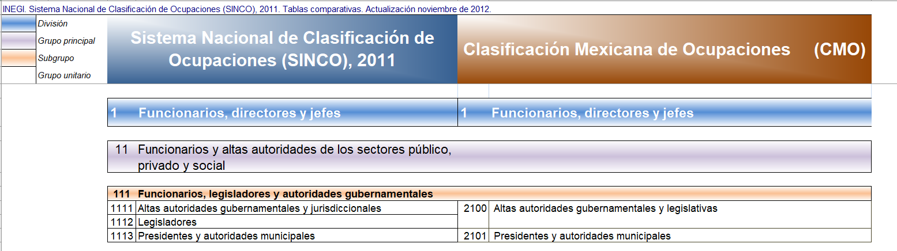
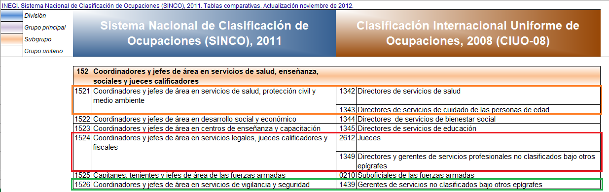
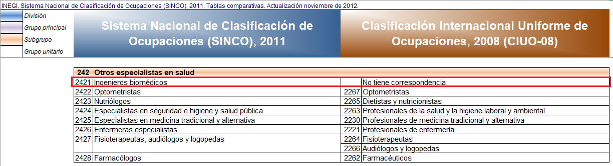
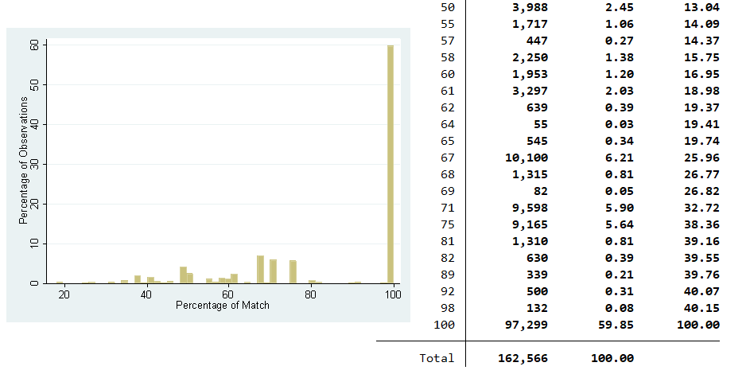

# Correspondence between Mexican occupation codes and ISCO 08

This document first describes the logic of the process and then provides users with the underlying conversions tables, conversion algorithms, as well as the generated `dta` files used in the harmonization codes.

## Occupation codes used in Mexico’s ENOE

The Mexican *Encuesta de Ocupación y Empleo* uses two different classification systems between 2005 and 2020. Between 2005 and the second quarter of 2012 the National Statistics Office [INEGI]( https://www.inegi.org.mx) uses the *Clasificación Mexicana de Ocupaciones* (CMO) while after that it uses the *Sistema Nacional de Clasificación de Ocupaciones* (SINCO).

Since for this harmonization only the first quarter is used (see [further details why here](www.link.com)), the information coded as `occup_isco` is mapped from CMO for 2005 to 2012 and from SINCO from 2013 to 2020.

## Correspondence information available

The INEGI does provide correspondence tables between different classifications, but only maps SINCO to ISCO-08. CMO is only mapped to SINCO. Below are images of the tables of the correspondence tables from SINCO to ISCO-08 (first) and CMO to SINCO (second):

  

  

  

This means that we can only map directly to ISCO from 2013. The information from 2005 to 2012 needs first to be mapped to SINCO and then, in a second step, from SINCO to ISCO.

## Creating a map between national and international occupation codes

### Overall mapping logic

The logic of the mapping is the same as the one used for converting the national industry classification (NAICS) to the international classification (ISIC), namely, to try to map classifications at full length (four digits) only if there is a perfect match, and if not to try to reduce the classification first by one digit to try to find a match. The image below gives an example of three different kind of matches:

  

  

The easiest match is the one in the green box. SINCO code `1526` matches a single code in ISCO, namely `1439`. This match we can make in the first iteration. SINCO code `1521`, in the orange box, is a bit trickier. It matches two different ISCO codes (`1342` and `1343`) so there is no direct match. If we, however, reduce the match to a three digit ISCO codes, both instances start with `134` so we can match SINCO `1521` perfectly to a code `1340`, where the last zero is just padding to make sure all codes are of four digits.

The most difficult case is the case in the red box. Here SINCO code `1524` describes an occupation classification that ISCO essentially views as two completely different occupations. Even if we try to reduce to a single digit we cannot map with certainty: with two categories the algorithm chooses at random between `2000` and `1000`. For a more detailed explanation of the process see [the document on NAICS to ISIC correspondence](Correspondence_NAICS_ISIC.md), the distribution of the quality of matches is shown below in the [section on merging in the correspondence info]( #merging-the-correspondence-with-the-survey-data).

### Direct SINCO to ISCO mapping

In the easiest case, we use the SINCO to ISCO correspondence and create a map for every four-digit SINCO code, following the logic outlined above. Note that not all SINCO codes appear to have a correspondence. The case of SINCO code `2421` of biomedical engineers (red box in the image below) is described by INEGI as having no correspondence in ISCO. This code is therefore not mapped.

  

  

### Indirect CMO to ISCO mapping

The more difficult case is for surveys between 2005 and 2012. Here we first use the mapping logic to map CMO codes to SINCO codes. This includes reducing the SINCO accuracy to achieve more certain matches. For example, in the image below, CMO code `6160` cannot be matched unique to a four-digit SINCO code so the mapping occurs to code `1710`.

  

  

The second step is to map from SINCO to ISCO. For four-digit matchings we can use the process used above, but for less accurate ones, new SINCO to ISCO mappings need to be made: in the example above, CMO code 6160 is mapped to SINCO `1710`, but there is no SINCO to ISCO mapping to `1710`.

Applying the mapping logic explained above to codes that start with `171` gives us five potential matches (see image below). The iterative process would reduce to two digits, `12` and `14`, with 40% of cases starting with `12` and 60% starting with `14`. Since at the two-digit stage a match is made if there is a single maximum over 50%, SINCO code `1710` would be mapped to ISCO-08 code `1400`.

  

  

In turn this means that CMO code `6160` (department heads, coordinators, and supervisors in restaurant, hospitality, and commerce services) would be mapped to ISCO-08 sub-major 14 (coded as `1400`) (hospitality, Retail and Other Services Managers), which may not be accurate for those under CMO `6160` in commerce activities, but a good match to provide more information than `occup`.

## Merging the correspondence with the survey data

### Merging directly

Merging directly is possible for the years 2013 onwards. As an example here we use the data from 2014. In that year, of the more than 160,000 individuals with SINCO occupation codes we can map 98.94% to an ISCO code. Of the mapped cases 84 percent are perfect matches (that is, categories agree) and in 9 out of 10 cases the match agrees with two thirds of possible categories (see image below). A percentage of 80 would mean, if SINCO code `####` maps to 10 different ISCO four-digit codes but eight of them start with `24` and the other two to `31`, then the map to `24` would have an 80 percent match.

  

  

This does not mean, however, that 84 percent of matches are at four digits since, if there is no perfect agreement at ISCO-08 with four digits, the mapping tries to find agreement with fewer digits. In fact, as the image below (left-hand side) shows, in 2014 about half of all matches are at four digits, another 20 percent are respectively at three and two digits, while only 10 percent of matches from SINCO codes are at a one digit ISCO-08 code.

  

  

The right-hand side of the image above shows the average match quality of the digits. By definition, matches are perfect for three and four digits (if not we try to match at lower digits). Matches at two digits agree on average with 86 percent of categories, while those at one digit, the least reliable, match on average at 68 percent.

### Merging indirectly

To see an example of indirect merging we use the data from 2005. In this case of all individuals with CMO occupation code we can map again nearly all (98.6%) yet the percentage of perfect matches falls from 84 to 60 percent and 75 percent of matches agree in at least two thirds of cases as opposed to 90 percent when matching directly (see image below).

  

  

There are also fewer matches at more detail. Only a quarter of matches are at four digits, about a seventh is at three digits, and 40 percent are at two digits. 22 percent are at one digit compared with 10 percent previously (see left-hand side of the image below). The quality of these matches is also somewhat lower. There are more two digit matches and their average match is of 82 percent, still relatively high but below the 86 percent previously. One-digit matches are of 60 percent (see right-hand side of the image below).

  

  

## Caveats and limitations

The limitations of the match quality are explained in the caveats section of the [document on matching industrial codes](Correspondence_NAICS_ISIC.md). Additionally, users should consider that, while the series contains ISCO-08 data throughout, there is an underlying break in the occupation codes between 2012 and 2013. Not only is the matching more difficult but also the underlying classification may have caused changes. An individual working in the same occupation in 2012 and 2013 will be coded with different CMO and SINCO codes. This alone can change the outcome as definitions of categories do not overlap. In addition, a different code may be treated differently in the matching algorithm, thus leading to two different ISCO codes even if the person is doing the same job.

The likelihood of this happening is low. For example, the most common CMO code, `7111` (shop assistants) has its own SINCO category (`4211`) and a perfect ISCO-08 match (`5223` – shop sales assistant) but should be kept in mind, especially if looking into certain sectors where matching is more difficult.

## Underlying data for emulating process

The [Excel document containing the correspondences between occupation classifications](utilities/tablas_comparativas.xlsx) is the basis of the mapping. In particular, the first sheet contains the SINCO to ISCO classification, while the second sheet contains the SINCO to CMO classification.

Each are used in the `R` algorithms to [code directly from SINCO to ISCO](utilities/sinco_to_isco_correspondance.R) or to [code from CMO to ISCO via SINCO](utilities/cmo_isco_via_sinco.R). These codes create the `dta` files in the harmonization, namely the [CMO_09_ISCO_08.dta file](utilities/Additional%20Data/CMO_09_ISCO_08.dta) and the [SINCO_11_ISCO_08.dta file](utilities/Additional%20Data/SINCO_11_ISCO_08.dta).
