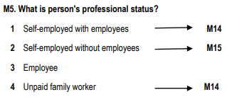
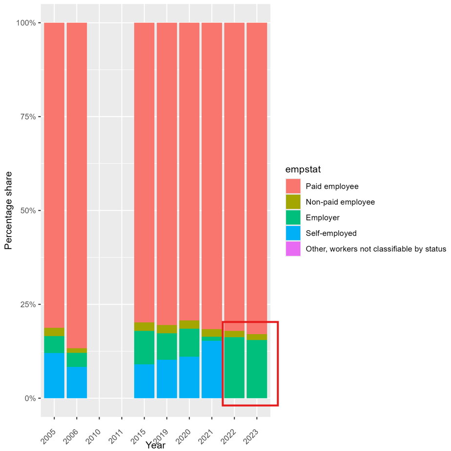

# Introduction to Somalia (MNE) Labour Force Survey ([LFS)]

- [What is the MNE LFS?](#what-is-the-mne-lfs)
- [What does the MNE LFS cover?](#what-does-the-mne-lfs-cover)
- [Where can the data be found?](#where-can-the-data-be-found)
- [What is the sampling procedure?](#what-is-the-sampling-procedure)
- [What is the significance level?](#what-is-the-geographic-significance-level)
- [Other noteworthy aspects](#other-noteworthy-aspects)

## What is the MNE LFS?

The Labour Force Survey has been carried out in the country since 1994. Surveys of this kind have a long tradition in many developed countries, and over recent years they have also been widely introduced in developing and transition economies. This survey is based on a sample of observation units and uses a structured questionnaire to collect information on key labour-market characteristics.

## What does the MNE LFS cover?

The Montenegro Labour Force Survey (LFS) collects information on the economically active population, in line with recommendations from the International Labour Organization (ILO). The labour force includes all individuals who are working or actively seeking work to earn their livelihood. Accordingly, the survey focuses on key labour-market categories—employment and unemployment—as well as the demographic, educational, socioeconomic, and other relevant characteristics of the individuals within these groups. The years and sample size of harmonized GLD are:

| **Year**	| **# of Households**	| **# of Individuals**	| **Expanded Population**	| **Officially Reported Sample Size(# HH)**	| 
| :------:	| :-------:		| :-------:	 	| :-------:	 	| :-------:	| 
| 2005 | 900         | 3184     |  641,411  |   900   |
| 2006 | 901         | 3131     |  639,890  |   -   |
| 2010 | 9,258         | 27,513     |  -  |   9,258   |
| 2011 | 8,756        | 26,633     |  -  |   8,758   |
| 2019 | 8,438       | 24,505     |  619,711  | 8,442   |
| 2020 | 8,205       | 23,121     |  619,808  | 8,208   |
| 2021 | 7,817      | 21,160     |  619,850  | 7,818   |
| 2022 | 7,700       | 20,022     |  619,794  | 7,707   |
| 2023 | 7,482       | 19,198    |  619,600  |  7,782  |

**Note**: The raw datasets for 2010 and 2011 do not contain a weight variable, which limits the ability to produce weighted population estimates for those years.

## Where can the data be found?

The microdata are not publicly available. The datasets are provided to the World Bank by the Statistical Office of the Republic of Montenegro. For World Bank users, access can be requested through the Jobs Group at gld@worldbank.org.

## What is the sampling procedure?

The Labour Force Survey has always used a two-stage sampling design. Since 2008, the survey has been conducted quarterly, which introduced a rotation scheme. Before 2008, although the sample was also selected in two stages, there was no rotation pattern, as the survey was not organized by quarters.

First stage: Enumeration areas are selected using probability proportional to size, based on the number of households. Since 2008, a 2-(2)-1 rotation scheme is applied: each area is surveyed for two consecutive quarters, excluded for the next two, and then included once more before leaving the sample for an extended period.

Second stage: Within each selected area, households are randomly chosen and evenly assigned across the 13 weeks of each quarter. Under the rotation system, these households are re-interviewed after 13 weeks and again after 52 weeks.

## What is the geographic significance level?

The LFS has national geographic coverage, encompassing all persons residing in the country. According to the methodology documentation, the reference area is Montenegro as a whole, though breakdowns are also available for three regions (Northern, Central, and Southern).

## Other noteworthy aspects

##Sampling weights
As mentioned above, the raw datasets available in the GLD for the years 2010 and 2011 do not include sampling weight variables. This limitation restricts the ability to produce weighted population estimates for those years, and therefore results for 2010–2011 should be interpreted with caution, as they reflect unweighted figures rather than representative population estimates.

### Changes in the raw data structure
Starting in 2019, the raw dataset provided to the GLD differs from the raw dataset that would be obtained directly from the survey questionnaire. Instead of including variables corresponding to individual survey questions, the dataset contains labor-related variables constructed by EUROSTAT.

Nevertheless, these variables allow for the construction of the key GLD variables describing both sociodemographic and labor market characteristics. For further details on the structure and methodology of this dataset, please refer to the following document:  
[EUROSTAT explanatory notes](utilities/MNE-LFS-explanatory-notes-from-2017-onwards.pdf)

A notable exception concerns the variable `empstat`. In the original questionnaire, employment status is collected through a question that explicitly distinguishes between employees, unpaid family workers, employers, and self-employed individuals.

<strong>Figure 1: Employment status question</strong>

<figure>

</figure>

However, in the raw data available to the GLD, information on *employers* and *self-employed* individuals is combined into a single category. To distinguish employers from self-employed workers, one can rely on firm size information: in the questionnaire, self-employed individuals were not asked about the number of persons employed in their business, whereas employers were.

From 2022 onwards, this distinction can no longer be made in the raw data, as all individuals in this combined group report a firm size greater than one employee. As a result, no individuals can be clearly identified as self-employed in the raw data.

<strong>Figure 2: Employment status across years</strong>

<figure>

</figure>
**Note**: The raw datasets for 2010 and 2011 do not contain a weight variable, which limits the ability to produce weighted population estimates for those years.

### Education system

In Montenegro, the education system is organized into three main stages: primary education, secondary education, and tertiary education. Primary education is compulsory and lasts nine years, followed by secondary education, which typically lasts three to four years depending on the program. Tertiary education includes undergraduate, graduate, and postgraduate studies. The table below presents the average duration, in years, of each educational stage. This information is used to construct the variable `educy`, which measures the total number of years of schooling, and the variable `educat7`, which classifies the highest level of education attained into seven categories.

| Education Level            | Years |
|:---------------------------|:-----:|
| Primary                    | 5/6   |
| Lower Secondary            | 4     |
| Upper Secondary            | 3     |
| Vocational high school     | 2     |
| Bachelor                   | 4     |
| Master                     | 2     |
| PhD                        | 3     |

