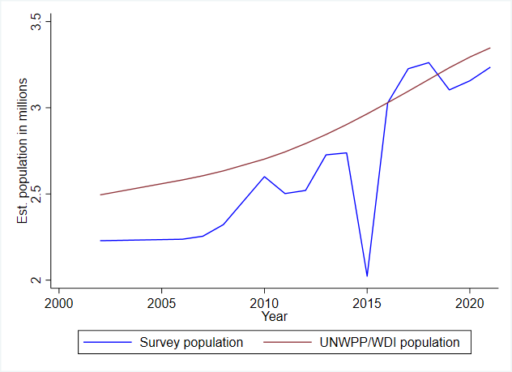

# Introduction to Mongolia Labor Force Survey (MNG LFS)

- [What is the MNG LFS?](#what-is-the-mng-lfs)
- [What does the MNG LFS cover?](#what-does-the-mng-lfs-cover)
- [Where can the data be found?](#where-can-the-data-be-found)
- [What is the sampling procedure?](#what-is-the-sampling-procedure)
- [What is the significance level?](#what-is-the-significance-level)
- [Other noteworthy aspects](#other-noteworthy-aspects)

## What is the MNG LFS?

The Mongolia Labor Force Survey (LFS) has been conducted by the Mongolia National Statistics Office since 2002. The period covered varied across different rounds of the LFS. From 2002 to 2008, the data was collected between July and June of the subsequent year. Since 2010, the data is gathered within a calendar year.

## What does the MNG LFS cover?

The Mongolia LFS collects information on demographic characteristics, education, and labor market activities. The household and individual sample sizes are presented on the table below:

| Year | Individual count | HH count |
|---|---|---|
| 2002 |          49,948  |                      12,787  |
| 2006 |          48,108  |                      12,286 |
| 2007 |          25,300  |                      7,008  |
| 2008 |          24,940  |                      7,008  |
| 2010 |          47,493  |                      12,815 |
| 2011 |          45,358  |                      12,815 |
| 2012 |          45,442  |                      12,815 |
| 2013 |          44,678  |                      12,815 |
| 2014 |          43,664  |                      12,816 |
| 2015 |          30,607  |                      12,816 |
| 2016 |          43,680  |                      12,816 |
| 2017 |          44,414  |                      12,816 |
| 2018 |          44,260  |                      12,816 |
| 2019 |          44,240  |                      5,922  |
| 2020 |          46,934  |                      6,219  |
| 2021 |          46,873  |                      6,157  |

It's worth noting that the expanded population using the survey weights does not align perfectly with population projections in the WDI or the UN World Population Prospects. In the 2015 survey round, the raw dataset only included samples aged 15 and above. While there's no indication that the survey sampling is deliberately limited to this age group, it seems that individuals younger than 15 were excluded from the data. Consequently, only an estimate of the working age population can be deduced for this year.

## Where can the data be found?

The data are freely available (as of August 2023) on the dedicated LFS catalogue on the [microdata website of the National Statistics Office of Mongolia](http://web.nso.mn/nada/index.php/catalog/LFS/dataset)

## What is the sampling procedure?

The MNG LFS employs a two-stage stratified sampling design to collect representative data on the country's labor force. This sampling methodology involves selecting Primary Sampling Units (PSUs) in the first stage and households within each PSU in the second stage. 

Starting in 2019, the survey adopted a rotation sampling design where 75% of the sample in a given round is re-interviewed in the next round, while 25% exit the sample. The rotation restarts every year, meaning the survey no longer re-interviews the 75% of the sample from the last quarter of the previous year. The precise details on constructing the panels are covered in a separate document [here](Panels.md).

## What is the significance level?

The official reports detail estimates by area of residence (urban or rural), and the regions (GLD variable `subnatid1`) in Mongolia. The [2019 official report]("Utilities/1.%20report_LFS_eng.pdf") also detailed estimates by provinces (GLD variable `subnatid2`), and given similarities in the sampling design, it is possible that the data for the 2019 and 2020 LFS are representative at this level as well. However, it should be noted that the sample size has not increased. Any additional significance at lower level must have come from a more efficient sampling. The GLD team could not verify how this was achieved. 

## Other noteworthy aspects

### Definition of concept of employment

Since the passing of the [resolution concerning statistics of work, employment and labour underutilization](https://www.ilo.org/global/statistics-and-databases/standards-and-guidelines/resolutions-adopted-by-international-conferences-of-labour-statisticians/WCMS_230304/lang--en/index.htm) in 2013 at the 19th International Conference of Labour Statisticians (ICLS) surveys are at risk of a series break due to the change in the concept of employment.

In short, the ICLS 19 resolution restricts employment to *work performed for others in exchange for pay or profit*, meaning that own consumption work (e.g., subsistence agriculture or building housing for oneself) are not counted as employment.

The GLD codes the harmonization’s `lstatus` variable based on the concept used in the survey. In the case of the Monoglia LFS this change occurs in 2019, when the survey switches to new definition. This implies that estimates for 2019 onwards may not be directly comparable with those from the previous years. However, it is possible to recode `lstatus` such that it matches the previous definition. The precise details are covered in a [separate document here](Converting%20between%20ICLS%20Definitions.md)

### Household ID
The datasets provided in the GLD project initially lack ID information. To enhance the user experience, we've created identifiers using geographical references. The household ID is typically derived from data concerning the primary sampling unit and the household identification number. 

However, during the 2011 and 2012 rounds, some exceptions required us to construct the household ID using the interview date and time, as the combination of PSU and SSU data didn't precisely identify households. For the 2013 round, we made an effort to incorporate additional household data, such as the number of household visits and individuals absent from households. However, this approach did not fully result in the desired uniqueness of the IDs, and the survey is left with a few duplicate IDs with each having unique individual characteristics. The number of unique households thus identified in those years does not differ from previous or subsequent years.

Additionally, once the rotation panel started in 2019, it became clear that the household IDs (and as a consquence most personal IDs since they are HHID plus in house running number) are being repeated over the years. This would wrongly create the impression that panels of households cross over the years when in fact the IDs are reused every calendar year and assigned to different households (e.g., household `299022020` is in surveys in 2019 and 2020 but these are in fact different households). Hence, since 2019 the year is included as part of the household ID to ensure the uniqueness of the households across years.  

### Geographic Information
As of the time of writing (July 2023) Mongolia is composed of 21 administrative divisions, known as aimags, and the capital city, Ulaanbaatar. These were grouped into 5 regions:

| Subnatid1 (Regions)  | Subnatid2 (Divisions/"Aimags")   |
|-------------|-------------|
| Ulaanbaatar | Ulaanbaatar |
| Central     | Umnugovi, Selenge, Tuv, Darhan-Uul, Govi-sumber, Dornogovi, Dundgovi |
| East        | Suhbaatar, Hentii, Dornod |
| West        | Uvs, Hovd, Bayan-Ulgii, Govi-Altai, Zavhan |
| Highlands   | Arhangai, Uvurhangai, Huvsgul, Orhon, Bayanhongor, Bulgan |

### Coding of industry and occupation codes

Based on the questionnaires, the Mongolia LFS codifies industry and occupation based on the International Standards for Industrial Classification (ISIC) and the International Standards for Classification of Occupations (ISCO), respectively. However, there was no information on what ISIC or ISCO versions are used for each survey.  The precise details on the logic used in the mapping process are covered in separate documents for [industry](Industry.md) and [occupation](Occupation.md)

### Mappings between raw and harmonized variables
The mappings between the raw and harmonized variables can be found [here](Utilities/mappings_year_data.xls) for the following categorical variables: education, employment status, marital status, reasons for migration, reasons for non-participation in the labor force, sector of occupation, and relationship to household head.

