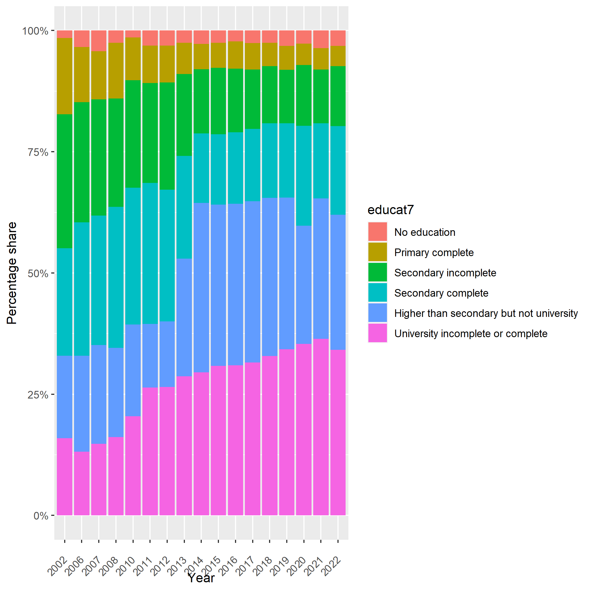

# Mapping for education categories

The table below summarizes the mapping of the GLD `educat7` categories and the categories in the education variable in the raw dataset. 

| GLD `educat7` categories                      | Raw education variable categories                                                          |
|-----------------------------------------------|--------------------------------------------------------------------------------------------|
| No education                                  | None                                                                                       |
| Primary complete                              | Primary                                                                                    |
| Secondary incomplete                          | Secondary, Basic                                                                           |
| Secondary complete                            | High school, Secondary                                                                     |
| Higher than secondary but not university      | Technical vocational, Specialized secondary, Initial technical/vocational diploma/certificate, Technical/vocational diploma/certificate             |
| University incomplete or complete             | Undergraduate, Postgraduate, master, Doctor and above, University graduate, Docter, Master and above |

There are multiple categories in the raw dataset that correspond to the GLD `educat7` category for secondary education. From 2019 onwards, the LFS differentiates between "high school" and "secondary", whereas in earlier years, both were grouped under "secondary". The GLD team identified that this distinction that began in 2019 might stem from translation discrepancies in the Mongolian questionnaire. Specifically, the term "Бүрэн дунд" was rendered as "secondary" in English, but a more fitting translation is "lower secondary". Similarly, "Техникийн болон" was translated to "high school", but "upper secondary" is a more precise interpretation. Given these refined translations, the GLD team has opted to label "secondary" as *secondary incomplete* and "high school" as *secondary complete*.

Also, it is worth noting that we classify "initial technical/vocational program" as *higher than secondary but not university*. By doing this, the GLD harmonization deviates from ILO, whose calculations for *post-secondary, but not university*, the equivalent to GLD's *higher than secondary but not university*, only include "technical/vocational diploma/certificate". ILO lumps "initial technical/vocational diploma/certificate" and "secondary" together to calculate "upper secondary". But beginning 2018, the ILO shifts to mapping "initial technical/vocational" to *post-secondary non-tertiary* causing a sharp increase in share of population with that level of education from ~133,000 in 2017 to ~523,000 in 2018.  The GLD team cannot confirm whether there is a policy that underpins ILO's decision. 
An implication of mapping "initial technical/vocational program" to *higher than secondary but not university* is a notable increase in the share of individuals with *higher than secondary but not university* (see below) between 2012 and 2013 from ~117,000 to ~297,000. This is accompanied by a drop in secondary complete from ~555,000 to ~488,000. We cannot confirm whether these changes are driven by policy or some reclassification in reporting. 

