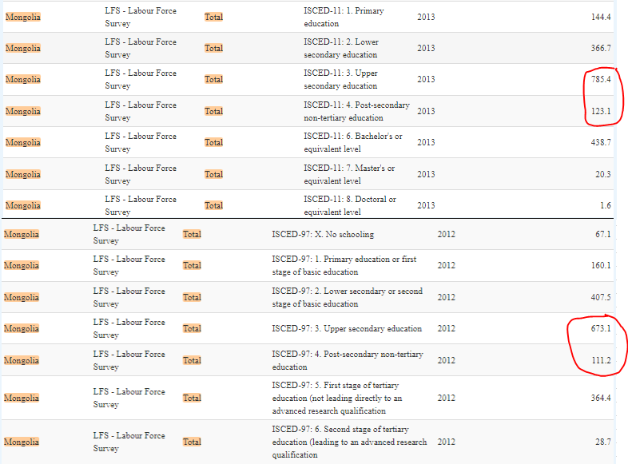
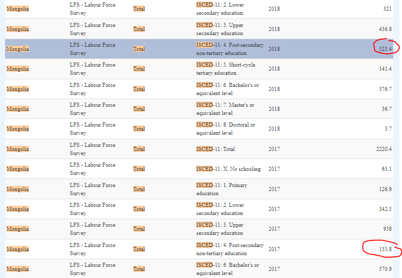

# Mapping for education categories

The table below summarizes the mapping of the GLD `educat7` categories and the categories in the education variable in the raw dataset. 

| GLD `educat7` categories                      | Raw education variable categories                                                          |
|-----------------------------------------------|--------------------------------------------------------------------------------------------|
| No education                                  | None                                                                                       |
| Primary complete                              | Primary                                                                                    |
| Secondary incomplete                          | Secondary, Basic                                                                           |
| Secondary complete                            | High school, Secondary                                                                     |
| Higher than secondary but not university      | Technical vocational, Specialized secondary, Initial technical/vocational diploma/certificate, Technical/vocational diploma/certificate             |
| University incomplete or complete             | Undergraduate, Postgraduate, master, Doctor and above, University graduate, Docter, Master and above |

There are non-distinct categories in the GLD `educat7` that map to "secondary education" in the raw education variable. From 2019 onwards, the LFS differentiates between "high school" and "secondary", whereas in earlier years, both were grouped under "secondary". The GLD team identified that this distinction that began in 2019 might stem from translation discrepancies in the Mongolian questionnaire. Specifically, the term "Бүрэн дунд" was rendered as "secondary" in English, but a more fitting translation is "lower secondary". Similarly, "Техникийн болон" was translated to "high school", but "upper secondary" is a more precise interpretation. Given these refined translations, the GLD team has opted to label "secondary" as *secondary incomplete* and "high school" as *secondary complete*.

An important deviation to note: we categorize "initial technical/vocational program" as *higher than secondary but not university*. An implication of this mapping is a notable increase in the share of individuals with *higher than secondary but not university* (see below) between 2012 and 2013 from ~117,000 to ~297,000. This is accompanied by a drop in secondary complete from ~555,000 to ~488,000. We cannot confirm whether these changes are driven by policy or some reclassification in reporting. 

In contrast, ILO's calculations for *post-secondary, but not university* (equivalent to GLD's *higher than secondary but not university*), only includes "technical/vocational diploma/certificate", while"initial technical/vocational diploma/certificate" is lumped "secondary" as *upper secondary* (equivalent to GLD's *secondary complete). Thus, a different conclusion can be made for *higher than secondary but not university* based on ILO's approach, such as shown below for 2012 and 2013.

From 2018, however, ILO began classifying "initial technical/vocational" under post-secondary non-tertiary. This decision led to a substantial increase in the population share with this educational level, jumping from ~133,000 in 2017 to ~523,000 in 2018 (see below). The rationale behind ILO's decision remains unclear. However, our consistent classification of "initial technical/vocational" as *higher than secondary but not university* prevents more abrupt year-to-year shifts

