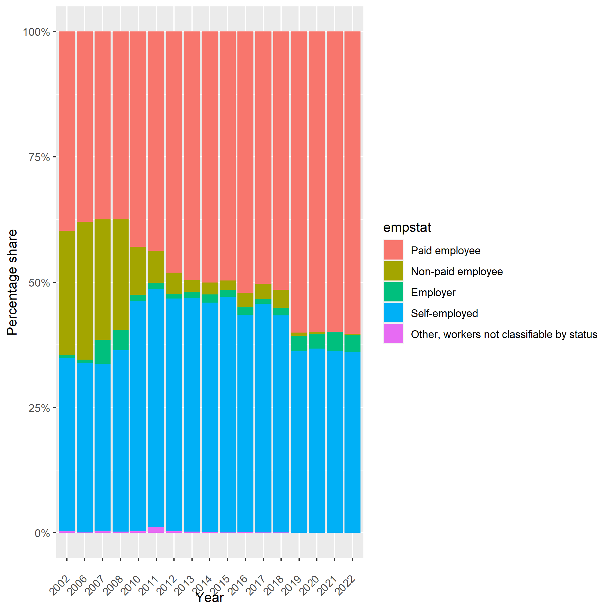

### Mapping for Employment Categories

The table below summarizes the mapping between the harmonized employment categories (`harmvar`) and the categories in the raw dataset (`rawvar`). These mappings generate estimates consistent with the ILO for each of the ICSE-93 status of employment categories.

| `harmvar`                                        | `rawvar`                                                                                   |
|--------------------------------------------------|-------------------------------------------------------------------------------------------|
| Employer                                         | In his/her own business activity or ina business operated by a household or family member **and** regularly hires workers, Employer |
| Self-employed                                    | In a business operated by a household or family member, Employed in animal husbandry, Own account worker, Self employer [sic] |
| Paid employee                                    | As an employee for someone else, As an apprentice, intern, Paid employee, Paid employee on contract, Paid employee under civil law|
| Non-paid employee                                | Helping a family member who works for someone else, Unpaid family worker                  |
| Other, workers not classifiable by status        | Member of cooperative, Other                       |

When examining the mappings, several noteworthy trends emerge. The figure below shows a significant decrease in *non-paid employees*, especially during 2008-2010 and 2018-2019. From 2008 to 2010, *non-paid employees* declined sharply from ~206,000 to ~100,000, while there was a corresponding increase in *paid employees*. In the years 2018 and 2019, terminology shifted from "unpaid family worker" to "helping a family member". Despite this change, our mapping consistently categorized both under *non-paid employee*, mirroring ILO's classification of both as *contributing family workers*. The GLD estimates of *non-paid employee*  are consistent with ILO's estimates for these periods; hinting that the observed shifts highlights the data's inherent nature rather than any discrepancy in harmonization. 

