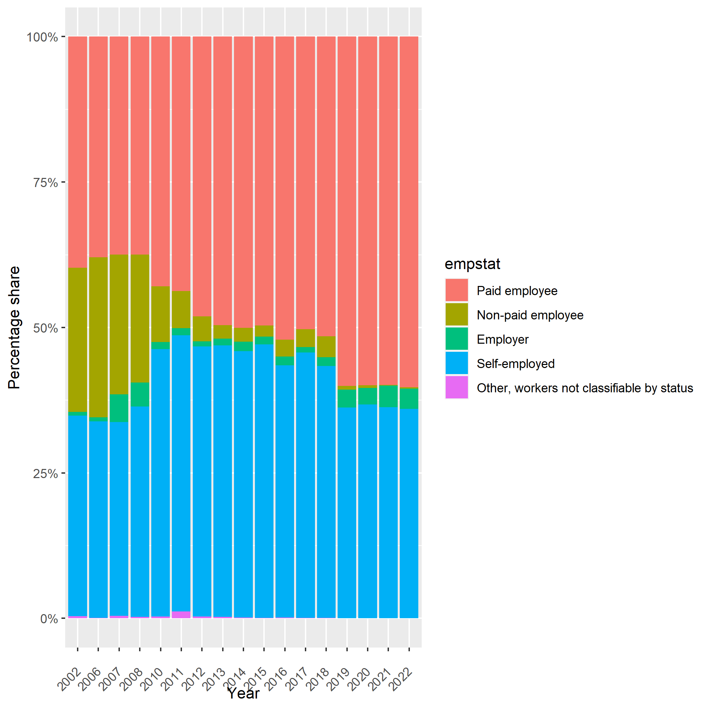
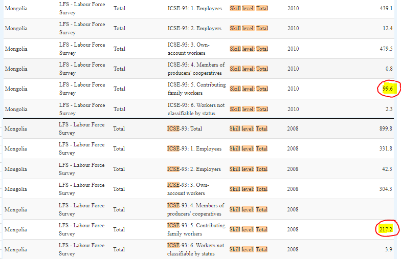
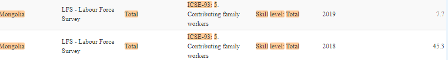

### Mapping for Employment Categories

The table below summarizes the mapping between the harmonized employment categories (`harmvar`) and the categories in the raw dataset (`rawvar`). These mappings generate estimates consistent with the ILO for each of the ICSE-93 status of employment categories.

| `harmvar`                                        | `rawvar`                                                                                   |
|--------------------------------------------------|-------------------------------------------------------------------------------------------|
| Employer                                         | In his/her own business activity or ina business operated by a household or family member **and** regularly hires workers, Employer |
| Self-employed                                    | In a business operated by a household or family member, Employed in animal husbandry, Own account worker, Self employer [sic] |
| Paid employee                                    | As an employee for someone else, As an apprentice, intern, Paid employee, Paid employee on contract, Paid employee under civil law|
| Non-paid employee                                | Helping a family member who works for someone else, Unpaid family worker                  |
| Other, workers not classifiable by status        | Member of cooperative, Other                       |

When examining the mappings, several noteworthy trends emerge. The figure below shows a significant decrease in *non-paid employees*, especially during 2008-2010 and 2018-2019. 

 

 

From 2008 to 2010, *non-paid employees* declined sharply from ~206,000 to ~100,000, while there was a corresponding increase in *paid employees*. In the years 2018 and 2019, category wording shifted from "unpaid family worker" to "helping a family member who works for someone else". Accompanying this semantic shift, estimates recorded a marked decrease, from about 45,000 in 2018 to roughly 7,600 in 2019. Despite this change, our mapping consistently categorized both under *non-paid employee*, mirroring ILO's classification of both as *contributing family workers*. These drastic changes on the number of *non-paid employese*  are consistent with ILO's estimates for these periods (see screenshots from the tables [from ILOSTAT](https://ilostat.ilo.org/data/) below). 

**ILO estimates for 2008 and 2010**

 

 

**ILO estimates of contributing family workers for 2018 and 2019**

 

 

According to ILO the number of unpaid family workers in 2018 is half of that in 2010 and near vanishing in 2019 - despite the labour force growing overall in absolute terms, confirming the GLD estimates. Users should be wary of the effect this anomaly may have in their analyses.

### Distinguishing paid and unpaid workers in the 2024 survey

There is a small change in the questionnaire in the recent rounds. In the 2022 and 2023 rounds, the GLD used `E04` for the broad status in employment and `E11` for the paid versus unpaid split among employee or apprentice cases (`E11 = 1` yes, `E11 = 2` no). In the 2024 round, the broad status question `E04` remains the same, but `E11` is no longer the same question and cannot be used for that split. Instead, the questionnaire records the type of payment in `E18`. To keep the harmonized `empstat` as close as possible to the previous methodology, the GLD still uses `E04` as the backbone of the mapping and uses `E18` only to separate paid employee or apprentice cases from explicitly unpaid ones. In practice, employee or apprentice cases with a reported form of payment in `E18` are treated as paid employees, while cases coded as unpaid in `E18` are treated as non-paid employees. Another small difference across the recent rounds is the employer split among own-account and family-business cases: the 2022 coding upgrades only regular hirers to employer, while the 2023 and 2024 coding upgrades both regular and occasional hirers.
