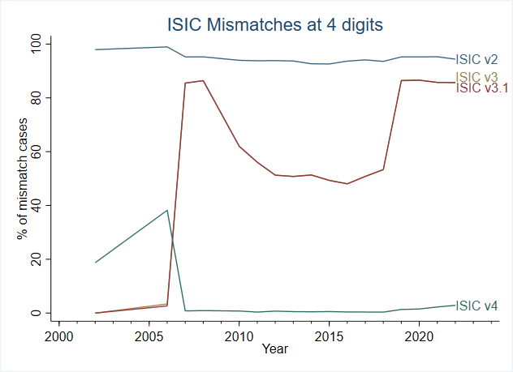
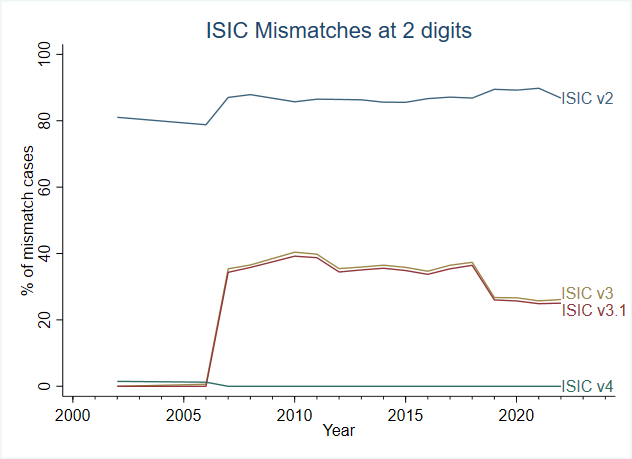

# Industry classification

The Mongolia LFS questionnaires indicate the use of International Standards for Industrial Classification (ISIC) to identify industry of employment, but the exact ISIC version is not specified. We determine the ISIC version by looking at the structure of the codes. As an example, ISIC 3.1 has codes starting with 01 and 02 for agriculture, 05 for fishing and then it skips to codes starting with 10 for mining and quarrying. In ISIC rev 4 agriculture and fishing has codes starting with 01 to 03, with mining and quarrying as codes 05 to 09. Hence codes 06 to 09 exist only in ISIC 4. There is a number of markers like this that allow us to identiy the version. In addition, we run an algorithm to see the number of mismatches at the 2- and 4- digits for each revision (e.g., does code XYZX exists in ISIC revision #?) and plot this over time to identify potential breaks (see below). These result align with the code structure. From 2002 to 2006, the industry codes match most frequently with ISIC version 3.1, while the rounds from 2007 and onwards more often match with ISIC version 4. 

  

Moreover, beginning the 2011 round, the questionnaire forces people with employment status of "employed in animal husbandry" and "unpaid family workers" to skip the question on industry codes (and, in fact, all subsequent questions like firm size or contract). For those in animal husbandry we can overwrite their industry code as `0140` (Agricultural and animal husbandry service activities, except veterinary
activities). For unpaid family workers this cannot be done and may influence a bit the composition of the industry breakdown. Up to 2011 the majority of unpaid family workers were active in agriculture.
