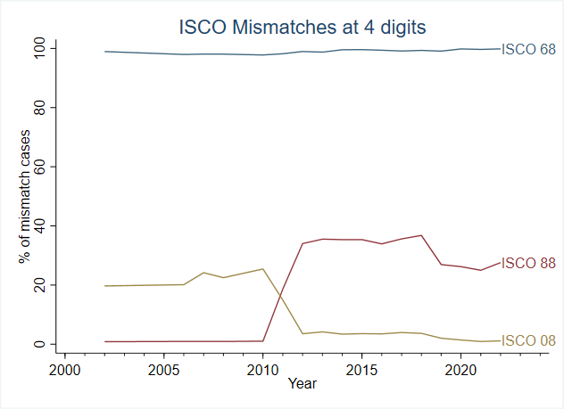

# Mapping occupation codes
The Mongolia LFS questionnaires suggest that the use of International Standards for Classification of Occupations (ISCO) to identify occupations, but the exact ISCO version is not specified. We identify the ISCO version based on the least number of mismatches. As suggested by the plot below, from 2002 to 2010, the occupation codes most often align with ISCO 1988. However, from 2011 onwards, the codes correlate more closely with ISCO 2008. Some mismatches occur, found in an earlier ISCO version, and some codes do not fit any ISCO versions. This issue is present in all rounds that seem to use ISCO 2008 but is especially noticeable in the 2011 round. We believe this may be due to a transition period between the two ISCO versions. To address this, we have opted to use only the first two digits of the codes for this round.

  
