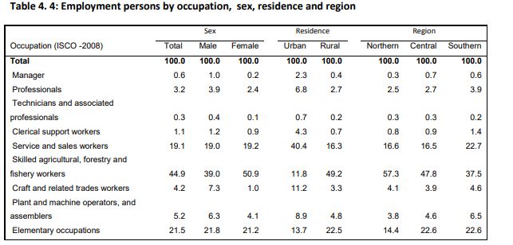
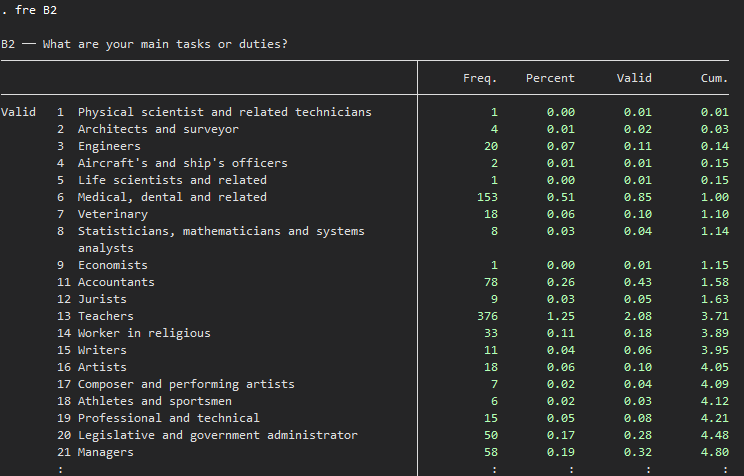
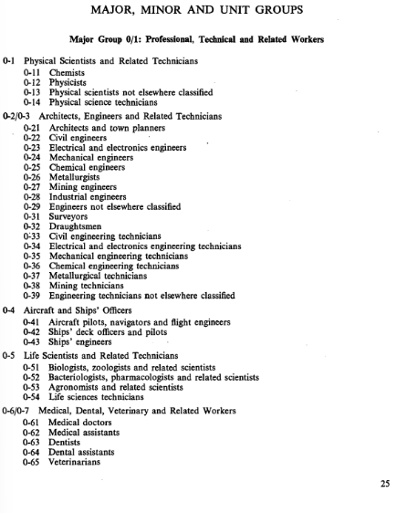
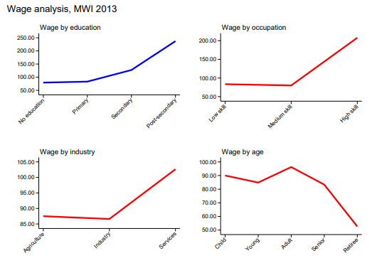

# Introduction to Serbia Labour Force Survey (MWI LFS)

- [What is the MWI LFS?](#what-is-the-mwi-lfs)
- [What does the MWI LFS cover?](#what-does-the-mwi-lfs-cover)
- [Where can the data be found?](#where-can-the-data-be-found)
- [What is the sampling procedure?](#what-is-the-sampling-procedure)
- [What is the geographic significance level?](#what-is-the-geographic-significance-level)
- [Other noteworthy aspects](#other-noteworthy-aspects)

## What is the MWI LFS?
The Malawi Labour Force Survey (LFS) is a household-based survey designed to measure employment, unemployment, and other labour force characteristics of the population aged 15–64. The MLFS provides key information on the size and composition of the labour force, employment by occupation, industry and status, the non-working population, and youth unemployment. Its results support labour market monitoring and inform policies on decent work, employment creation, poverty reduction, and national development goals

## What does the MWI LFS cover?
The survey collects information on labour market status, distinguishing between employment, unemployment, and the population not working. It provides data on the size and structure of the labour force for the population aged 15–64, including demographic characteristics, employment by occupation, industry and employment status, and youth unemployment.

The Global Labor Database (GLD) currently includes harmonized information for Malawi for the following survey year:

| **Year** | **# of Households** | **# of Individuals** | **Expanded Population** | **Officially Reported Sample Size (# HH)** |
|:--------:|:------------------:|:-------------------:|:----------------------:|:------------------------------------------:|
| 2013 | 10,562 | 29,978  | 10,371,041 | 10,818 |

## Where can the data be found?
The datasets are not accessible to the public and researchers have to request the data from the National Bureau of Statistics (NBS). The World Bank has been granted access to the datasets, if you work or are part of the World Bank Group, kindly contact the Jobs Group with a formal request for access to gld@worldbank.org

## What is the sampling procedure?
The 2013 Malawi Labour Force Survey used a two-stage sampling design. In the first stage, 550 clusters were selected from the 2008 Population and Housing Census sampling frame: 213 in urban areas and 337 in rural areas. By region, the sample included 97 clusters in the Northern region, 192 in the Central region, and 261 in the Southern region.

In the second stage, after a complete household listing was conducted in the selected clusters, 20 households were systematically selected from each cluster. In total, 11,000 households were sampled: 4,260 in urban areas and 6,740 in rural areas. All household members aged 10 years and over were eligible for individual interview.

## What is the significance level?
The 2013 Malawi LFS was designed to provide estimates at the regional level, as well as by area of residence within each region. Therefore, the survey allows analysis for the Northern, Central, and Southern regions, and for urban and rural areas within those regions.

## Other noteworthy aspects

### Limitations for selected harmonized variables

The 2013 Malawi LFS questionnaire does not collect information on the relationship to the household head or marital status. As a result, it is not possible to construct the harmonized variables `relationharm` and `marital_status` for this survey year.

## Limitations for migration-related harmonized variables

The 2013 Malawi LFS includes information that allows identifying whether a person migrated. However, the data shared for harmonization do not provide enough detail to classify the place of origin into the harmonized migration area categories.

In particular, the dataset does not include district-level information for the place of origin, and the country of origin is stored through value labels that were not available in the shared files. As a result, it is not possible to construct the following harmonized variables:

- `migrated_from_cat`
- `migrated_from_code`
- `migrated_from_country`

Therefore, these variables are set to missing in the harmonized Malawi LFS 2013 dataset.

### Note on occupation classification

The 2013 Malawi LFS report presents occupational results using **ISCO-2008**. For example, in the section on employment by occupation, the report labels the occupational breakdown as **“Occupation (ISCO-2008)”**.

This is because the data include a harmonized occupation variable at the **major group level** — that is, at the **one-digit level** — aligned with **ISCO-2008**. This harmonized major-group variable was used to construct `occup`, which follows the ISCO-2008 major groups.

However, when reviewing the more detailed occupation codes available in the microdata, the coding structure appears to correspond to **ISCO-1968 (ISCO-68)** rather than ISCO-2008. Therefore, `occup_isco` was constructed using **ISCO-68** codes.

This distinction should be considered if the occupation variables are analyzed at a more detailed level, beyond the one-digit major groups. In short, `occup` follows the ISCO-2008 major groups, while `occup_isco` reflects the more detailed ISCO-68 occupation codes available in the microdata.

For more details, see the survey report here: [Malawi Labour Force Survey 2013 Report](utilities/Final_LFS_Report_2013.pdf).

The image below shows the report’s reference to **ISCO-2008**:

*MWI 2013 employment by occupation - Report*

The following images illustrate that the detailed occupation codes observed in the microdata are instead consistent with **ISCO-68**:

*Microdata - Occupation codes consistent with ISCO-68*

*Isco-68 revised edition*

### Employment definition and harmonization

The definition of employment used in the Malawi LFS differs slightly from the standard international definition recommended by the International Labour Organization (ILO). 

To ensure cross-country comparability, the Global Labor Database (GLD) applies harmonization procedures that align the survey definitions as closely as possible with international standards. 

For a detailed description of the differences between the original survey definition and the harmonized GLD definition, as well as the specific adjustments applied during the harmonization process, please refer to this [document](Employment%20Definition.md).

### Wage patterns and consistency checks

The wage analysis for Malawi 2013 shows the expected pattern by education: average wages increase with higher educational attainment, especially for individuals with post-secondary education.

However, some patterns require caution. In the occupation-based wage comparison, medium-skilled occupations do not show higher average wages than low-skilled occupations, which is not the expected pattern. In the industry comparison, wages in services are higher than in agriculture and industry. While this may reflect the structure of the Malawian labour market, it should still be interpreted carefully. Finally, the age profile shows that children report higher average wages than young workers, which is also unexpected.

The GLD team did not identify a clear explanation for these patterns in the available documentation or data checks. For this reason, we flag these results as potential consistency issues. Wage-related estimates remain available in the harmonized data, but users should interpret analyses by occupation, industry, and age group with caution.

### Education system in Malawi

This section describes how education levels are recorded in the 2013 Malawi LFS and how they are harmonized in the Global Labor Database (GLD).

The survey asks respondents to report the highest level of schooling completed, with the following categories: no education, primary, secondary, university, other tertiary, and vocational education. This information is used to construct `educy`, which measures years of education, and `educat7`, which classifies educational attainment into seven internationally comparable categories.

The table below summarizes the correspondence between the education levels reported in the Malawi LFS, the assigned years of education, and the resulting GLD harmonization

| Level in Malawi LFS | Years | educat7|
|---|---:|---|
| None | 0 | No education |
| Primary | 8 | Primary complete |
| Secondary | 12 | Secondary complete |
| University | 16 | University incomplete or complete |
| Other tertiary | 14 | Higher than secondary but not university |
| Vocational | 13 | Higher than secondary but not university |

Since the Malawi LFS records only the highest completed education level, it is not possible to distinguish incomplete and complete levels within primary, secondary, or university education. Therefore, primary and secondary are treated as completed levels, while university is classified under `University incomplete or complete`.