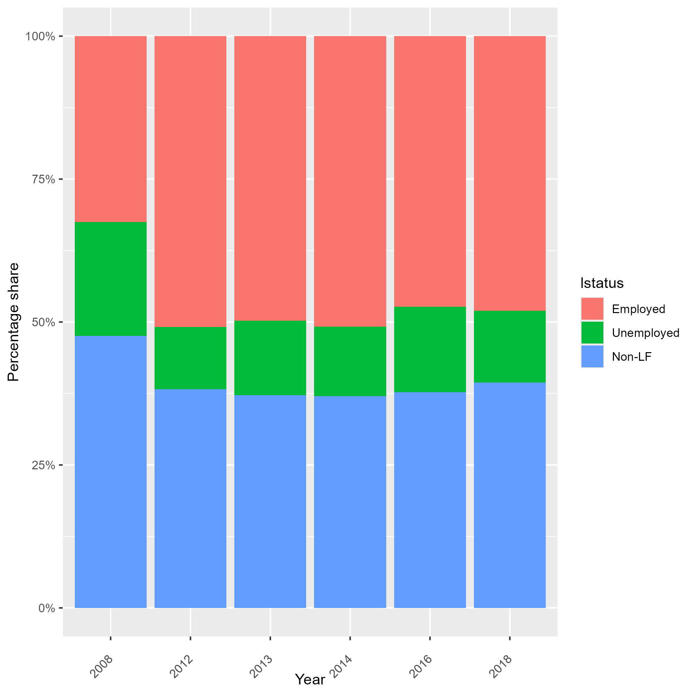

# Labor Force Survey (LFS)

- [What is the NAM LFS?](#what-is-the-nam-lfs)
- [What does the NAM LFS cover?](#what-does-the-nam-lfs-cover)
- [Where can the data be found?](#where-can-the-data-be-found)
- [What is the sampling procedure?](#what-is-the-sampling-procedure)
- [What is the significance level?](#what-is-the-geographic-significance-level)
- [Other noteworthy aspects](#other-noteworthy-aspects)

## What is the NAM LFS?

The Namibia (NAM) Labour Force Survey (LFS) is the comprehensive survey of Namibia's labor market, conducted by the Namibia Statistics Agency (NSA). The first LFS was carried out in 1997 as part of the National Household Survey Programme. Since then, nine Labour Force Surveys have been conducted in the country, typically at four-year intervals until 2012, after which they have been held annually. No LFS was conducted in 2015 due to the implementation of the 2015/2016 Namibia Household and Income Survey (NHIES). In 2017, the survey was not conducted due to budget constraints.

## What does the NAM LFS cover?

The LFS provides essential socio-economic indicators for assessment of labour market conditions. Currently, the GLD has information from 2008 to 2018. The harmonized sample sizes are: 

| Year  | # of Households         | # of Individuals |
| :---- | :--------------         | :--------------- |
| 2008  | 5,262                   | 22,966           |
| 2012  | 8,661                   | 34,531           |
| 2013  | 8,524                   | 33,744           |
| 2014  | 9,772                   | 40,212           |
| 2016  | No Information          | 47,345           |
| 2018  | 9,728                   | 40,993           |


## Where can the data be found?

The LFS data from 2012 to 2018 is downloadable freely from the [Namibian Statistical Service Microdata Catalog website](https://microdata.nsanamibia.com/index.php/catalog/?page=1&sk=lfs&ps=15). The website also provides all necessary documentation. The 2008 data is not public available, please contact Namibian Statistical Service for more information.

## What is the sampling procedure?

The LFS uses a two-stage stratified cluster 
sample. The LFS 2018 manual ([see document](utilities/2018%20Labour%20Force%20Survey%20Report%20.pdf)) outlines the sampling procedure as:

```
A national sampling frame was used in the design of the sample. The national sampling frame 
is a list of small geographical areas called Primary Sampling Units (PSU), created using the 
enumeration areas (EA) of which their demarcations are based on the 2011 Population and Housing 
Census. The measure of size in the frame is the number of households within a particular PSU of which 
the size ranges between 40 and 120 households. The frame units were stratified first by regions, and 
then by Urban/Rural areas within the regions.

The sample design was therefore a two-stage stratified cluster sample, where the first stage units 
were the PSUs and the second stage units were the households. Sample sizes were determined 
to give reliable estimates of the population characteristics at the regional level, the lowest domain 
of estimation for the LFS 2018.

```

The number of PSU samples varies over the years. The LFS 2008 uses enumeration areas (EAs) based on the 2001 Population and Housing Census, while subsequent years are based on the 2011 Census.

## What is the geographic significance level?

The LFS is representative at the regional level and rural/urban division.

## Other noteworthy aspects

### Survey Weights
For LFS 2012 to 2014, the survey weights, are available at the individual level. A more detailed explanation can be found in the [LFS 2012 document](utilities/book%20Final.pdf) (Section A3.3, Estimation Procedure)

```
These sample weights were then post-adjusted using the sex, age distribution of the 
2011 Population and Housing Census. These post-adjusted weights were then included 
in the data set to be used by the statistical software during the analysis.
```

For the years 2008, 2016, and 2018, the survey weights are available at the household level.

### Unemployment concept in Namibia
The Namibian LFS uses an unemployment concept that differ slightly from the harmonization methodology employed by the GLD. In this section, we explain the unemployment concepts used by the LFS and the differences with those of the GLD. Additionally, we provide codes in case users wish to apply the country's definitions to the survey.

In GLD we define unemployment as a individual jobless and available **and** looking for a job. In Namibian LFS, the the Namibia Statistics Agency uses a broader definition: unemployed are jobless individual who are available **or** looking for a job.

The below code, shows how to update the section on unemployed in the `lstatus` definition using national concept.

```
* ABOVE CODE AS IN CURRENT VERSION
	
*code unemployed
  // Code active, passive and emp_not_start as in the current version and add this code below
	replace lstatus = 2 if ((active == 1 | passive == 1 ) | (emp_not_start == 1)) & missing(lstatus)

* BELOW CODE AS IN CURRENT VERSION
```

### Occupation codes

The Namibian Labour Force Survey (LFS) employs the Namibia Standard Classification of Occupations (NASCO) for the coding of occupations. When compared to the International Labour Organization’s ISCO-88 system, NASCO’s Major and Sub-Major groups closely align with those of ISCO-88. However, the Minor and Unit groups have been modified to better reflect Namibia’s specific labour market context.For this reason, the GLD harmonization relies exclusively on the Major and Sub-Major groups.

### Questionnarie methodology

When comparing employment trends over the years (Figure 1), the labour status data for the LFS 2008 appears to be inconsistent with those of other years. Specifically, the number of employed individuals is significantly lower, while the number of unemployed individuals is notably higher.  This discrepancy is due to the structure of the survey. Starting with the LFS 2012, there was a change in methodology and the questions related to employment. The LFS 2012 report highlights this (Introduction, Highlights of changes in labour indicators 2004 to 2012): 

```
Close to three quarters (72.6 per cent) of the labour force are employed. The employed 
population of 630 094 persons obtained from the 2012 survey is almost twice that of 
the 2008 survey which puts the employed population at 331 444 persons. Further, the 
NLFS 2012 produced an unemployment rate of 27.4 per cent, much lower than the rate 
of 51.2 per cent reported in the previous survey. The substantial increase in the number 
of employed and the large decrease in the unemployment rate is in large part due to an 
improved methodology that resulted in better capture of categories of employed people 
other than paid employees.
```


<figure>

<figcaption><b>Figure 1</b><i> Labour Status Namibian LFS </i></figcaption>



</figure>


Another way to highlight this is by examining the employment status of individuals (Figure 2). In the LFS 2008, compared to the other years, there is a higher proportion of salaried workers and a lower proportion of self-employed and unpaid employees.


<figure>

<figcaption><b>Figure 2</b><i> Employment Status Namibian LFS </i></figcaption>


</figure>


In conclusion, when using the entire dataset, it is important to consider this difference in the survey structure.

### Namibian LFS 2016 identificator issue

Based on the available data from the LFS 2016, it is not possible to construct a unique household identifier `hid`. As a result, any variables derived at the household level cannot be generated `pid`, `hsize` .

In case year of the LFS, it is essential to consider this limitation from the outset of the analysis.

### Education System in Namibia

Namibia’s formal education system is organized into a 7-3-2 structure: seven years of primary education, followed by three years at the lower secondary level, and concluding with two years of upper secondary schooling.The table below illustrates the average duration in years of each stage. This information is useful for creating the variable `educy`, that codes the number of years spent in education and the variable `educat7`, that classifies the highest level of education attained by the respondent to seven levels.


| **Education Level**        | **Years** |
|----------------------------|:---------:|
| Primary                    | 7         |
| Junior Secondary School    | 3         |
| Senior Secondary School    | 2         |
| Vocational/Technical       | 2         |
| University                 | 5         |
| Master                     | 2         |
| PhD                        | 5         |


