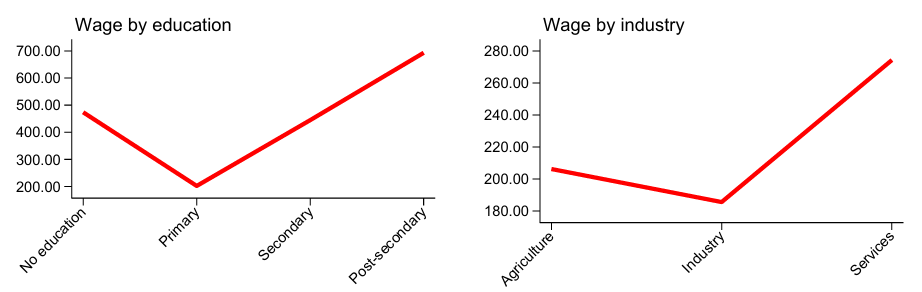

# Introduction to Niger 1-2-3 Survey, Phase 1 - Niamey (NER E123)

- [What is the NER E123?](#what-is-the-ner-e123)
- [What does the NER E123 cover?](#what-does-the-ner-e123-cover)
- [Where can the data be found?](#where-can-the-data-be-found)
- [What is the sampling procedure?](#what-is-the-sampling-procedure)
- [What is the geographic significance level?](#what-is-the-geographic-significance-level)
- [Other noteworthy aspects](#other-noteworthy-aspects)

## What is the NER E123?
The 1-2-3 Survey, Phase 1 is an employment survey designed to provide detailed information on labour market conditions, including activity, unemployment, employment structure, labour income, working conditions, and perspectives in the main urban labour markets of seven UEMOA countries. The survey was conducted in 2001–2002 in Abidjan, Bamako, Cotonou, Dakar, Lomé, Niamey, and Ouagadougou, using an identical methodology that allows reliable comparisons across these cities. This report focuses exclusively on Niamey, Niger, using the information from Phase 1 of the 1-2-3 Survey to describe the main characteristics of the labour market in the city.

## What does the NER E123 cover?
The survey provides information on the main characteristics of employment, unemployment, and activity conditions in Niamey. It covers socio-demographic characteristics, schooling, labour force participation, unemployment, employment structure and dynamics, labour income, working conditions, and labour market perspectives. The survey distinguishes between employed persons, unemployed persons, and inactive persons, and includes information that allows the analysis of urban labour market conditions in Niamey in comparison with other UEMOA capital cities.

This report focuses exclusively on Niamey, Niger, using information from Phase 1 of the 1-2-3 Survey.

| **Year** | **# of Households** | **# of Individuals** | **Expanded Population** | **Officially Reported Sample Size (# HH)** | **Officially Expanded Population** |
|:--------:|:------------------:|:-------------------:|:----------------------:|:------------------------------------------:|:------------------------------------------:|
| 2002 | 2,500 |  14,286  | 566,705 | Not reported | 675,000 |

As shown in the table, the expanded population obtained from the microdata is not exactly the same as the population reported in the official publication. However, both figures are relatively close. For more information on this difference, see [Available documentation and data consistency](#available-documentation-and-data-consistency).

## Where can the data be found?
The datasets are not publicly accessible. The version used in the Global Labor Database (GLD) comes from internal World Bank access to the survey microdata. If you work at or are part of the World Bank Group, please contact the Jobs Group with a formal request for access at gld@worldbank.org.

## What is the sampling procedure?
The available documentation does not provide a detailed description of the sampling design used for the Niamey 1-2-3 Survey. However, the STATECO publication indicates that Phase 1 was conducted in 2001–2002 in the main economic capitals of seven UEMOA countries, including Niamey, using an identical methodology across cities. The target population corresponds to ordinary households in the main urban agglomeration.

## What is the significance level?
The survey is representative at the city level. For this report, the relevant geographic level of representativeness is Niamey, since the analysis focuses exclusively on the Niamey sample.

## Other noteworthy aspects

### Available documentation and data consistency

The main public reference used for this report is the [STATECO publication](utilities/NER%20E123%20Niamey%20STATECO%20documentation.pdf). Given the age of the survey, this is the only documentation identified that provides useful reference information on Phase 1 of the 1-2-3 Survey and includes Niamey among the surveyed UEMOA capital cities.

For this reason, the STATECO publication is used as the main source to describe the survey context, coverage, methodology, and labour market concepts.

Some differences remain between the aggregates obtained from the microdata and the figures reported in the publication. In particular, the expanded population obtained from the microdata is not exactly the same as the population reported in the publication. However, the labour aggregate values are broadly similar and show relative patterns consistent with the data. For this reason, the publication is considered a useful reference for documenting the survey.

### Commune-level information

Niamey is composed of five [communes](https://en.wikipedia.org/wiki/Niamey#Administration). The microdata include a variable named `com`, which appears to refer to commune-level information, but it contains only three distinct values. The GLD team believes that the survey may have covered three of Niamey’s five communes, although no documentation was found to confirm this interpretation. Therefore, the variable was not included in the harmonization process. this information is documented here and remains available for users who may wish to take it into account in future analyses.

### Occupation coding

The survey asks about occupation through question `AP1`. However, the occupation responses are coded using an undocumented classification. Based on the values observed in the microdata, the coding scheme does not appear to match any standard ISCO classification available for harmonization.

Since no documentation was found to identify the meaning of these codes or to map them reliably to ISCO, the occupation-related harmonized variables were left as missing.

### Wage comparisons

The figure below shows the median hourly wage among paid employees by education level and industry.

**Median hourly wage, Niger-Niamey E123 2002**

The table below reports the corresponding median hourly wage and the number of paid employees with wage information in each category.

| Variable | Category | Median hourly wage | Sample size |
|---|---:|---:|---:|
| Education | No education | 473.4 | 1 |
| Education | Primary | 197.3 | 383 |
| Education | Secondary | 433.0 | 33 |
| Education | Post-secondary | 641.5 | 161 |
| Industry | Agriculture | 206.2 | 6 |
| Industry | Industry | 185.6 | 115 |
| Industry | Services | 274.2 | 677 |

At first glance, some results may seem counterintuitive. In the education graph, paid employees with no education appear to have higher median hourly wages than those with primary education. Similarly, in the industry graph, paid employees in agriculture appear to have higher median hourly wages than those in industry.

However, these patterns are mainly explained by the number of observations available in each category. In the education comparison, the “No education” category has only one paid employee with wage information, so the median is entirely driven by a single individual. In the industry comparison, agriculture has only six paid employees with wage information, making the median highly sensitive to the composition of those few cases.

For this reason, these estimates should not be interpreted as robust evidence of higher wages among paid employees with no education or among paid employees in agriculture. Instead, they reflect the limitations of wage comparisons when some categories have very small sample sizes. The figure and table are useful for exploratory analysis, but categories with very few observations should be interpreted carefully.

### Education system in Niger-Niamey

The table below presents the general correspondence used to harmonize education in the Niger 1-2-3 Survey. The harmonization uses completed years of education from `m15` to construct `educy`, and combines this information with the reported education level in `m14b` to classify respondents into `educat7`.

| Education level in the survey | Years in `educy` | `educat7` |
|---|---:|---|
| No education | 0 | No education |
| Primary education | 1–6 | Primary incomplete / Primary complete |
| Secondary education | 7–13 | Secondary incomplete / Secondary complete |
| Post-secondary non-university education | 14 or more | Higher than secondary but not university |
| University or higher education | 13 or more | University incomplete or complete |

Since some inconsistencies were observed between the reported education level and completed years of education, the harmonization applies basic plausibility checks. When the reported level and completed years are inconsistent, completed years of education are used to assign the closest comparable `educat7` category.

The table below summarizes the main inconsistencies observed after comparing completed years of education with the final harmonized education category. These inconsistencies appear to come from the original survey variables rather than from the harmonization process.

| Consistency check | Number of observations | Harmonization treatment |
|---|---:|---|
| Respondents classified as secondary incomplete with fewer than 6 completed years of education | 9 | Kept as secondary incomplete when the reported education level indicates secondary education |
| Respondents classified as primary complete with more than 6 completed years of education | 6 | Kept as primary complete when the reported education level indicates primary education |

Overall, the harmonization is internally consistent after applying the plausibility checks. The remaining cases reflect discrepancies between completed years of education and reported education level in the original data. Therefore, they are documented here for transparency but are not treated as coding errors in the harmonized variables.