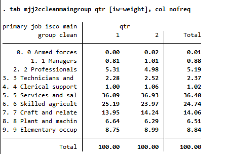

# Introduction to the Nigeria (NGA) Labour Force Survey (LFS)

- [What is the NGA LFS](#what-is-the-nga-lfs)
- [What does the NGA LFS cover?](#what-does-the-nga-lfs-cover)
- [Where can the data be found?](#where-can-the-data-be-found)
- [What is the sampling procedure?](#what-is-the-sampling-procedure)
- [What is the geographic significance level?](#what-is-the-geographic-significance-level)
- [Other noteworthy aspects](#other-noteworthy-aspects)


## What is the NGA LFS?

The NGA LFS is a quarterly survey collected by the Nigeria National Bureau of Statistics (NBS). The quarterly survey was first launched in Q4 2022 as a successor to an annual household labor force survey, which was has been conducted
after the passage of the Statistics Act of 2008 (refer [here](utilities/On%20the%20Compilation%20of%20Labour%20Force%20Statistics%20for%20Nigeria.pdf)). The quarterly survey has adopted the ICLS-19 standards, improved household listing processes, organized continuous fieldwork, and utilized advanced technology for real-time data monitoring to enhance labor market statistics (for more information, refer to this [blog](https://blogs.worldbank.org/en/opendata/moving-frontier-labor-market-statistics-nigeria))


## What does the NGA LFS cover?

The NGA LFS contains data on the labor force (employed and unemployed) and the household demographic and geographic characteristics, e.g., gender, age, education,and economic activity.

The raw datasets retrieved from the NBS start in Q4 2022 for four quarters. The next quarter starts in Q1 of 2024 to align the survey year to the quarter year. However, only Q1 and Q2 have been released publicly thus far.

The harmonized years and sample sizes used in the GLD harmonization are:

| Year	        | # of Households | # of Individuals  |
| :-------	    | :--------		  | :--------	 	  |
| 2022          | 35,235          |  185,250          |
| 2024 (Q 1& 2) | 17,627          |  90,170           |


## Where can the data be found?

The microdata are free and publicly available on the National Bureau of Statistics' Microdata Catalog (link here)[https://microdata.nigerianstat.gov.ng/index.php/catalog/?page=1&ps=100]. The website also provides all necessary documentation.

## What is the sampling procedure?

The NGA LFS uses a two-stage cluster design, selecting first enumeration areas (EA) and subsequently households (HH) in each EA. 24 EAs are canvassed quarterly in each State (and the Federal District), while 10 HHs are selected systematically in each EA. All households with members 15 years and above are eligible to be interviewed for the labor force component.

## What is the geographic significance level?

The data covers a sample of urban and rural enumeration areas in all 36 states of Nigeria. The survey is designed to detail estimates by urban/rural for the quarterly data, and state-level for the full-year data. Note that for 2024, since the raw datasets do not cover the full year, we set the representativeness at urban/rural, and potentially update it once the full year data becomes available. 

Nigeria groups the 36 states into 6 regions. No changes have been made in the geographic divisions throughout the survey series.

<br></br>

<br></br>


## Other noteworthy aspects

### Aggregation into yearly data

The NGA LFS is designed as a yearly survey. The data collection was started in the last quarter of 2022 and therefore the year is made up of Q4 of 2022 in addition to Q1 through Q3 of 2023. The next wave of the survey did not start in Q4 of 2023. Instead that quarter was skipped so the next round of survey could start in Q1 of 2024, to align survey and calendar year.

### Definition of concept of employment

Since the passing of the [resolution concerning statistics of work, employment and labour underutilization](https://www.ilo.org/global/statistics-and-databases/standards-and-guidelines/resolutions-adopted-by-international-conferences-of-labour-statisticians/WCMS_230304/lang--en/index.htm) in 2013 at the 19th International Conference of Labour Statisticians (ICLS) surveys are at risk of a series break due to the change in the concept of employment.

In short, the ICLS 19 resolution restricts employment to *work performed for others in exchange for pay or profit*, meaning that own consumption work (e.g., subsistence agriculture or building housing for oneself) are not counted as employment.

The GLD codes the harmonization’s `lstatus` variable based on the concept used in the survey. This has been the case for all years in the Nigeria LFS. Nonetheless, it possible to alter the code so that it matches the previous definition. The precise details are covered in a [separate document here](Converting%20between%20ICLS%20definitions.md)


### ISCO and ISIC Classification

The data already included the occupation and economic activities in the ISCO-08 and ISIC version 4, respectively. 


### Missing information on industry and occupation in Q2 2024

The information on industry and occupation is collected from respondents in the form of descriptions (e.g., shoe repair, primary school teacher) transcribed by the enumerators and converted by the statistical office into ISIC and ISCO codes (here ISIC revision 4 and ISCO 2008). However, in the second quarter of 2024, nearly half of the answers have not been converted into codes. To identify the cases, we used the following definitions:

```
gen odd_ind = .
replace odd_ind = 1 if !mi(mjj3a) & mi(mjj3cclean)
replace odd_ind = 0 if !mi(mjj3a) & mi(odd_ind)

gen odd_occ = .
replace odd_occ = 1 if !mi(mjj2a) & mi(mjj2cclean)
replace odd_occ = 0 if !mi(mjj2a) & mi(odd_occ)
```

where `mjj2a` and `mjj3a` are the text answers to occupation and industry, respectively, while `mjj2cclean` and `mjj3cclean` are the coded versions. This gives the distribution shown below:


The upper half shows the relationship between the variables. We can see that whenever industry information is missing, occupation information is also missing. There are a few cases (59) where occupation information has not been coded but industry has. The lower half shows the cases of non-coded occupation information by quarter. Nearly all cases occur in the second quarter.

The GLD team has communicated this to local teams in the hope that the statistical offices will correct this. However, it seems the missing information is truly missing at random. The below shows the percent distribution of industry and occupation information per quarter (i.e., with half the information missing in Q2 versus a full set in Q1).

|  **Industry**	                                | **Occupation**                                   | 
| :-------------------------------------------: | :----------------------------------------------: |
| |  | 

Nonetheless, users are advised to use the data with caution.


### Missing data on wages

The GLD variable for wages , `wage_no_compen` and `wage_no_compen_2` are not coded in the Nigeria LFS even though there is wage information available in the raw data. This is for two reasons. Firstly, the wage variable in the raw data combines wages for both primary and secondary occupation. The GLD variables make a distinction between the wages for the primary occupation, `wage_no_compen` and `wage_no_compen_2`. Secondly, the variable in the raw data is a categorical variable representing a range of values, while the GLD requires the wage variables to be continuous. 

Users may add variables on the earnings across all jobs (and the time unit) by using the below code.

```
gen all_earnings_cat = sjj12
la de aec 1 "Under 5K" 2 "5K to under 10K" 3 "10K to under 20K" 4 "20K to under 30K" ///
5 "30K to under 50K" 6 "50K to under 70K" 7 "70K to under 100K" ///
8 "100K to under 500K" 9 "500K+"
label values all_earnings_cat aec
label var all_earnings_cat "All earnings categories"

gen all_earnings_time = sjj10
la de aet 1 "Hourly" 2 "Daily" 3 "Weekly" 4 "Fortnight" 5 "Month" 6 "Annual" 7 "No Payment (should skip earnings categories)"
label values all_earnings_time aet
```

### Use of relative weights in 2022/23

In the first survey year (Q4 2022 to Q3 2023), the weight information shared in the data is a relative weight. The "true" weight, which reflects the national population of Nigeria, was normalized so that the sum (in each quarter) equals one million. Therefore, for the 2022 data, only relative estimates can be obtained (e.g., the labor force participation rate), but no absolute estimates (e.g., the number of people in the labor force).

One option to address this is to apply the total population from another source and adjust the weight accordingly. The code below demonstrates how this can be achieved using WDI information via the `wbopendata` command:

```
* Assume harmonized 2022 file is loaded.

preserve
	
	* Load WDI population data for NGA in 2022 (requires installing wbopendata)
	wbopendata, country(NGA) indicator(SP.POP.TOTL) year(2022:2022) long clear
	
	* Store population in local
	local wdi_nga_22_pop = sp_pop_totl[1]

restore

* Now amend the weight to match that value. To do so, we need to increase all
* weights by a scalar equal to the ratio of the actual population divided by the 
* survey population. First, obtain the survey population, then use the local to 
* calculate the scalar. Lastly, create a new variable applying the scalar.
summ weight
local survey_pop = `r(N)' * `r(mean)'
local scalar = `wdi_nga_22_pop' / `survey_pop'
gen weight_wdi = weight * `scalar'

* Example shows, absolutes now present, relative weight maintained.
tab lstatus if inrange(age, 15, 999) [iw = weight]
tab lstatus if inrange(age, 15, 999) [iw = weight_wdi]
```

Note that the population estimated via WDI may differ from the population of an LFS. Hence, in 2024, the population (via the survey weight) may be lower than the WDI population for 2022 despite the population in Nigeria growing. Users wanting to smooth the population estimates over the years may calculate population growth from WDI between 2022 and 2024, then apply that back to the 2024 survey population to obtain a "survey-like" 2022 population to apply to the scalar.


