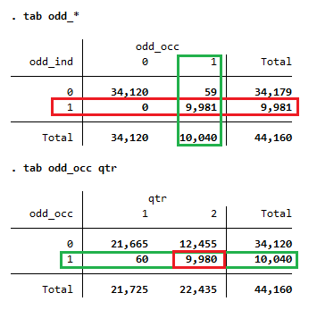
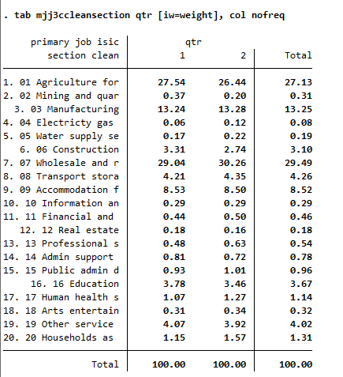
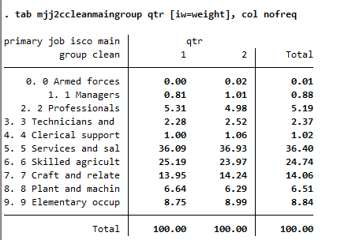

# Introduction to the NGA Labour Force Survey (LFS)

- [What is the NGA LFS survey?](#what-is-the-nga-lfs)
- [What does the NGA LFS cover?](#what-does-the-nga-lfs-cover)
- [Where can the data be found?](#where-can-the-data-be-found)
- [What is the sampling procedure?](#what-is-the-sampling-procedure)
- [What is the significance level?](#what-is-the-geographic-significance-level)
- [Other noteworthy aspects](#other-noteworthy-aspects)

## What is the NGA LFS?

The Nigerian Labour Force Survey is a routine household survey conducted by National Bureau of Statistics to collect data about labour market indicators in Nigeria. It was started in 2022 based on a new methodology to align with the latest ILO labor market definitions and methodology recommendations.

## What does the NGA LFS cover?

The Nigerian LFS covers general household and individual information 

| Year	| # of Households	| # of Individuals	|
| :-------	| :--------		| :--------	 	    |
| 2022      | 35,235        |  185,250          |
| 2024      | 17,627        |  90,170           |

## Where can the data be found?

The microdata are free and publicly available on the National Bureau of Statistics' Microdata Catalog (link here)[https://microdata.nigerianstat.gov.ng/index.php/catalog/?page=1&ps=100]. The website also provides all necessary documentation.

## What is the sampling procedure?

The NGA LFS uses a two-stage cluster design, selecting first enumeration areas (EA) and subsequently households (HH) in each EA. 24 EAs are canvassed quarterly in each State (and the Federal District), while 10 HHs are selected systematically in each EA.

## What is the geographic significance level?

The sample is designed to report at State and National level when using all four quarters, the data is nationally representative for each quarter.

## Other noteworthy aspects

### Aggregation into yearly data

The NGA LFS is designed as a yearly survey. The data collection was started in the last quarter of 2022 and therefore the year is made up of Q4 of 2022 in addition to Q1 through Q3 of 2023. The next wave of the survey did not start in Q4 of 2023. Instead that quarter was skipped so the next round of survey could start in Q1 of 2024, to align survey and calendar year.

### Use of relative weights in 2022/23

In the first survey year (Q4 2022 to Q3 2023), the weight information shared in the data is a relative weight. The "true" weight, which reflects the national population of Nigeria, was normalized so that the sum (in each quarter) equals one million. Therefore, for the 2022 data, only relative estimates can be obtained (e.g., the labor force participation rate), but no absolute estimates (e.g., the number of people in the labor force).

One option to address this is to apply the total population from another source and adjust the weight accordingly. The code below demonstrates how this can be achieved using WDI information via the `wbopendata` command:

```
* Assume harmonized 2022 file is loaded.

preserve
	
	* Load WDI population data for NGA in 2022 (requires installing wbopendata)
	wbopendata, country(NGA) indicator(SP.POP.TOTL) year(2022:2022) long clear
	
	* Store population in local
	local wdi_nga_22_pop = sp_pop_totl[1]

restore

* Now amend the weight to match that value. To do so, we need to increase all
* weights by a scalar equal to the ratio of the actual population divided by the 
* survey population. First, obtain the survey population, then use the local to 
* calculate the scalar. Lastly, create a new variable applying the scalar.
summ weight
local survey_pop = `r(N)' * `r(mean)'
local scalar = `wdi_nga_22_pop' / `survey_pop'
gen weight_wdi = weight * `scalar'

* Example shows, absolutes now present, relative weight maintained.
tab lstatus if inrange(age, 15, 999) [iw = weight]
tab lstatus if inrange(age, 15, 999) [iw = weight_wdi]
```

Note that the population estimated via WDI may differ from the population of an LFS. Hence, in 2024, the population (via the survey weight) may be lower than the WDI population for 2022 despite the population in Nigeria growing. Users wanting to smooth the population estimates over the years may calculate population growth from WDI between 2022 and 2024, then apply that back to the 2024 survey population to obtain a "survey-like" 2022 population to apply to the scalar.

### Missing information on industry and occupation in Q2 2024

The information on industry and occupation is collected from respondents in the form of descriptions (e.g., shoe repair, primary school teacher) transcribed by the enumerators and converted by the statistical office into ISIC and ISCO codes (here ISIC revision 4 and ISCO 2008). However, in the second quarter of 2024, nearly half of the answers have not been converted into codes. To identify the cases, we used the following definitions:

```
gen odd_ind = .
replace odd_ind = 1 if !mi(mjj3a) & mi(mjj3cclean)
replace odd_ind = 0 if !mi(mjj3a) & mi(odd_ind)

gen odd_occ = .
replace odd_occ = 1 if !mi(mjj2a) & mi(mjj2cclean)
replace odd_occ = 0 if !mi(mjj2a) & mi(odd_occ)
```

where `mjj2a` and `mjj3a` are the text answers to occupation and industry, respectively, while `mjj2cclean` and `mjj3cclean` are the coded versions. This gives the distribution shown below:



The upper half shows the relationship between the variables. We can see that whenever industry information is missing, occupation information is also missing. There are a few cases (59) where occupation information has not been coded but industry has. The lower half shows the cases of non-coded occupation information by quarter. Nearly all cases occur in the second quarter.

The GLD team has communicated this to local teams in the hope that the statistical offices will correct this. However, it seems the missing information is truly missing at random. The below shows the percent distribution of industry and occupation information per quarter (i.e., with half the information missing in Q2 versus a full set in Q1).

|  **Industry**	                                | **Occupation**                                   | 
| :-------------------------------------------: | :----------------------------------------------: |
| |  | 

Nonetheless, users are advised to use the data with caution.


### ISIC mapping example (MEX)

The Mexican INEGI codes industry in the ENE based on the North American Industry Classification System (NAICS). This system is very different from the international ISIC format. To map from NAICS to ISIC (versions 3.1 and 4) to code `industrycat_isic`, a special procedure is needed. This process is detailed in a [separate document, available here](../B%20-%20Country%20Survey%20Details/MEX/ENOE/Correspondence_NAICS_ISIC.md).

### Other Documentation Files 
If we want to link to other documentation files in the same directory, the issue is that we cannot use the permalink web address because eventually the document will change branches, and the link will change. However, GitHub have allowed for [this solution](https://github.blog/2013-01-31-relative-links-in-markup-files/), which involves relative linking. As long as the Introduction and linked files are in the same directory, simply follow the example below and the relative link will always link to the file no matter what branch the files are on: 
- [GLD Code Template](GLD_Harmonization_Template.do)
