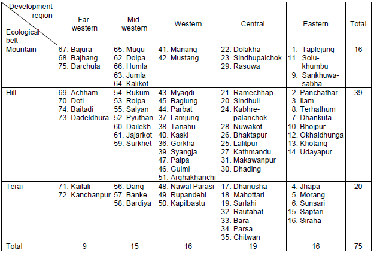
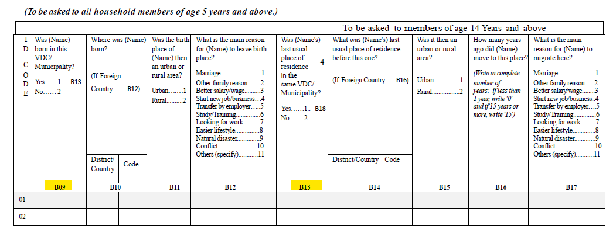
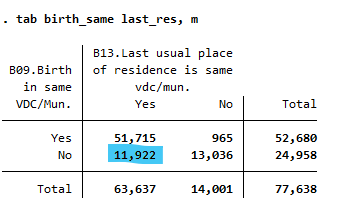
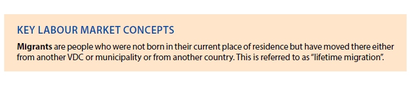

# Introduction to Nepal (NPL) national Labour Force Survey (LFS)

- [What is the NPL LFS](#what-is-the-npl-lfs)
- [What does the NPL LFS cover?](#what-does-the-npl-lfs-cover)
- [Where can the data be found?](#where-can-the-data-be-found)
- [What is the sampling procedure?](#what-is-the-sampling-procedure)
- [What is the geographic significance level?](#what-is-the-geographic-significance-level)
- [Other noteworthy aspects](#other-noteworthy-aspects)

## What is the NPL LFS?

The 1998 NPL LFS is the first labor force survey in the country. The Ninth Five-Year Development Plan of Nepal prioritized poverty alleviation through employment generation and skills enhancement. The national LFS was initiated with the aim to better monitor the labour market and provide comprehensive statistics on employment, unemployment, and underemployment. The 1998 LFS was carried out by the Central Bureau of Statistics (CBS) from 1998 to 1999, with technical assistance from the International Labour Organization and financial support from the United Nations Development Programme. The second LFS took place in 2008, while the latest available data is from 2017.

## What does the NPL LFS cover?

The NPL LFS mainly covers detailed information on demographic details, including age, sex, marital status, and location, education, and labour market activities. This harmonization series has three years: 1998, 2008, and 2017. The first year, 1998 does not have migration section compared to the other two years. 1998 and 2008 both have two recall periods, 7-day and 12-month recall periods whereas 2017 only has 7-day recall period. In terms of geographical coverage, all three years cover the whole country, and the data are nationally representative. 

Below is a table showing each year's simple size with their official annual reports linked:

| **Year**	| **# of Households**	| **# of Individuals**	| **Expanded Population**	| **# of PSU**	| **Planned Sample Size(# HH)**	| **Planned # of PSU**	|
| :------:	| :-------:		| :-------:	 	| :-------:	 	| :-------:	| :-------:	| :-------:	|
| [1998](utilities/NPL_LFS_1998_report.pdf)  | 14,355 | 74,622  |  20,085,787  |  719  | 14,400 | 720 |
| [2008](utilities/NPL_LFS_2008_report.pdf)  | 15,976 | 76,208  |  24,075,099  |  799  | 15,976 | 799 |
| [2017](utilities/NPL_LFS_2017_report.pdf)  | 18,000 | 77,638  |  29,022,288  |  900  | 18,000 | 900 |

## Where can the data be found?

The NPL LFS data is not publicly available. All the data we used was downloaded from SARRAW via datalibweb using the command `datalibweb, country(NPL) year(2017) type(SARRAW) surveyid(NLFS) clear`. It requires team members request the data and SAR team to approve it to download the data. Hence, the data is only accessible among World Bank colleagues upon request.

## What is the sampling procedure?

For 1998 and 2008, the total number of households is divided evenly between rural and urban areas. During the selection, a two-stage stratified sampling procedure based on probability proportional to size (PPS) was applied in both years. In the first stage, wards (PSUs) were selected with PPS, where the number of households in the ward at the time of the census provided the measure of size. In the second stage, from all the households listed in the selected PSUs, 20 households were selected from each on a systematic sampling basis. 

The level of representativeness changed from four regions to seven provinces and hence the sample design in 2017 is different from the previous years in stratification and sample selection. During the sample selection, 2017 has the problem that too few PSUs with large number of households and most of the PSUs have small number of households. To address this issue, 2017 LFS used a stratification strategy which stratifies PSUs in each domain (province combined with rural/urban division) into three following the Lavallee-Hidiroglou (LH) algorithm. Details of this methodology are illustrated below and can be found on page 3 in the [2017 annual report](utilities/NPL_LFS_2017_report.pdf). 

```
This stratification method jointly minimizes the total coefficient of variation and the sample size in the choice of stratum
boundaries and in the determination of sampling rate per stratum. Further accounting for the possible discrepancy between the
stratification variables (number of households) and the target variable (e.g., number of employed individuals), modified LH
Algorithm is used for a thorough review of methods of stratifying skewed populations. Modified LH Algorithm used to identify
stratum boundaries of the three strata. Stratum 1 and Stratum 2 are smaller than Stratum 3, and are called the “take some”
strata. Stratum 3, comprising of “bigger” PSUs where big is defined in terms of number of households, is also called “take all”
stratum. From all the strata, samples were drawn from probability proportional to size (PPS) except in the areas where all the
PSUs were taken in the sample. Regarding the sampling from stratum 3, the "take all" criterion was followed in all the rural
areas and urban areas of province 3 only.
```

## What is the geographic significance level?

In 1998 and 2008, the distribution of the total 75 districts is by five developing regions and three ecological belts. The five regions are: Eastern, Central, Western, Mid-western, and Far-western. And the three ecological belts are: mountain, hill, and terai. The distribution is shown in the table below. The **geographic significance level of 1998 and 2008 is region by rural and urban divisions**. 



In 2017, the first level of administration changed to seven provinces and thus the geographic **significance level of 2017 is the combination of province and rural/urban divisions**, which generates fourteen statistically significant domains.

## Other noteworthy aspects  

### Names of the Provinces 

The provinces of Nepal were created by the 2015 consitution of Nepal (and hence surveys are divided by regions). In the official report of 2017, four out of seven provinces were named after numbers (i.e., Province 1, Province 2, Province 3 and Province 5) instead of their actual province names and so does the raw data set. By checking the populations and and districts they have, we confirmed their names (and coded them in variable `subnatid1`) as:

* Province 1: Koshi
* Province 2: Madhesh
* Province 3: Bagmati
* Province 4: Gandaki
* Province 5: Lumbini
* Province 6: Karnali 
* Province 7: Sudurpashchim

### The Splits of Nawalparasi and Rukum 

Two districts in Nepal have experienced an administrative change during the harmonized years. Nawalparasi was divided into district Parasi and district Nawalpur in 2015 (at the time of the creation of Nepal's provinces). The district Parasi was assigned to Gandaki province whereas district Nawalpur is located in Lumbini province. 

Similarly, Rukum district was split into two districts in 2017. It was split into district Western Rukum located in Lumbini province and Eastern Rukum in Karnali province. Instead of using the new district names, the raw data of 2017 still uses the original district names Nawalparasi and Rukum, which matches one district to two different provinces. To correct this mismatch, we re-coded these two districts by splitting the observations and assigning them to their new districts, based on their provinces. In this way we increased the total number of district from 75 to 77. 
 
Because these changes happened after 2008 and 2008 did not use province as its administrative level in the survey, we only recoded the two districts to match observations to their current province in 2017.      

### Change of the Employment Standard

Since the passing of the [resolution concerning statistics of work, employment and labour underutilization](https://www.ilo.org/global/statistics-and-databases/standards-and-guidelines/resolutions-adopted-by-international-conferences-of-labour-statisticians/WCMS_230304/lang--en/index.htm) in 2013 at the 19th International Conference of Labour Statisticians (ICLS) surveys are at risk of a series break due to the change in the concept of employment.

In short, the ICLS 19 resolution restricts employment to *work performed for others in exchange for pay or profit*, meaning that own consumption work (e.g., subsistence agriculture or building housing for oneself) are not counted as employment.

The GLD codes the harmonization’s `lstatus` variable based on the concept used in the survey. In the case of the NPL LFS this change occurs between 2008 and 2017, when the survey switches to new definition. This implies that estimates for 2017 may not be directly comparable with those from the previous years. However, it is possible to recode `lstatus` such that it matches the previous definition. The precise details are covered in a [separate document here](Converting%20between%20ICLS%20Definitions.md).

### Definition of Migrants

As shown below, questions **B09** and **B13** in the questionnaire of 2017 are directly related to whether a given respondent is a migrant or not. B09 and B13 correspond to original variables `birth_same` and `last_res` respectively in the raw data set. But tabulating these two variables indicates that 11,922 observations whose last usual place of residence is in the same municipality were not born in the same place. This might be caused by the lack of clarity of "usual place of residence" and the reference period of migration.   




The annual report of 2017 states the definition of "Lifetime Migration" as the follows:



According to this definition, observations whose birthplaces are not current municipalities (or in other words, `birth_same` is equal to two) should be regarded as migrants. In this way, the weighted number of migrants matched the reported data as 10,510,000. However, this is just a country-specific definition of migration. To incorporate this "Lifetime Migration" into the GLD definition, we define that in addition to observations whose birthplace is not their current residence, observations born in the same municipality but have different last usual places of residence are also migrants. Furthermore, we set the age limit to 14 and above, excluding people aged from 5 to 13. Hence, we have 10,203,959 migrants following our definition.

### Classifications of Industry and Occupation

In general, NPL 1998 and NPL 2008 both follow ISIC Rev.3 and ISCO-88 for industrial and occupational classifications respectively, while NPL 2017 follows ISIC Rev.4 and ISCO-08. The national and international classifications only have a few cases of discrepancy. The detailed corresponding table is included in a [separate document](Correspondence_National_International_Classifications.md). 
