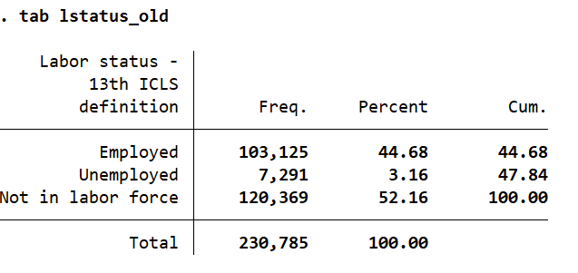
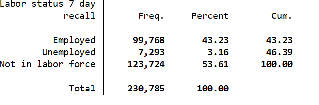
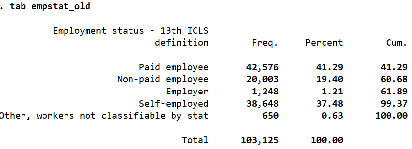
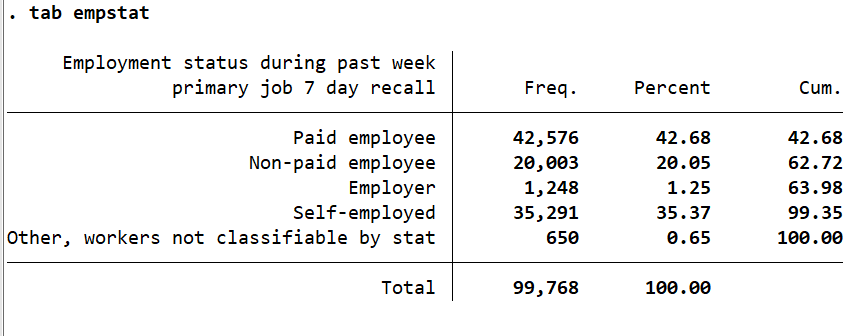
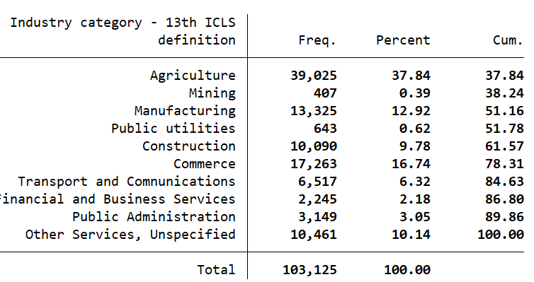
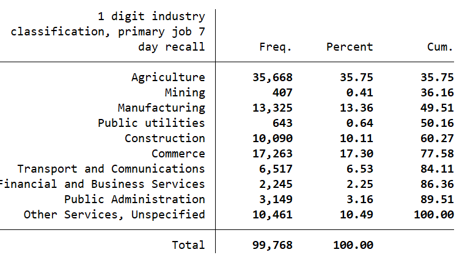
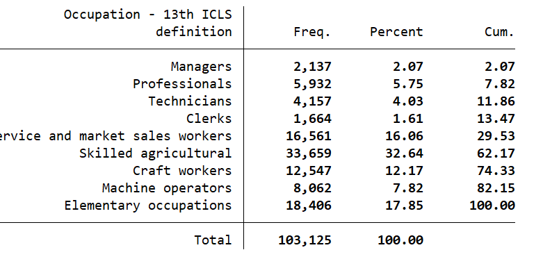
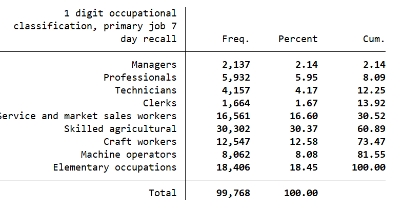

# Introduction
Since the passing of the [resolution concerning statistics of work, employment and labour underutilization](https://www.ilo.org/global/statistics-and-databases/standards-and-guidelines/resolutions-adopted-by-international-conferences-of-labour-statisticians/WCMS_230304/lang--en/index.htm) in 2013 at the 19th International Conference of Labour Statisticians (ICLS) surveys are at risk of a series break due to the change in the concept of employment.

In short, the ICLS 19 resolution restricts employment to *work performed for others in exchange for pay or profit*, meaning that own consumption work (e.g., subsistence agriculture or building housing for oneself) are not counted as employment.

# Coding to convert the 2024 ILFS to the old definition

In converting back to the 13th ICLS definition, the approach adopted here is to identify workers engaged in subsistence or own-use agricultural production who are excluded from employment under the 19th ICLS. In the 2024 PAK LFS, these workers are precisely identified by whether they produce mainly or solely for family use — the skip pattern that routes them out of the employment module entirely. Since these workers never reach the employment questions, their industry, occupation, and employment status must be imputed: they are assigned to agriculture (industrycat10 = 1), skilled agricultural occupations (occup = 6), and self-employment (empstat = 4), consistent with their activity type. The code below is suggested to conduct comparision analysis with surveys that use the old ICLS definition. 
```
* ------------------------------------------------------------------
* ICLS 13th BRIDGE CODE — PAK LFS 2024
* Reconstructs employment variables as they would appear under ICLS 13
* The excluded group: subsistence/own-use agricultural producers
* identified by S5C10 = 3 or 4 (products mainly/only for family use)
* These workers were skipped to Section 9 under ICLS 19 and have
* no employment module responses (S5C11, S5C12, S5C13 all missing)
* ------------------------------------------------------------------

* LSTATUS: add back as employed
gen lstatus_old = lstatus
replace lstatus_old = 1 if inrange(s5c10, 3, 4)
label var lstatus_old "Labor status - 13th ICLS definition"

* EMPSTAT: self-employed (independent worker, code 4)
* Subsistence producers have no employer and work on own account
gen empstat_old = empstat
replace empstat_old = 4 if inrange(s5c10, 3, 4)
replace empstat_old = . if lstatus_old != 1
label var empstat_old "Employment status - 13th ICLS definition"

* INDUSTRYCAT10: Agriculture (category 1, ISIC 0100-0399)
* All these workers came through S5C8 farming/rearing/fishing
gen industrycat10_old = industrycat10
replace industrycat10_old = 1 if inrange(s5c10, 3, 4)
replace industrycat10_old = . if lstatus_old != 1
label var industrycat10_old "Industry category - 13th ICLS definition"

* OCCUP: Skilled agricultural workers (category 6, ISCO 6000-6999)
gen occup_old = occup
replace occup_old = 6 if inrange(s5c10, 3, 4)
replace occup_old = . if lstatus_old != 1
label var occup_old "Occupation - 13th ICLS definition"

```
| Before (13th ICLS) | After (19th ICLS) |
|:------------------:|:-----------------:|
|  |  |
|  |  |
|  |  |
|  |  |


