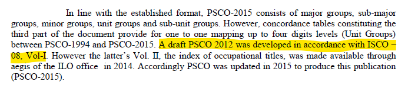

# Correspondences between national and international classifications

This document describes the methodology used to map national industrial and occupational codes to their international counterparts. For industry, three versions of national classification, *Pakistan Standard Industrial Classification (PSIC)*, were mapped to three versions of *International Standard Industrial Classification of all Economic Activities (ISIC)*; regarding occupation, three versions of national classification, *Pakistan Standard Classification of Occupations (PSCO)*, were mapped to two versions of *International Standard Classification of Occupations (ISCO)*. Specific versions mapped for each year harmonized are summarized in the table below along with internal links to the docs.

|**Year**|**# Digit of PSIC**|**PSIC Version**|**ISIC Version**|**# Digit of PSCO**|**PSCO Version**|**ISCO Version**| 
|:----:|:-:|:----:|:----------:|:-:|:----:|:-------:|  
| 1992 | 2 | [1970](utilities/PSIC_2007) | ISIC Rev.2 | 2 | [1994](utilities/PSCO94_to_ISCO88) | ISCO-88 | 
| 1999 | 2 | 1970 | ISIC Rev.2 | 2 | 1994 | ISCO-88 |
| 2001 | 2 | 1970 | ISIC Rev.2 | 2 | 1994 | ISCO-88 |
| 2003 | 2 | 1970 | ISIC Rev.2 | 2 | 1994 | ISCO-88 |
| 2005 | 2 | 1970 | ISIC Rev.2 | 2 | 1994 | ISCO-88 |
| 2007 | 2 | 1970 | ISIC Rev.2 | 2 | 1994 | ISCO-88 |
| 2008 | 2 | [2007](utilities/PSIC_2007) | ISIC Rev.3 | 2 | 1994 | ISCO-88 |
| 2009 | 2 | 2007 | ISIC Rev.3 | 2 | 1994 | ISCO-88 |
| 2010 | 2 | 2007 | ISIC Rev.3 | 2 | 1994 | ISCO-88 |
| 2012 | 2 | 2010 | ISIC Rev.4 | 2 | 2012 | ISCO-08 |
| 2013 | 2 | [2010](utilities/PSIC_2010) | ISIC Rev.4 | 2 | 2015 | ISCO-08 |
| 2014 | 2 | 2010 | ISIC Rev.4 | 2 | [2015](utilities/PSCO_2015) | ISCO-08 |
| 2017 | 4 | 2010 | ISIC Rev.4 | 4 | 2015 | ISCO-88 |
| 2018 | 4 | 2010 | ISIC Rev.4 | 4 | 2015 | ISCO-88 |
| 2020 | 4 | 2010 | ISIC Rev.4 | 2 | 2015 | ISCO-88 |

Note that in the annual report of LFS 2012, PSCO 2012 is said to be used for occupation classification. However, PSCO 2012 is a PSCO draft that is in fact the same as PSCO 2015 which is the latest version, according to the FOREWORD page of PSCO 2015 manual.

## Correspondence in industry classification

**PSIC 1970 to ISIC Rev.2**

PSIC 1970 has an identical structure as ISIC Rev.2 with 10 major divisions. At two-digit level, PSIC has the same code and categories mathcing ISIC except the fifth major division, construction. In construction division, PSIC mas more sub-categories. In this case, we mapped all sub-categories of construction to 50-Construction in ISIC. This is the only difference between the two classifications. 

| **PSIC-1970 Code**	| **PSIC-1970 Industry**	| **ISIC Rev.2 Code**	| **ISIC Rev.2 Industry**	|
| :-----------------------:	| :---------------------------:	| :-------------:|:----------------:|	 	
| 51 | Building Construction | 50 | Construction |
| 52 | Construction, repair, maintenance of streets, roads, highways and bridges | 50 | Construction |
| 53 | Construction, repair, maintenance of irrigation, flood control, drainage and reclamation and hydro-electric projects | 50 | Construction |
| 54 | Construction, repair and maintenance of docks and communication projects| 50 | Construction |
| 55 | Construction, repair and maintenance of sports projects | 50 | Construction |
| 56 | Construction, repair and maintenance of sewers, water mains and storm water drains | 50 | Construction |
| 57 | Construction, repair and maintenance of pipe lines for transportation | 50 | Construction |
| 59 | Construction projects n.e.c. |50 | Construction |

**PSIC 2007 to ISIC Rev.3**

Similar to the correspondence between PSIC 1970 and Rev.2, PSIC 2007 is also only slightly different from Rev.3. The only difference between the two exists in major division 9, *Community, Social, and Personal Services*. PSIC 2007 has two more sub-categories in this division. They were mapped to the general category 93 in ISIC as follows:

| **PSIC-2007 Code**	| **PSIC-2007 Industry**	| **ISIC Rev.3 Code**	| **ISIC Rev.3 Industry**	|
| :-----------------------:	| :---------------------------:	| :-------------:|:----------------:|	 	
| 96 | Undifferentiated goods-producing activities of private households for own use | 93 | Other service activities |
| 97 | Undifferentiated service-producing activities of private households for own use| 93 | Other service activities |

**PSIC 2010 to ISIC Rev.4**

PSIC 2010 is identical to Rev.4 at two-digit level in terms of code and industry. 

## Correspondence in occupation classification

**KBLJI 1982 to ISCO 1968**

KBJI-1982 was used for most of the years as it constantly exists in the harmonized years with three digits. In terms of structure, it categorizes occupations in the same way as ISCO-1968 does. Similar to industry correspondence described above, several categories in KBJI-1982 have more subcategories than ISCO-1968's, which requests a good number of recoding. Therefore, the mapping work mainly refers to mapping additional KBJI subcategories to broader, more general subcategories in ISCO-1968. The table below shows the differences between the two classifications and how they were mapped.   

| **KBLI-1982 Code**	| **KBLI-1982 Industry**	| **ISCO 1968 Code**	| **ISCO 1968 Industry**	|
| :-----------------------:	| :---------------------------:	| :-------------:|:----------------:|	 	
| 055 | Life science technicians | 05 | Life scientists and related technicians |
| 123 | Attorney| 129 | Jurists not elsewhere classified |
| 133 | Junior secondary school teaching professionals  | 132 |Secondary education teachers |
| 134 | Primary school teaching professionals| 133 | Primary education teachers |
| 135 | Preschool teaching professionals | 134 | Pre-primary education teachers |
| 136 | Non-formal education teaching professionals | 139 | Manufacture of other non-metallic mineral products |
| 137 | Special education teaching professionals | 135 | Special education teachers |
| 142 | Christian-Protestant pastor and other associate professionals | 140 | workers in religion|
| 143 | Christian-Catholic priest and other associate professionals | 140 | workers in religion|
| 144 | Monks and other associate professionals in Buddhism religion | 140 | workers in religion|
| 145 | Pastor/ Pedanda and other associate professionals in Hinduism religion | 140 | workers in religion|
| 153 | Editors, writers and other not elsewhere classified | 150 | Authors, journalists and related writers|
| 169 | Others not elsewhere classified | 160 | Sculptors, painters, photographers and related creative artists
| 176 | Puppeteers, gamelan players and other associate artists | 179 | Performing artists not elsewhere classified |
| 177 | Protocols, broadcasters and associate professionals | 179 | Performing artists not elsewhere classified |
| 213 | Marketing Manager | 219 | Managers not elsewhere classified |
| 215 | Administration Manager | 219 | Managers not elsewhere classified |
| 216 | Personnel Manager | 219 | Managers not elsewhere classified |
| 217 | Manager of research and development | 219 | Managers not elsewhere classified |
| 323 | Telex clerks | 320 | Stenographers, typists and card- and tape-punching machine operators|
| 324 | Other stenographer, typist, and telex clerk not elsewhere classified | 320 | stenographers, typists and card- and tape-punching machine operators |
| 332 | Cashiers | 331 | Bookkeepers and cashiers |
| 333 | Treasurers | 339 | Bookkeepers, cashiers and related workers not elsewhere classified |
| 349 | Calculating machine operators and data processors not elsewhere classified | 340 | Computing machine operators |
| 352 | Head of ports | 359 | Transport and communications supervisors not elsewhere classified |
| 353 | Head of Airport | 359 | Transport and communications supervisors not elsewhere classified |
| 354 | Head of postal and giro office | 352 | Postmasters |
| 355 | Head of telephone and telegraph office | 352 | Postmasters |
| 371 | Letter deliverers | 370 | Mail distribution clerks |
| 372 | Other cargo distribution workers | 370 | Mail distribution clerks |
| 442 | Salesperson for building and land rental | 441 | Insurance, real estate and securities salesmen |
| 443 | Salesperson for bonds | 441 | Insurance, real estate and securities salesmen |
| 444 | Salesperson for corporate service | 442 | Business services salesmen |
| 445 | Auctioneer and appraisers | 443 | Auctioneers |
| 593 | Health service personnel | 599 | Other service workers |
| 613 | Breeders | 610 | Farmers |
| 632 | Forestry business workers | 630 | Forestry workers |
| 633 | Forest products seekers (except wood) | 632 | Forestry workers (except logging) |
| 642 | Inland waters fish catching workers | 641 | Fishermen |
| 643 | Marine fish cultivation workers | 641 | Fishermen |
| 644 | Marine fish catching workers (except the ship captain and crews) | 641 | Fishermen |
| 645 | Sea-product seekers (except fish) | 641 | Fishermen |
| 646 | Hunters | 641 | Fishermen |
| 721 | Main metal melting and refining operators | 720 | Metal processers |
| 722 | Metal grinding operators (metal grinding machine operators) | 720 | Metal processers |
| 723 | Metal metal melting and refining operators | 720 | Metal processers |
| 724 | Metal melting operators | 720 | Metal processers |
| 725 | Metal melting makers | 720 | Metal processers |
| 726 | Thermostat and metal hardening operators | 720 | Metal processers |
| 727 | Wire and pipe makers | 720 | Metal processers 
| 728 | Metal coating workers | 720 | Metal processers |
| 729 | Other metal processing workers not elsewhere classified | 720 | Metal processers |
| 739 | Other wood processing-, papermaking-, bamboo processing, rattan-processing not elsewhere classified | 730 | Wood preparation workers and paper makers |
| 757 | Batik makers | 759 | Spinners, weavers, knitters, dyers and related workers not elsewhere classified |
| 911 | Paper- and paperboard-products makers | 910 | Paper and paperboard products makers |
| 932 | Vehicle painters | 939 | Painters not elsewhere classified |
| 944 | Wood-curving-processing and related workers | 949 | Other production and related workers |
| 945 | Bamboo-processing workers | 949 | Other production and related workers |
| 946 | Rattan-processing workers | 949 | Other production and related workers |
| 987 | Rickshaws and pedal vehicle drivers | 989 | Transport equipment operators not elsewhere classified |

**KBJI 2002 to ISCO 1988**

Same as ISCO 1988, KBJI-2002 also has 0 to 9, 10 major groups in total. At three-digit level, only category 2 "Professionals", categroy 3 "Technicians and associate professionals", and category 0 "Armed forces" have different numbers of subgroups. KBJI-2002 has 19 whereas ISCO has 18 in category 2; and KBJI has 19 compared to 21 in ISCO's category 3; and 5 in KBJI category 0 versus 1 in ISCO. Therefore, we only recoded subgroups in "Professionals", "Technicians and associate professionals", and "Armed forces". 

