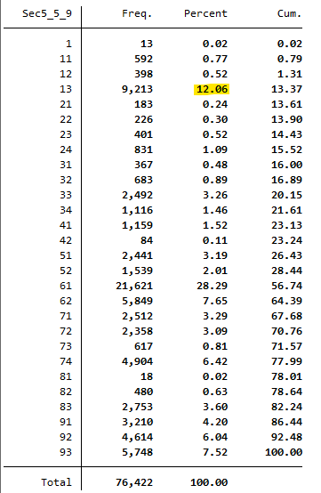
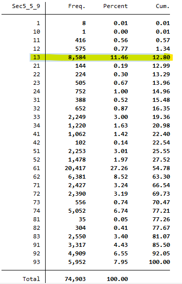
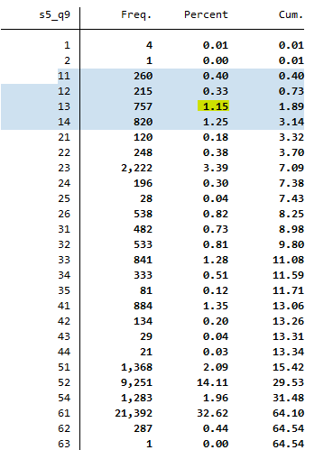
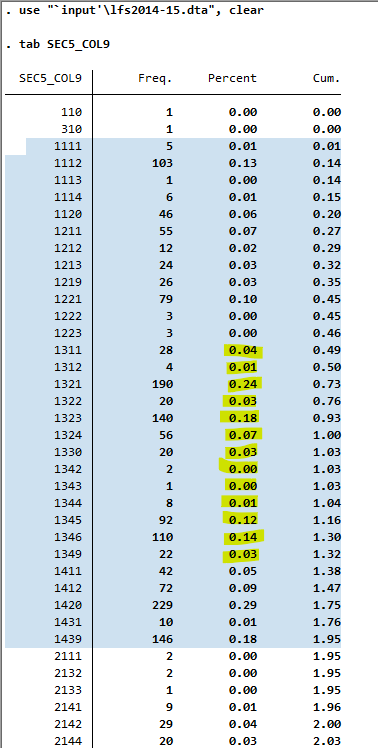

# Correspondences between national and international classifications

This document describes the methodology used to map national industrial and occupational codes to their international counterparts. For industry, three versions of national classification, *Pakistan Standard Industrial Classification (PSIC)*, were mapped to three versions of *International Standard Industrial Classification of all Economic Activities (ISIC)*; regarding occupation, three versions of national classification, *Pakistan Standard Classification of Occupations (PSCO)*, were mapped to two versions of *International Standard Classification of Occupations (ISCO)*. Specific versions mapped for each year harmonized are summarized in the table below along with internal links to the docs.

|**Year**|**# Digit of PSIC**|**PSIC Version**|**ISIC Version**|**# Digit of PSCO**|**PSCO Version**|**ISCO Version**| 
|:----:|:-:|:----:|:----------:|:-:|:----:|:-------:|  
| 1992 | 2 | [1970](utilities/PSIC_2007.pdf) | ISIC Rev.2 | 2 | [1994](utilities/PSCO94_to_ISCO88.xlsx) | ISCO-88 | 
| 1999 | 2 | 1970 | ISIC Rev.2 | 2 | 1994 | ISCO-88 |
| 2001 | 2 | 1970 | ISIC Rev.2 | 2 | 1994 | ISCO-88 |
| 2003 | 2 | 1970 | ISIC Rev.2 | 2 | 1994 | ISCO-88 |
| 2005 | 2 | 1970 | ISIC Rev.2 | 2 | 1994 | ISCO-88 |
| 2007 | 2 | 1970 | ISIC Rev.2 | 2 | 1994 | ISCO-88 |
| 2008 | 2 | [2007](utilities/PSIC_2007.pdf) | ISIC Rev.3 | 2 | 1994 | ISCO-88 |
| 2009 | 2 | 2007 | ISIC Rev.3 | 2 | 1994 | ISCO-88 |
| 2010 | 2 | 2007 | ISIC Rev.3 | 2 | 1994 | ISCO-88 |
| 2012 | 2 | 2010 | ISIC Rev.4 | 2 | 2012 | ISCO-08 |
| 2013 | 2 | [2010](utilities/PSIC_2010.pdf) | ISIC Rev.4 | 2 | 2015 | ISCO-08 |
| 2014 | 2 | 2010 | ISIC Rev.4 | 2 | [2015](utilities/PSCO_2015.pdf) | ISCO-08 |
| 2017 | 4 | 2010 | ISIC Rev.4 | 4 | 2015 | ISCO-88 |
| 2018 | 4 | 2010 | ISIC Rev.4 | 4 | 2015 | ISCO-88 |
| 2020 | 4 | 2010 | ISIC Rev.4 | 2 | 2015 | ISCO-88 |

Note that in the annual report of LFS 2012, PSCO 2012 is said to be used for occupation classification. However, PSCO 2012 is a PSCO draft that is in fact the same as PSCO 2015 which is the latest version, according to the FOREWORD page of PSCO 2015 manual.

## Correspondence in industry classification

**PSIC 1970 to ISIC Rev.2**

PSIC 1970 has an identical structure as ISIC Rev.2 with 10 major divisions. At two-digit level, PSIC has the same codes and categories mathcing ISIC except the fifth major division, construction. In construction division, PSIC mas more sub-categories. In this case, we mapped all sub-categories of construction to 50-Construction in ISIC. This is the only difference between the two classifications. 

| **PSIC-1970 Code**	| **PSIC-1970 Industry**	| **ISIC Rev.2 Code**	| **ISIC Rev.2 Industry**	|
| :-----------------------:	| :---------------------------:	| :-------------:|:----------------:|	 	
| 51 | Building Construction | 50 | Construction |
| 52 | Construction, repair, maintenance of streets, roads, highways and bridges | 50 | Construction |
| 53 | Construction, repair, maintenance of irrigation, flood control, drainage and reclamation and hydro-electric projects | 50 | Construction |
| 54 | Construction, repair and maintenance of docks and communication projects| 50 | Construction |
| 55 | Construction, repair and maintenance of sports projects | 50 | Construction |
| 56 | Construction, repair and maintenance of sewers, water mains and storm water drains | 50 | Construction |
| 57 | Construction, repair and maintenance of pipe lines for transportation | 50 | Construction |
| 59 | Construction projects n.e.c. |50 | Construction |

**PSIC 2007 to ISIC Rev.3**

Similar to the correspondence between PSIC 1970 and Rev.2, PSIC 2007 is also only slightly different from Rev.3. The only difference between the two exists in major division 9, *Community, Social, and Personal Services*. PSIC 2007 has two more sub-categories in this division. They were mapped to the general category 93 in ISIC as follows:

| **PSIC-2007 Code**	| **PSIC-2007 Industry**	| **ISIC Rev.3 Code**	| **ISIC Rev.3 Industry**	|
| :-----------------------:	| :---------------------------:	| :-------------:|:----------------:|	 	
| 96 | Undifferentiated goods-producing activities of private households for own use | 93 | Other service activities |
| 97 | Undifferentiated service-producing activities of private households for own use| 93 | Other service activities |

**PSIC 2010 to ISIC Rev.4**

PSIC 2010 is identical to Rev.4 at two-digit level in terms of code and industry naming. 

## Correspondence in occupation classification

As shown in the first table above, in fact, only two versions of PSCO and ISCO were used when mapping occupation variable. And both of the two pairs (PSCO and ISCO), regardless of version, are identical at the two-digit level. In that sense, links in the first table to ISCO documents can be referred as the complete codelist for occupation. 

One noteworthy data issue is that the number of "Managers" plummets from 2010 to 2012 and stays lows since then. Because this is a `industrycat10` category and `occup_skill` is coded based on this variable, the decrease in "Managers" leads to decrease in the number of highly skilled workers. See the screenshots of original occupation distribution in 2009, 2010, 2012, and 2014:

**2009**

**2010**

**2012**

**2014**

According to the table shown at the beginning of this doc, there is a version change in classification between 2010 and 2012, from PSCO 1994 to 2012. In PSCO 1994, category 13 is "General Managers" whereas in PSCO 2010 it is "Production and specialized services managers" which may narrow down the definition of managers in general. Kindly be aware that this is not a coding error or mistake. 
