# Labor status and labor force participation rate
This document shows the details of the GLD’s team coding for the variable labor status or `lstatus`. We include the approach for different years because of changes in the labor question’s structure. 

## Employed Population
The structure of the **employment** variable on the survey is consistent for all years; our coding follows this consistency. The definition “employment” by the BPS is:  
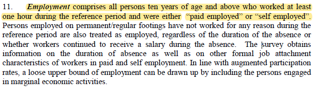


Below we show an example of the employment question section from the questionnaire of 2012: 
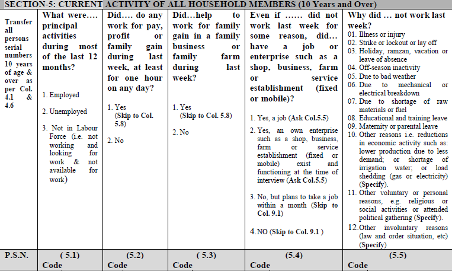

Following the definition from the BPS, we coded the variable lstatus using the questionnaire questions 5.1 to 5.4. We coded `lstatus==1` or employed for anyone answering yes to any of the following options: 
```
1. Being employed was the principal activity during most of the last 12 months or
2. Did some work for pay, profit or family gain during last week, as least for one hour one day or
3. Helped to work for family gain in a family business or family farm during last week or
4. Had a job or enterprise such as a shop, business, farm or service establishment (fixed or mobile)
```


Compared to employment, the definition of unemployment varies over years due to changes in the section’s questions as well as the order of appearance in the questionnaire. In GLD, we define unemployment and potential labor if a respondent is **seeking a job** and **available for work**. The sub-sections below focus changes over the years on the questions concerning "seeking a job" and availability.
We define being unemployed if the respondent: 1) does not have any work and 2) is currently seeking employment. The BPS uses a broader definition of unemployment which we follow. 
According to BPS, unemployment is:
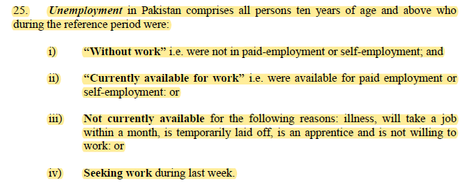


## 1992-2010
>The questionnaires of the years 1992 to 2010 follow the same structure across the year and have the same labor force module questions. Questions 9.1 and 9.2 are labor availability questions, while question 9.3 relates to seeking employment.   
**Labor module in the questionnaire**
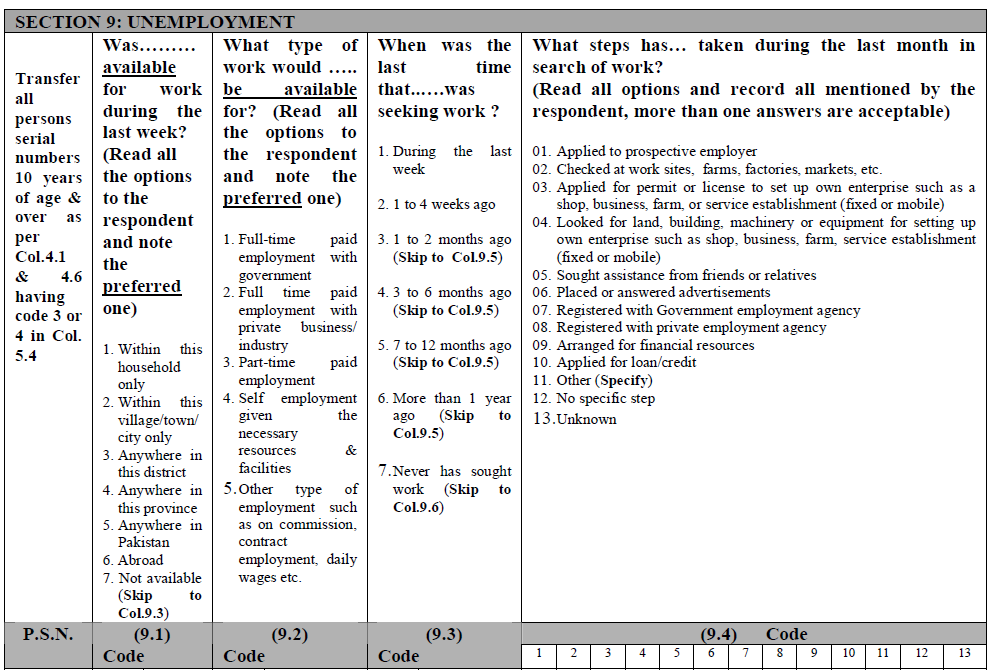
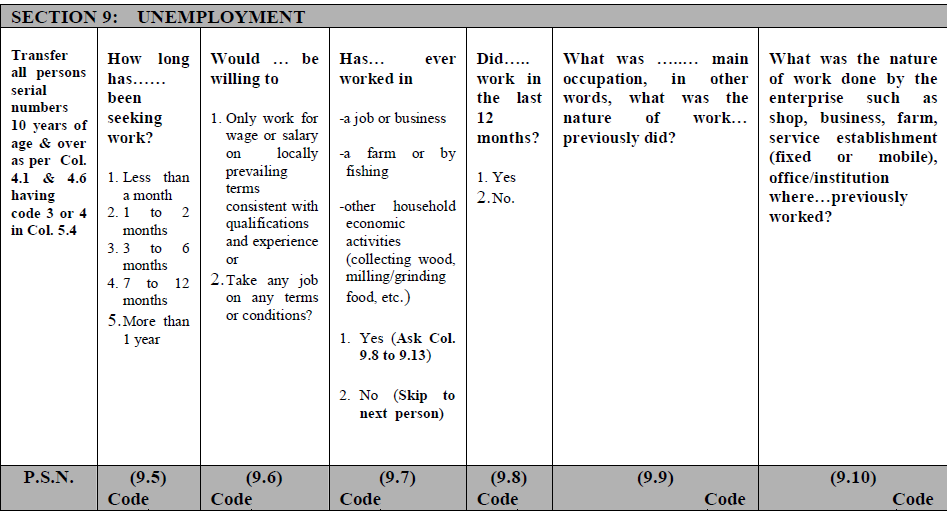

Questions 9.1, 9.2 and 9.3 were used for defining `lstatus==2` *(unemployed)*. 
```
Question 9.1 (1-6) or Question 9.2 (1-5): available for work
Question 9.3 (1-2): currently seeking a job 
*Note: Using the available information from the questionnaire, we define respondents as "currently seeking work" if they respond affirmatively to the question "the last time I sought work" within the timeframe 1-4 weeks ago, for the years without alternative questions.
```

For years from 1992 to 2010, questionnaires do not ask respondents **why they are not available for work**. This is one of the main differences in the unemployment section compared to earlier and later years.  
## 2012-2018
Since 2012, the questionnaires suffered changes in the unemployment section. Questions 9.1, 9.4, and 9.6 are used to define "seeking work", "availability", and "reason why not available" respectively. Note that 2012 is the first year that begins to have a specific question about reasons for not on employment.  
**Labor module in the 2012 questionnaire**
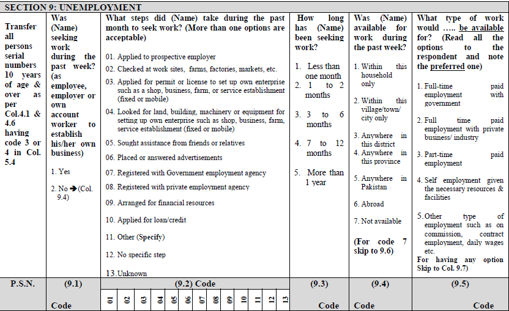
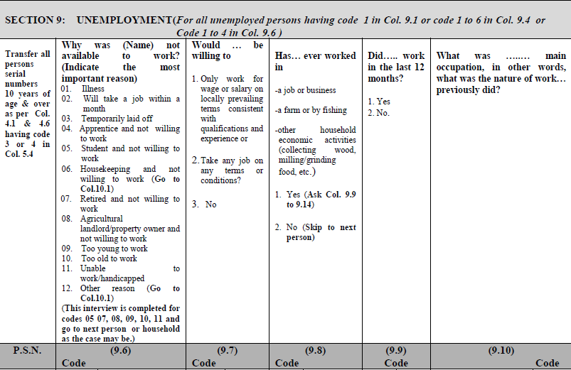

```
Question 9.1 = 1: seeking work in the past week
Question 9.4 (1-6): available for work
Question 9.6 (1-4): unavailable for certain reasons that still belong to unemployed population
```

## 2020
In the year 2020, the employment variable is defined differently to other years. A person aged 10 and above is classified as employed if they did any work for pay, profit, or family gain during the reference week, helped in a family business or farm, or had a job or business but were temporarily absent — provided that absence was either expected to last three months or less, or they continued to receive income during the absence. 
A person is classified as unemployed if they are not employed and actively search for work during the reference period and are available to take up a job. Anyone who does not meet the criteria for either employed or unemployed is classified as outside the labor force. This definition applies to all household members aged 10 years and above. The availability question is different compared to the years 2012 to 2018. In 2020, question 9.6 asks about availability for employment in the next week. In previous years, the questionnaire asked if the respondent was available in the past week. 
To maintain consistency, a respondent is considered unemployed if they were active (`S9C1 == 1`) and willing to work in the short term (`inlist(S9C6,1,2)`).
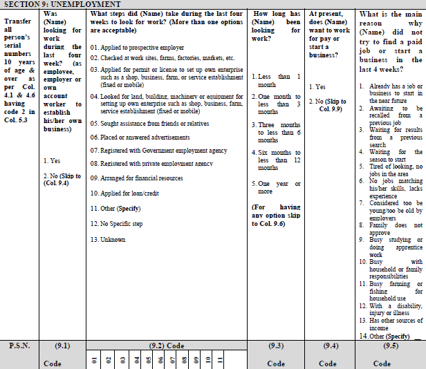
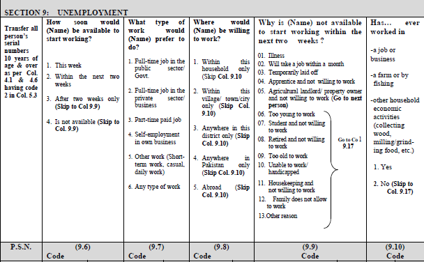

## 2024
In the year 2024, the labor module was extended to capture definitions aligned with the 19th International Conference of Labour Statisticians (ICLS-19).

A person aged 10 and above is classified as employed if, during the reference week, they: did any work for pay or wage (in cash or kind) for someone else for at least one hour; ran or operated any kind of business, farming, or other income-generating activity; or helped in a family business or farm for family gain. A person who did not work during the reference week is also classified as employed if they had a paid job or business but were temporarily absent, provided that they are expected to return to the same job or business within three months (including time already spent in absence), or that they continued to receive income during the absence. Importantly, persons engaged in farming, rearing animals, or fishing exclusively or mainly for family use are excluded from employment and classified outside the labor force or assessed for unemployment — reflecting the ICLS-19 distinction between employment and own-use production work.

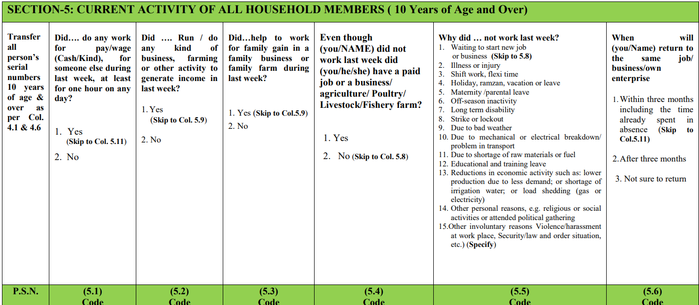
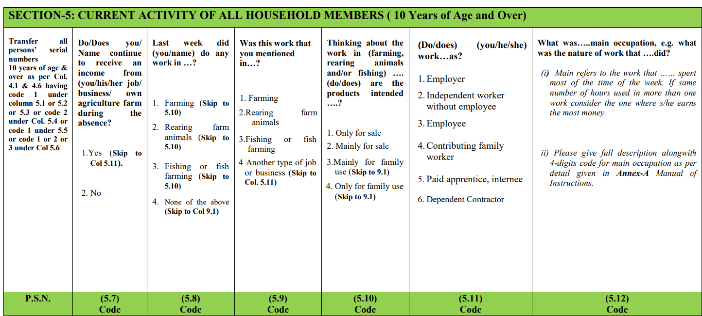
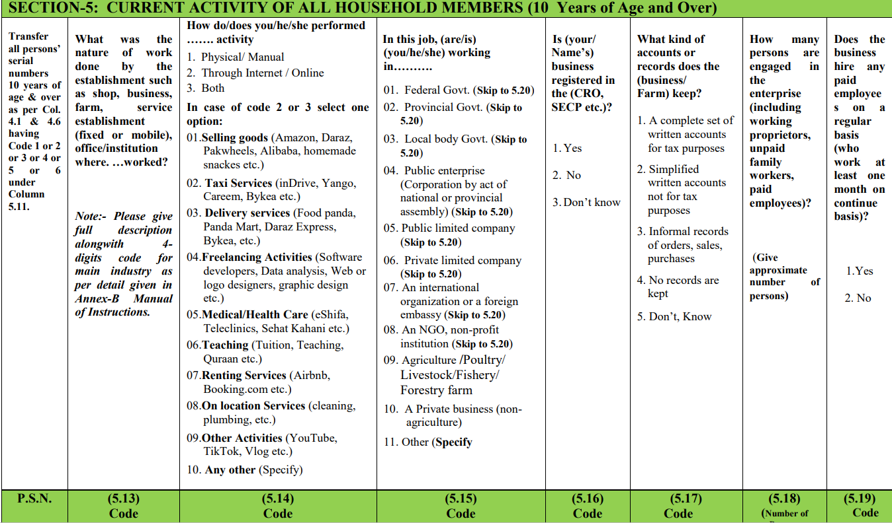

A person is classified as unemployed if they are not employed and either actively searched for work in the last four weeks (Col 9.1) or expressed a desire to work for pay or start a business (Col 9.4), and could start working within the next two weeks (Col 9.5, code 1). Anyone who does not meet the criteria for either employed or unemployed is classified as outside the labor force.

Two key differences from the 2020 definition are worth noting. First, the job search reference period was extended from one week to four weeks. Second, the availability window shifted from the next week (2020) to the next two weeks (2024), both consistent with ICLS-19 standards.

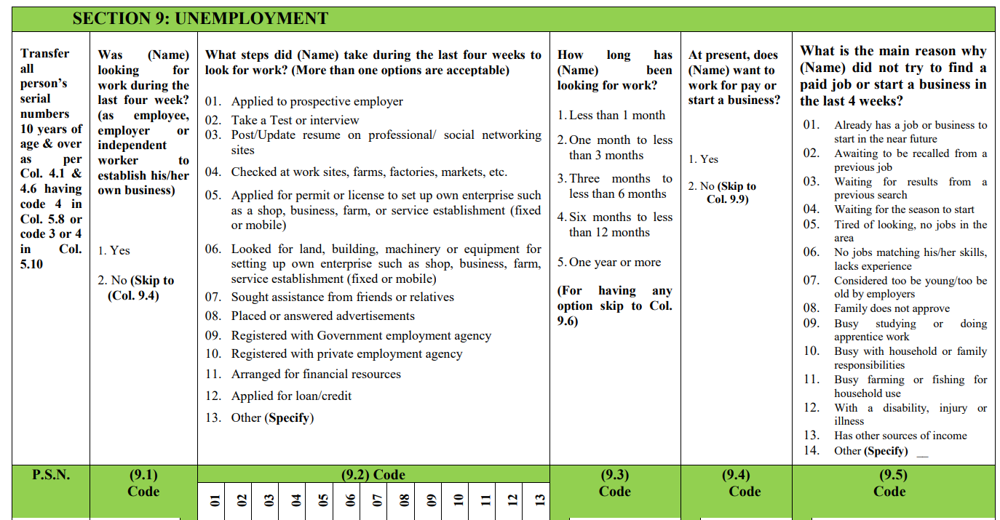
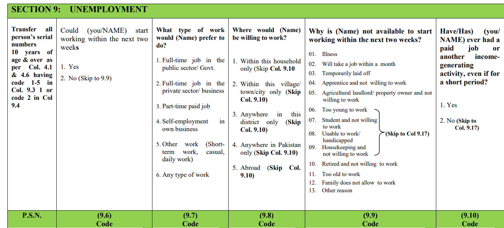

For comparability with earlier years , the PAK statistical bureau in their the labor module has an additional filter question (5.8 "did the respondent do any work in farming, rearing, fishing, none of the above?) captures respondents who respond no to questions 5.1 (Did…. do any work for pay/wage (Cash/Kind), for someone else during last week, at least for one hour on any day?) to 5.4 (even if... not worked in the last week have a paid jon/business...?) from the questionnaire but may still have done any type of agricultural work in the reference period. The captured group is included in the employed category. This additional restriction helps to recreate the labour status variable for the ICLS-13 labour definitions.

``
replace lstatus=1 if S5C1==2 & S5C2==2 & S5C3==2 & S5C4==2 & inrange(S5C8,1,3)
``


## Labor Force Participation Rate Comparison

The figure below is a comparison among GLD harmonization, BPS reports (*refined activity participation rate* shown in a following screenshot), and WDI:
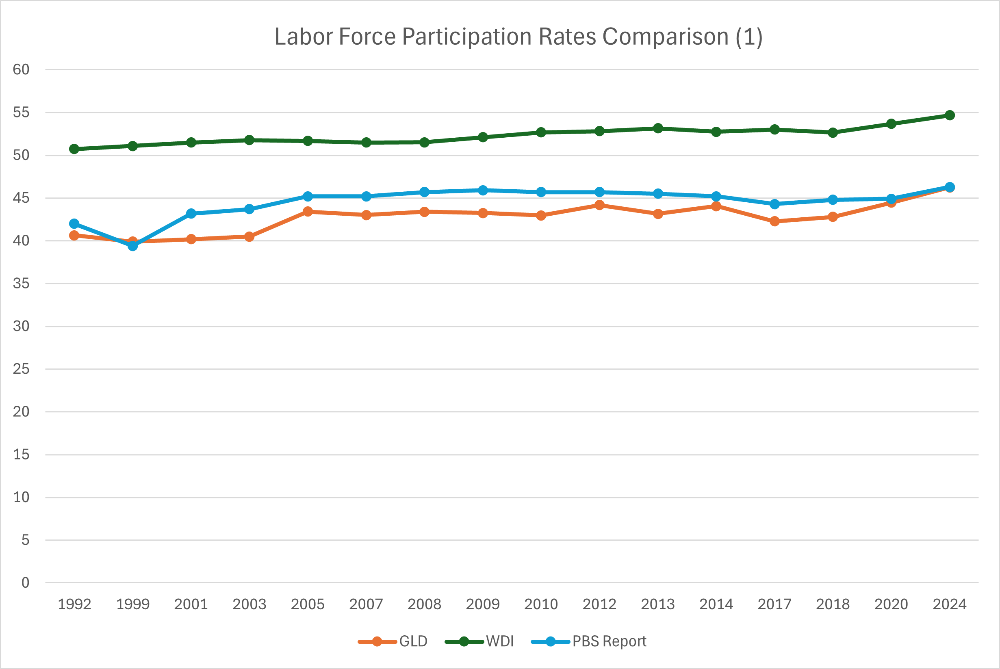

This chart plots labor force participation rates from three sources — WDI, PBS Report, and GLD — from 1992 to 2024. The WDI is consistently the highest by a wide margin, running 8–10 percentage points above the other two throughout the entire period, which likely reflects differences in age group coverage or ILO modeled estimates versus survey-based figures. PBS and GLD are highly correlated, following nearly identical trajectories, and by 2024 have converged to virtually the same estimate of around 46%. All three sources agree on a long-run upward trend.
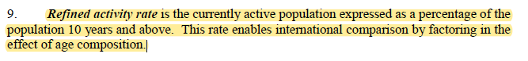

 The next chart isolates the effect of age group definition on participation rate estimates, comparing WDI (ILO modeled), GLD for ages 15+, and GLD for ages 10+. Unsurprisingly, GLD+10 consistently produces the lowest estimates, as including 10–14 year olds — who have very low participation — pulls the rate down. GLD+15 sits in the middle and converges strongly toward the WDI estimate by 2024, with the gap narrowing to just about 1 percentage point. This suggests that the remaining gap between WDI and survey-based estimates is largely driven by modeled adjustments in the ILO figures rather than age coverage. Together, the two charts confirm that the persistent gap between WDI and GLD figures is not explained by age group differences alone.


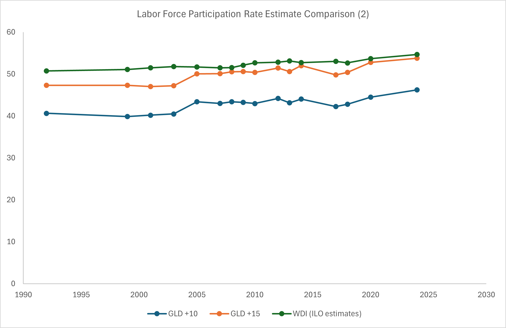

In order to find out the reason for the continuous gaps between GLD and BPS in 1992-2012, we compared other variables such as marital status and literacy. The close results show that the sample size and weight we used should be the same as those reports used. In that sense, sample size and weight should not be the cause. 

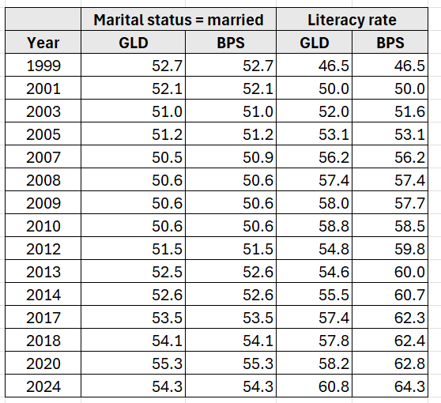

Another possible explanation might be that BPS changed their definition of employment when doing estimation for the reports. But so far, this has not been verified. 
We will update this documentation if we get more information in the future. Please feel free to contact the GLD focal point (gld@worldbank.org) if you know anything that might help. Thanks!


