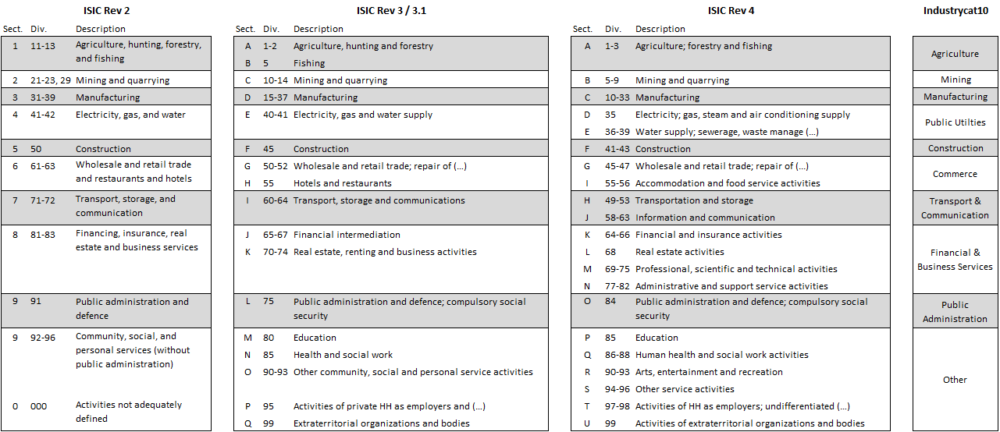

Industry and Occupation Codes: Philippines GLD
================

-   [Industry and Occupation Codes](#industry-and-occupation-codes)
    -   [Industry Codes](#industry-codes)
        -   [GLD Classification and Coding](#gld-classification-and-coding)
        -   [Schemas Covered in Raw Data](#schemas-covered-in-raw-data)
    -   [Occupation Codes](#occupation-codes)
        -   [GLD Classification and Coding](#gld-classification-and-coding-1)
        -   [Schemas Covered in Raw Data](#schemas-covered-in-raw-data-1)
        -   [Occupation Codes: Special Cases](#occupation-codes-special-cases)

# Industry and Occupation Codes

This document provides a brief overview of the industry coding and occupation coding in GLD. Note that the information is only recorded for individuals who, because of age minimums in each survey, have been included in the labor module.

## Industry Codes

### GLD Classification and Coding

The codes for the industry classification of the main job, `industrycat10`, are given here based the alignment of industries depending on the different revisions of the UN International Standard Industrial Classification as shown below:

  

  

### Schemas Covered in Raw Data

The raw data naturally spans different categorization schemes over time. Principally, there are the 1994 PSCIC and the [2009 PSCIC](http://psa.gov.ph/content/philippine-standard-industrial-classification-psic); the latter went into effect in January 2012. Since these codes are available on the PSA website and are quite detailed, a the most useful overview here is a short table that summarizes the changes in the metadata. A detailed version of this table, along with individual
labels, can be found by running `label_tools.R`.

| Scheme | PSCIC Version    | Years Applicable  | Characteristics | Coding methodology                                 |
|:------:|:------:  |:------:   |:------:|:------:|
| 1      | 1977     | 1997-2000 | [PSIC 1977 based on ISIC 68](utilities/phl1990cbi.pdf) but with two digits cannot assign   | -------- |
| 2      | 1994     | 2001-2011 | Departure from first-digit pattern, vals range from 1-99                              | `gen industry1 = .` then manually replace |
| 3      | 2009     | 2012-2013 | Values range from 100 - 9999, first 2 digits usually correspond to key level          | code manually by ranges                   |
| 4      | 2009     | 2014-2016 | Values range from 1-99 but first two digits correspond to same first two in scheme\#3 | `gen industry1 = .` then manually replace |
| 5      | 2009     | 2017      | Mix of schemas 3 and 4 depending on month/round                                       | code with block conditionals on survey month/round|
| 6      | 2009     | 2018-2019 | \~5% Labeled, values range from 1-99, like schema 2;4. first two digits correspond to same first two in scheme\#3 | `gen industry1 = .` then manually replace          |

## Occupation Codes

### GLD Classification and Coding

The classification for GLD’s occupation classification, `occup` is based on the [International Standard Classification of Occupations (ISCO) 88](https://www.ilo.org/public/english/bureau/stat/isco/isco88/publ4.htm). In the case of different classifications re-coding has been done to best match the ISCO-88.

| value | Category Description                               |
|-------|----------------------------------------------------|
| 1     | Managers                                           |
| 2     | Professionals                                      |
| 3     | Technicians and associate professionals            |
| 4     | Clerical support workers                           |
| 5     | Service and sales workers                          |
| 6     | Skilled agricultural, forestry and fishery workers |
| 7     | Craft and related trades workers                   |
| 8     | Plant and machine operators, and assemblers        |
| 9     | Elementary occupations                             |
| 10    | Armed forces occupations                           |
| 99    | Other/unspecified                                  |

### Schemas Covered in Raw Data

As with Industry Codes, the Occupation Codes span different categorization schemas over time also. Our data spans the PSA’s 1992 PSOC and 2012 PSOC Codes. The 2012 PSOC states that the 2012 system was modeled after the 2008 ISCO revision. The first survey that used the 2012 PSOC codes was the April 2016 LFS survey, according to the [PSA’s
technical note](https://psa.gov.ph/content/technical-notes-labor-force-survey-lfs). This means that the year 2016 spans two different codification systems.

We can confirm that the codification systems likely changes in the April 2016 round when they are designed to do so because of the differences in upper numeric limits between the two rounds. The data under the 1992 schema usually ends at `93` while the data under the 2012 schema ends at `96`, which is reflected in the 2012 PSOC codebook as well.

| scheme | PSOC | Years Applicable       | Characteristics                                                                                                                                                                                           | Coding methodology                                         |
|--------|-------|------------------------|-----------------------------------------------------------------------------------------------------------------------------------------------------------------------------------------------------------|------------------------------------------------------------|
| 1      | ----  | 97,99,00               | Coding does not seem to follow any known strcture                                                                                             | -------- |
| 2      | 1992  | 98, 01-11, 14,15,Jan16 | same as scheme1, but encoded as numeric directly. 2-digit, upper limit of `93`. First digit generally corresponds to major category of ISCO-88.                                                           | `floor([var]/10)` then adjust by case                      |
| 3      | 1992  | 12,13                  | same as scheme2, but 4-digit. First digit generally corresponds to major category of ISCO-88. The 4-digit codes are simply the lowest-level specificity for each profession in the same 1992 PSOC schema. | `floor([var]/1000)` then adjust by case                    |
| 4      | 2012  | April16-2019           | 2-digit, upper limit of `96`. First digit generally corresponds to to major category of ISCO-88.                                                                                                          | `floor([var]/10)` then adjust by case                      |

### Occupation Codes: Special Cases

#### 1997

The occupation codes in 1997 are encoded as string. Most values are
actually numbers but are simply encoded as characters; in these cases,
the numeric value is extracted from the string and processed further.
There are a few alpha values, but the 1992 PSOC codebook doesn’t give
any clear indication as to what these might correspond. Thus, these
alpha values have been left as missing.

Also, there are some numeric values that appear in the data that do not
correspond to codes in the 1992 PSOC codebook. These values have been
coded as “Other” in our data.

#### 2007, 2017

In 2017, the April round has data values under a 4-digit classification
scheme, but all other rounds/months are under a 2-digit classification
scheme. For this year, the coding will occur conditionally based on the
round. This also occurs for the January 2007 round.

#### 2016

Similarly to the cases above, the occupation variable will be coded
conditionally based on the round: January will receive one coding based
on the 1992 PSOC and the rest of the rounds will be coded based on the
2012 PSOC.

## Correspondence Tables

The data files used to create the conversions between national and international classifications [is available in the Additional Data folder](utilities/Additional%20Data)
