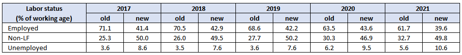
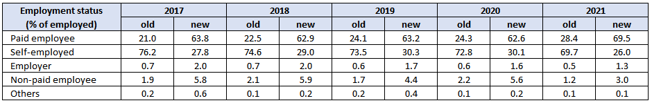
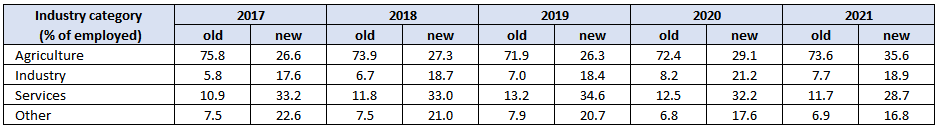
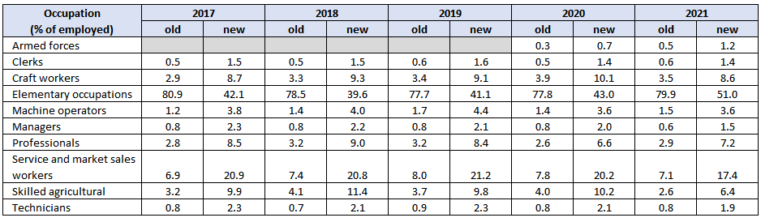

# Introduction
Since the passing of the [resolution concerning statistics of work, employment and labour underutilization](https://www.ilo.org/global/statistics-and-databases/standards-and-guidelines/resolutions-adopted-by-international-conferences-of-labour-statisticians/WCMS_230304/lang--en/index.htm) in 2013 at the 19th International Conference of Labour Statisticians (ICLS) surveys are at risk of a series break due to the change in the concept of employment.

In short, the ICLS 19 resolution restricts employment to *work performed for others in exchange for pay or profit*, meaning that own consumption work (e.g., subsistence agriculture or building housing for oneself) are not counted as employment.

The GLD codes the harmonization’s `lstatus’ variable based on the concept used in the survey. This has been the case for all years in the Rwanda LFS. Nonetheless, it possible to alter the code so that it matches the previous definition.

# Current coding for the each survey of the Rwanda ILFS

Currently, the code used to create the `lstatus` variable (which distinguishes between employment, unemployment, and out of the labour force) is the following:

```
  ***************************
  * Create Variable
  ***************************
	gen byte lstatus = .
  
  ***************************
  * Define those employed
  ***************************
  
	* E1 - Engaged in wage employment for at least an hour in the past 7 days
	replace lstatus = 1 if C01 == 1
	
	* E2 - Ran a business but not in agriculture
	replace lstatus = 1 if C01 == 2 & C02 == 1 & inrange(C04, 2, 3)
	
	* E3 - Worked in agriculture, produce mostly for sale
	replace lstatus = 1 if C01 == 2 & C02 == 1 & C04 == 1 & inrange(C05, 1, 2)
	
	* E4 - Engaged in unpaid work not in agriculture
	replace lstatus = 1 if C01 == 2 & C02 == 2 & C03 == 1 & inrange(C04, 2, 3)
	
	* E5 - Engaged in unpaid work in agriculture, produce mostly for sales
	replace lstatus = 1 if C01 == 2 & C02 == 2 & C03 == 1 & C04 == 1 & inrange(C05, 1, 2)
	
	
	* E6 - Did not work in the past 7 days due to sick leave, public holiday, annual leave, or maternity or paternity leave
	replace lstatus = 1 if C06 == 1 & inrange(C07, 1, 3)
	
	* E7 - Did not work in the past 7 days due to other reasons, except seasonal work, and on leave for less than 3 months
	replace lstatus = 1 if C06 == 1 & inlist(C07, 4, 5, 6, 8, 9, 10 , 11) & C08 == 1
	
	* E8 - Did not work in the past 7 days due to other reasons, except seasonal work, and on leave for more than 3 months but continued to receive income
	replace lstatus = 1 if C06 == 1 & inlist(C07, 4, 5, 6, 8, 9, 10 , 11) & inlist(C08, 2, 3) & C09 == 1
	

  ***************************
  * Define those unemployed
  ***************************
	egen effort = rowtotal(C21A - C21G)
	gen didwhatittakes =strpos(C21, "H") == 0
	
	* Weird when C21 reports no method but also individual has "yes" response to categories indicating active search in labor market (C21A to C21G). To address this contradiction, insist that these people are actively searching (aka doing what it takes)
	replace didwhatittakes = 1 if effort >= 1 & !missing(effort)
	replace didwhatittakes = 0 if C21 == "H"

	
	* U1 - Made an effort to look for a job, and would have started if the job becomes available 
	replace lstatus = 2 if (C19 == 1 & didwhatittakes==1) & C25 == 1
	*replace lstatus = 2 if (C19 == 1 & wave != "05") & C25 == 1

	* U2 - not looking for work because already found one and available to work
	replace lstatus = 2 if C19 == 2 & C20 == 1 & C25 == 1
	


  ***************************
  * Define those not in the LF
  ***************************
	* N1 - Made an effort to find a job and not available to work (potential LF) or does not want to work
	replace lstatus = 3 if (C19==1 & didwhatittakes == 1) & (C25 == 2)
	*replace lstatus = 3 if (C19 == 1 & wave != "05") & C25 == 2

	* N2 - Did not make an effort, wants to work, and available to work (potential LF)
	* Special case: Individuals who report being available but missing response for wanting to work. Wanting to work is a prerequisite for availability; hence, insist that these people want to work
	replace C23 = 1 if missing(C23) & C25 == 1
	replace lstatus = 3 if (C19==1 & didwhatittakes == 0) & C23 == 1 & C25 == 1

	* N3 - Did not make an effort and does not want to work (not in LF)
	replace lstatus = 3 if (C19==1 & didwhatittakes == 0) & C23 == 2
	
	* N4 - Did not make an effort , wants to work but not available to work (not in LF)
	replace lstatus = 3 if (C19==1 & didwhatittakes == 0) & C23 == 1 & C25 == 2
	replace lstatus = 3 if (C19==1 & didwhatittakes == 0) & missing(C23) & C25 == 2

	
	* N5 - Not looking for work, already found a job, but not available to work (potential LF)

	replace lstatus = 3 if C19 == 2 & C20 == 1 & C25 == 2
	
	* N6 - Not looking for work, have not found a job,  and does not want a job (not in LF)
	replace lstatus = 3 if C19 == 2 & C20 == 2 & C23 == 2
	
	* N7 - Not looking for work, have not found a job, wants a job and not available to work (not in LF)
	replace lstatus = 3 if C19 == 2 & C20 == 2 & C23 == 1 & C25  == 2

	* N7 - Not looking for work, have not found a job, wants a job and available to work (potential LF)
	replace lstatus = 3 if C19 == 2 & C20 == 2 & C23 == 1 & C25  == 1
	
	* N8 - All other categories
	replace lstatus = 3 if missing(lstatus) & age>minlaborage & !missing(age)
```


# Added lines of code to match the old definition

Thus, to obtain a unique series with the old definition we would first need to identify the subsistence farmers. In the Rwanda LFS, this includes those who reported engaging in agriculture mainly for own consumption  (variable `H1`) in the last 4 weeks, excluding those who reported working for sale or trade in the past 7 days (codes 1 and 2 in variable `C05`).

Once the subsistence farmers are identified, all it takes is to recode `lstatus` to 1. This must be done immediately after the block of code to define the non-participants in the labor force.

```
	* Identify subsistence farmers
	
	** Reported working mainly for own consumption in the past month
	gen sub_f = H01
	
	** Among those, recode to 
	replace sub_f = 2 if inrange(C05, 1, 2)

	replace lstatus = 1 if sub_f == 1

```

# Comparing indicators between old and new definition

The size of the subsistence farmers in Rwanda is large, ranging between 33% and 48% of the working age population. For this reason, indicator estimates are very sensitive to the definition used. 

| **Year** | **Subsistence farmers population** | **% of working age** |
|:---:|:---:|:---:|
| 2017 | 3,488,359 | 48% |
| 2018 | 3,417,256 | 45% |
| 2019 | 3,333,802 | 42% |
| 2020 | 2,621,935 | 33% |
| 2021 | 3,048,017 | 36% |
 
 The tables below show how the indicator values can vary substantially between the two definitions. Because the survey does not ask subsistence farmers about the characteristics of their jobs, the estimates below rely on the assumption that (i) all subsistence farmers belong in agriculture and (ii) they are all self-employed. The first assumption can be accepted wholeheartedly since the question on subsistence farmers explicitly asks for activites in agriculture, although it is possible they engage in activities outside agriculture for their consumption (e.g., construction). Meanwhile, the second assumption is a simplification as they can also be non-paid employees, which we cannot verify without other information, such as wages. 
 
 

  
  
  
  
   


 
