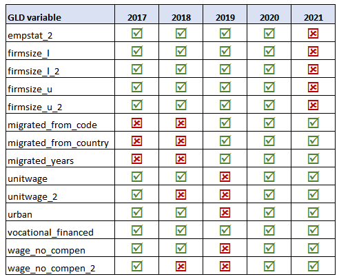

# Discrepancies between questionnaire and the datasets

There are cases of variables that were not in the datasets despite being included in the questionnaire or having an estimate reported in NSO reports. It is not clear why these variables were omitted in the datasets. This limits the indicators that can be generated out of the harmonized datasets.

Below is the list of the recurring variables and those years where they are not available as indicated by the red X marks.

