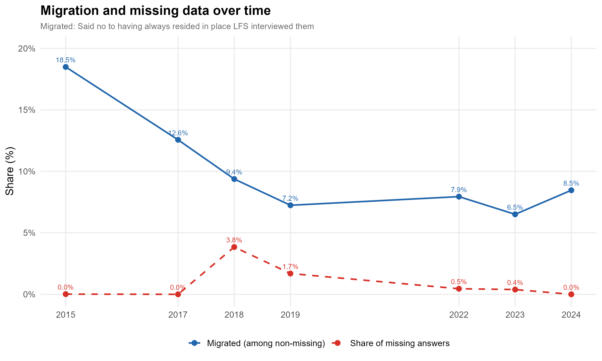

# Introduction to Senegal labor force survey – Enquête Nationale sur l'Emploi (ENES)

## What is the SEN ENES?
SEN ENES stands for Enquête nationale sur l’Emploi au Sénégal (National Employment Survey of Senegal). It is a labor force survey (LFS) produced by ANSD and implemented on a quarterly basis (in the ILO survey catalog it is listed as a quarterly LFS series).

## What does the SEN ENES cover?

At a high level, ENES is a household / individual survey designed to measure core labor-market outcomes and characteristics. In the ILO catalog, ENES is documented to cover (among others):

- Labor force status (employment, unemployment, outside labor force)
- Labor market attachment and related aggregates
- Education, age, sex, marital status, disability (in aggregated forms)
- Economic activity / sector (ISIC Rev.4)
- Occupation (ISCO-08) and skill level
- Hours worked
- Earnings (e.g., monthly earnings, low hourly pay indicators)
- Status in employment and job characteristics (contract type, working-time arrangement, establishment size)
- Informality/formality (nature of job / unit of production)

Years and sample size of ENES harmonized for GLD are: 

| **Year**	| **# of Households**	| **# of Individuals**	| **Expanded Population**	|
| :------:	| :-------:		| :-------:	 	| :-------:	 	|
| 2015  | 5,903   | 53,662         |  13,936,114      |
| 2017  | 9,504   | 61,966         |  10,020,504*     |
| 2018  | 12,083  | 104,251        |  15,346,300      |
| 2019  | 11,730  | 98,442         |  14,936,831      |
| 2022  | 12,780  | 97,209         |  17,736,132      |
| 2023  | 12,596  | 93,456         |  18,135,492      |
| 2024  | 10,461  | 70,966         |  18,703,974      |

Note: * 2017 data (missing Q2) has been adjusted to approximate a full annual sample (i.e., weights rescaled to account for the missing quarter). Nonetheless, each quarter individually sums to just under 10 million. Relative distributions remain reliable; users are nonetheless advised to exercise caution with aggregate-level estimates.

## Where can the data be found?

The ENES microdata the GLD team uses were partly downloaded from the Senegalese national data archive ([ANADS](https://anads.ansd.sn/index.php/catalog/TRV/?page=1&ps=50&repo=TRV)) and shared by colleagues at the World Bank.

## What is the sampling procedure?

ENES uses a stratified multi-stage cluster sampling design. In general, the design can be described as: (1) selecting primary sampling units (PSUs) from census enumeration areas / districts de recensement (DR), and (2) selecting households within selected PSUs.

Baseline design (ENES 2015 – annual “reference” round)
For the 2015 annual ENES, the documented sampling procedure is:
PSU selection (DR / enumeration districts): Households are sampled from districts de recensement (DR), which serve as the primary sampling units (PSUs). The sample is stratified by residence, distinguishing urban vs. rural, and further distinguishing urban Dakar from other urban centers (second stratification).
Household selection within PSU: Within each selected DR, a fixed number of households are selected (documentation indicates different take rates by residence type, e.g., 12 households per DR in urban areas and 18 households per DR in rural areas).
Overall target sample size: The theoretical sample for ENES is stated as ~6,000 households (with implementation-based deviations due to fieldwork/nonresponse).

How the sampling implementation changes across years (post-2015)
After the 2015 annual round, ENES is implemented as a quarterly survey, with a partial rotation structure:
Quarterly implementation + sample rotation: ANSD documentation for recent ENES rounds describes a design that renews about one-third of the sample each year, with a referenced sample size of 3,614 (for the quarterly framework).
 

## What is the geographic significance level?

The official ENES reports detail results by gender, sector (i.e., urban or rural), and administrative area. Region is the primary administrative level at which ENES is designed to be representative in earlier rounds (corresponding to Senegal’s 14 regions).

## Other noteworthy aspects

### Age is reported in brackets

In 2015, 2017, 2018, and 2019 the raw data collect age in grouped intervals (with different grouping schemes by year). In the harmonized data, age was imputed using the midpoint of each age group.

### Wage reporting relies heavily on brackets

In both 2015 and 2019, most workers—especially employees—report earnings using wage ranges rather than exact amounts (2015: ~64% of employed and ~99% of employees; 2019: ~53% of employed and ~52% of employees). Following GLD practice, no bracket-to-point wage imputation was performed because exact-wage reporters are not a clear majority (≥75%). Exact wages were retained where available; wages for bracket reporters were left missing.

### Wage Imputation

For wage employees who did not report an exact wage amount but provided a wage range, wages were imputed using information from comparable wage employees who did report exact wages. Reported wage amounts were first converted to a common monthly basis to ensure consistency across different payment frequencies. These monthly wages were then assigned to the corresponding wage ranges, and median monthly wages were calculated within each range.

The imputation used a step-by-step fallback approach to balance precision and reliability. When possible, the imputed value was based on the median wage of workers in the same sex, location, and wage-range group, as long as the group had a sufficient number of observations. If that group was too small or unavailable, the median wage for workers of the same sex and wage range was used instead. If this was still unavailable, the overall median wage within the same wage range was applied. This approach preserves the information contained in the reported wage ranges while avoiding unstable estimates from small cells.

Only wage employees with a valid wage range but no valid exact wage amount were imputed. Self-employment income was not imputed, since this information was considered less stable and less directly comparable to wage earnings.

### Low wage response rates

In 2022–2024, only ~10% of workers report wage/earnings information, resulting in substantial missingness in wage variables in the harmonized data (wage coverage is limited and estimates based on wages should be interpreted with caution).

### Exact wage variable absent in some years

The exact wage variable is not available in the raw data for 2015, 2017 and 2018, so wage_no_compen is set to missing for those years.

### Missing quarter / incomplete annual coverage

ENES 2017 Q2 is not available to GLD. Neither is Q4 of 2024. The former could not be downloaded, the latter does not contain individual identifiers. The GLD team is trying to receive the 2024 Q4 data. If you may share this, please reach out to gld@worldbank.org

### Subnational/urban variables missing in specific quarters

2017 Q4 is missing region (subnatid1) (under review; it may be recoverable from the household code).
Some quarters are missing urban/rural (urban) information (e.g., 2019 quarters where area is not recorded); these variables are left missing for the affected quarters.

### Industry and occupation not present despite being in the questionnaire

Although the questionnaires include industry/occupation questions, the corresponding variables are absent in the raw microdata for 2017 and 2018. Therefore, industry and occupation variables were set to missing in the harmonized dataset.

### Migration patterns

The share of respondents reporting that they have not always resided in the interview location falls sharply from around 15% in 2015 to roughly 5% in 2019, where it has since remained stable. This structural break likely reflects a change in survey design or sampling frame rather than a genuine shift in migration behaviour, given the abruptness of the decline. The 2018 wave — and to a lesser extent 2019 — show an elevated share of missing values, which should be kept in mind when interpreting estimates for those years.

