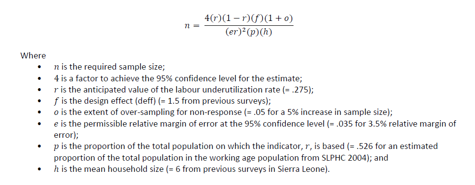

# Introduction to Sierra Leone (SLE) national Labor Force Survey (LFS)

- [What is the SLE LFS](#what-is-the-sle-lfs)
- [What does the SLE LFS cover?](#what-does-the-sle-lfs-cover)
- [Where can the data be found?](#where-can-the-data-be-found)
- [What is the sampling procedure?](#what-is-the-sampling-procedure)
- [What is the geographic significance level?](#what-is-the-geographic-significance-level)
- [Other noteworthy aspects](#other-noteworthy-aspects)

## What is the SLE LFS?

The 2014 SLE LFS is the first labor force survey in the country since 1984. Before SLE LFS 2014, the 2004 and 2011 country integrated household survey were the main source of information on labor market and employment. SLE LFS 2014 was conducted by the Statistics Sierra Leone (SSL), with the support of the World Bank, the International Labor Organization, and the Deutsche Gesellschaft für Internationale Zusammenarbeit. The survey data was collected between July and August 2014 and is nationally representative. 

## What does the SLE LFS cover?

The SLE LFS mainly covers detailed information on demographic details, including age, sex, marital status, and location, education, and labour market activities over the previous 7 days and in the past year. In addition, the SLE LFS also includes information on migration. As we currently only have one year survey data, there is no way to compare the depth and richness in information between years. However, SLE LFS covers 25,645 individuals, 4,199 households randomly selected from a stratified cluster sample with oversampling urban areas. At strata level, it covers 280 enumeration areas in 19 districts/cities plus Western region as a whole.    

Below is a table showing districts and cities in the report vs. in the data:

| **District Name**	| **In the Report?**	| **# EA in the Report**	| **In the Data?**	| **# EA in the Data**	|**Note**|
| :---------------:	| :---------------:		| :------------------:	 	| :--------------:	| :------------------:	|:----:| 
| Kailahun District | YES | 14 | YES | 14 |NA|
| Kenema City       | YES | 14 | YES | 28 | Kenema city and district are combined as one in the data.|
| Kenema District   | YES | 14 | YES | -  | See Kenama City. | 
| Koidu/New Sembehun City | YES | 14 | NO | NA | See Kono district. |
| Kono District     | YES | 14 | YES | 28 | Koido and Kono are combined as one in the data.|
| Makeni City       | YES | 10 | NO  | NA | NA |
| Bombali District  | YES | 12 | YES | 22 | NA |
| Kambia District   | YES | 12 | YES | 13 | NA |
| Koinadugu District| YES | 12 | YES | 12 | NA |
| Port Loko District| YES | 12 | YES | 12 | NA |
| Tonkolili District| YES | 12 | YES | 12 | NA |
| Bo City           | YES | 14 | YES | 29 | Bo city and district are combined as one in the data.|
| Bo District       | YES | 14 | YES | -  | See Bo City. |
|Bonthe Municipality| YES | 6  | YES | 18 | Bonthe Mnucipality and district are combined as one in the data.|
| Bonthe District   | YES | 12 | YES | -  | See Bonthe Mnucipality. |
| Moyamba District  | YES | 12 | YES | 12 | NA |
| Pujehun District  | YES | 12 | YES | 12 | NA |
| Freetown City     | YES | 50 | YES | 51 | Called "Western Urban" in the data.|
|Western Rural District| YES | 20 | YES | 21 | NA |

## Where can the data be found?

The Microdata is freely available on the public [World Bank microdata library](https://microdata.worldbank.org/index.php/catalog/2687). The data and relevant documents are availabel from the [SSL website](http://www.statistics.sl/index.php/what-we-offer/open-data-free-datasets.html). 

## What is the sampling procedure?

The survey uses a two-stage cluster sampling methodology on a sstratified cluster sample with oversampling in urban areas for non-response. 280 enumeration areas are selected from four regions which contain 19 districts or cities plus Western region as a whole, with 15 households randomly selected in each for a total 4,200 (4,199 in the data eventually) households as planned. SSL conducted the sampling using the 2004 Population and Housing Census as the sampling frame. The sample size was calculated using the formula below:

(*NOTE:The target number of households in the sample, i.e. the sample size, was thus estimated at 4,200, based on the computed value of 4296 rounded down to 4200 for ease of use and due to budget constraints.*)

## What is the geographic significance level?

## Other noteworthy aspects  
