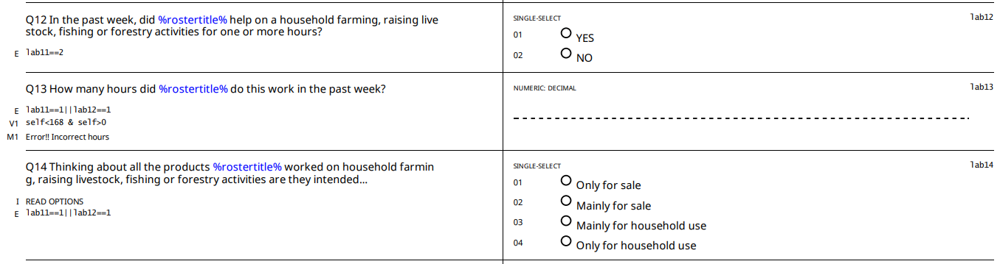

# Overview

At the 19th ICLS in 2013, a significant development emerged with the adoption of the [Resolution concerning statistics of work, employment, and labor underutilization](https://www.ilo.org/resource/resolution-concerning-statistics-work-employment-and-labour). This led to a change in the concept of employment compared to ICLS-13.

In essence, the ICLS-19 resolution delineates **employment** as work conducted for pay or profit. Whereas activities performed exchange for remuneration, like own-use production work, volunteer work, and unpaid trainee work, are classified as **other forms of work**.

Therefore, in order to compare GLFS 2018 and 2023 with surveys which employ ICLS-13, it is necessary to modify the coding of  variable ```lstatus``` using the questionnaire.

## Framework for identifying employment in the ISHBS

ISHBS 2022 questionnaire used information on current activity to define employment through the ***Labor** block. 

## From current coding to the ICLS-13 definition

In converting to the old definition, the approach adopted here is to create a variable that identifies those that are engaged in activities for market exchange as well as those that work without (or mostly without) market exchange. Figure 1 below shows an example of one of the relevant building blocks in the questionnaire for the employment definition.

<figure>

<figcaption><b>Figure 1</b><i> Farm Enterprise Questions </i></figcaption>



</figure>

In this case, if we code 1 to 4 for question 14, we can capture the employees according to the ICLS-13 definition. This strategy should be applied to all relevant questions in this section.

The code below applies this procedure to all relevant questions. It should be pasted *after* the code creating the ```lstatus``` variable as coded in the harmonization code file. 

```     
  *Create an indicator "emp_diff" that identifies the difference between definitions (emp_diff)
	 gen emp_diff = 0 if inrange(lstatus, 2, 3)
	*Add those in non market interaction
	 gen icls_13 = 1 if inlist(lab14,3,4) | inlist(lab19,3,4) 
	 replace emp_diff = 1 if emp_diff == 0 & icls_13 == 1
  
  * Use emp_diff to generate ICLS-13 definition
	replace lstatus = 1 if emp_diff == 1
	
	replace lstatus = . if age < minlaborage
```
We can go further an try to overwrite the employment status, occupation sector, industry and occupation of those that we assume would have - under the old definition - been recorded with their own consumption definition under the previous employment definition.

```     
   *Own consmuption farm/non-famr enterprises is considered as self-employed
	 replace empstat = 4 if lab11 == 1 & emp_diff == 1 & missing(empstat)
	 *Family help in farm/non-famr enterprises is considered as Non-paid employee
	 replace empstat = 2 if lab12 == 1 & emp_diff == 1 & missing(empstat)
	 
	*Assume farmers work in the agricultural sector.
	replace industrycat10 = 1 if emp_diff == 1 & missing(industrycat10)
	
	*Assume farmers work in Skilled agricultural occupations.
	replace occup = 6 if emp_diff == 1 & missing(occup)
```
Finally, do the last bits of cleaning up to ensure the other labour variables are in line with what could be expected for own-consumption workers.

```
  * WAGE (send to missing)
  replace wage_no_compen = . if emp_diff == 1 
  
  * WHOURS (send to missing)
  replace whours = . if emp_diff == 1 
  
  * CONTRACT (send to missing)
  replace contract = . if emp_diff == 1 
  
  * SOCIAL SECURITY (send to missing)
  replace socialsec = . if emp_diff == 1
  
  * UNION (send to missing)
  replace union = . if emp_diff == 1 
  
  * NLF Reason (send to missing)
  replace nlfreason = . if emp_diff == 1 

```