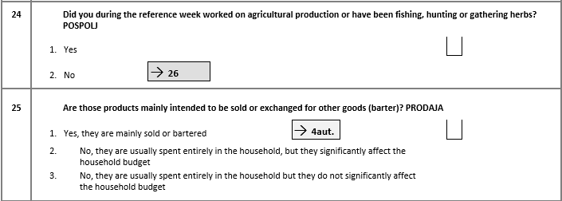
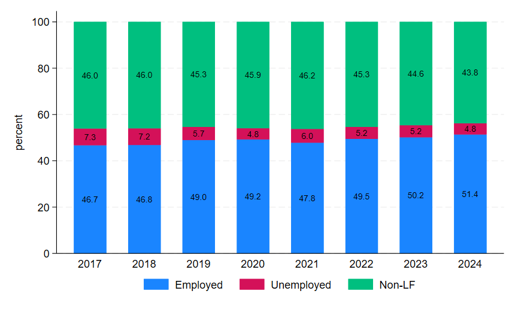

# Conversion from ICLS-19 to ICLS-13 version

## Overview

At the 19th ICLS in 2013, a significant development emerged with the adoption of the [Resolution concerning statistics of work, employment, and labor underutilization](https://www.ilo.org/resource/resolution-concerning-statistics-work-employment-and-labour). This led to a change in the concept of employment compared to ICLS-13.

In essence, the ICLS-19 resolution delineates **employment** only as work conducted for pay or profit. Activities performed not in exchange for remuneration, like own-use production work, volunteer work, and unpaid trainee work, are classified as **other forms of work**.

The GLD harmonizes data following the standards used in each survey’s design and reporting. Data from LFS 2008 to 2020 use the ICLS-13 standard, and since 2021 we use ICLS-19. (see variable `icls_v` in each survey). To compare all LFS directly it is necessary to modify the coding of  variable `lstatus` using the nuances of the questionnaire.

## Framework for identifying employment in the LFS

All questionnaires used information on current activity to define employment through the ***Employment status*** section.

## From ICLS-19 coding to the ICLS-13 definition

In converting to the old definition, the approach adopted here is to create a variable that identifies those that are engaged in activities for market exchange as well as those that work without (or mostly without) market exchange. This step is necessary to align the newer conceptual structure with earlier surveys that did not distinguish between these forms of work.

Starting in 2021, the questionnaire incorporates the ICLS-19 framework, which allows us to identify subsistence workers explicitly. Earlier questionnaires do not differentiate this group, and therefore we cannot isolate them when applying the ICLS-19 logic backward. Because of this structural asymmetry, we convert the ICLS-19 classification into the ICLS-13 definition rather than the reverse. Figure 1 below illustrates one of the key building blocks in the questionnaire for the employment definition.

<figure>

<figcaption><b>Figure 1 </b><i> Primary Sector Questions - LFS 2021 TO 2024 </i></figcaption>



</figure>

In this case, if we code 2 and 3 for question 25, we can capture the employees according to the ICLS-13 definition. This strategy should be applied to all relevant questions in this section.

The code below applies this procedure to all relevant questions. It should be pasted *after* the code creating the ```lstatus``` variable as coded in the 2016 harmonization code file. 

```     
  * Create an indicator "emp_diff" that identifies the difference between definitions (emp_diff)
  gen emp_diff = 0 if inrange(lstatus, 2, 3)

  * Define the broader ICLS-13 concept
  gen icls_13 = 1 if inlist(prodaja,2,3)

  * Replace emp_diff is one if ICLS-19 is not employed but ICLS-13 yes
  replace emp_diff = 1 if emp_diff == 0 & icls_13 == 1
  
  * Use emp_diff to replace cases that differ
  replace lstatus = 1 if emp_diff == 1
```

We can go further an try to overwrite the employment status, occupation sector, industry and occupation of those that we assume would have - under the old definition - been recorded with their own consumption definition under the previous employment definition.

```     
   *Own consmuption farm/non-famr enterprises is considered as self-employed
	 replace empstat = 4 if  emp_diff == 1 & missing(empstat)
	 
	*Assume farmers work in the agricultural sector.
	replace industrycat10 = 1 if emp_diff == 1 & missing(industrycat10)
	
	*Assume farmers work in Skilled agricultural occupations.
	replace occup = 6 if emp_diff == 1 & missing(occup)
```
Finally, do the last bits of cleaning up to ensure the other labour variables are in line with what could be expected for own-consumption workers.

```
  * WAGE (send to missing)
  replace wage_no_compen = . if emp_diff == 1 
  
  * WHOURS (send to missing)
  replace whours = . if emp_diff == 1 
  
  * CONTRACT (send to missing)
  replace contract = . if emp_diff == 1 
  
  * SOCIAL SECURITY (send to missing)
  replace socialsec = . if emp_diff == 1
  
  * UNION (send to missing)
  replace union = . if emp_diff == 1 
  
  * NLF Reason (send to missing)
  replace nlfreason = . if emp_diff == 1 

```

The figure below presents labor market proportions based on the respective ICLS versions applied in each survey, and compares them with all years coded under the ICLS-13 framework. The relative changes are very small, indicating the low prevalence of **other forms of work** as defined at the beginning of this section.


| **ICLS Version by Year** | **All Years under ICLS-13** |
|---------------------------|------------------------------|
|  |  |

*Note 1:* Starting in 2021, the survey began applying the **ICLS-19** framework.  

*Note 2:* For a clearer comparison, the analysis includes data only from 2017 onward.
