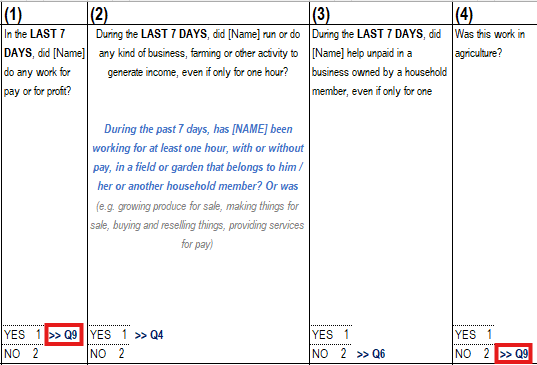
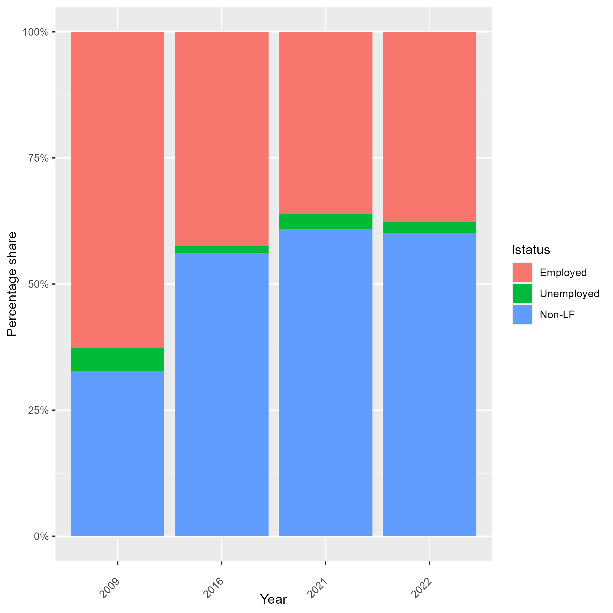
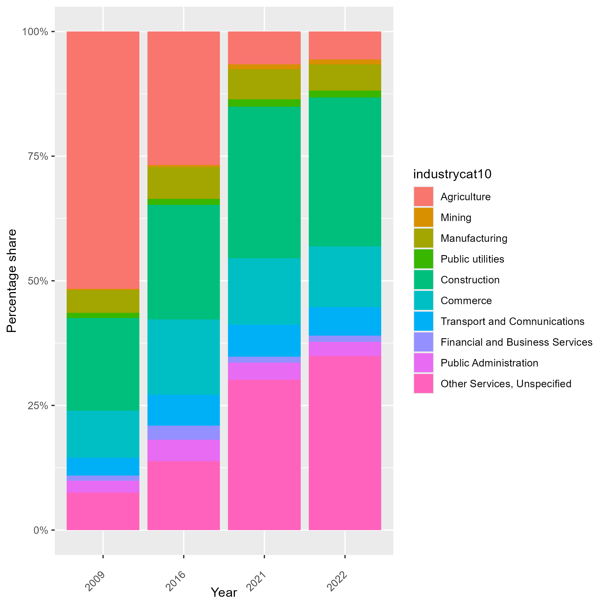
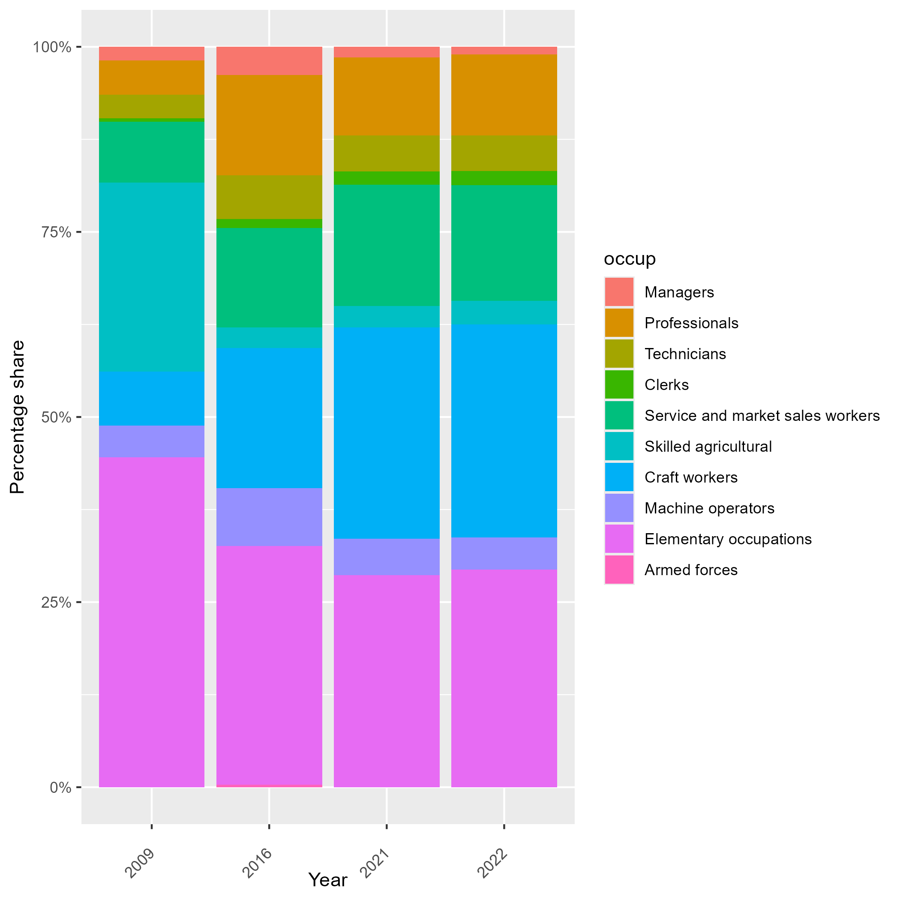

# HouseHold Budget Survey (HBS)

- [What is the tjk survey?](#what-is-the-tjk-HBS)
- [What does the tjk survey cover?](#what-does-the-tjk-HBS-cover)
- [Where can the data be found?](#where-can-the-data-be-found)
- [What is the sampling procedure?](#what-is-the-sampling-procedure)
- [What is the significance level?](#what-is-the-geographic-significance-level)
- [Other noteworthy aspects](#other-noteworthy-aspects)

## What is the TJK HBS?

The Household Budget Survey (HBS) is a household-based sample survey conducted by the Agency for Statistics under the President of the Republic of Tajikistan (TAJSTAT). This survey has been responsible for providing statistics on household living conditions in Tajikistan. Prior to the dissolution of the Soviet Union, the HBS was implemented using Soviet methodology, collecting household consumption data from a fixed sample over time. Following the outbreak of civil war in the early 1990s, the survey was suspended and only partially resumed in 1997, covering three districts due to limited staff capacity. The HBS was fully reestablished in January 2000, and since then, data have been collected every quarter.

## What does the TJK HBS cover?

Through the Household Budget Survey (HBS), the Agency for Statistics of Tajikistan collects data on household expenditures, living conditions, and various household characteristics. By incorporating additional modules aligned with the Sustainable Development Goals, the HBS also captures demographic indicators disaggregated by sex, age, education level, marital status, and other related variables.

e Household Budget Survey (HBS) in Tajikistan has been implemented continuously since the year 2000. However, the Global Labour Database (GLD) harmonization currently includes only the 2021 and 2022 rounds. Years and their corresponding sample sizes of HBS harmonized are:

| **Year** | **Households Interviewed**  | **Individuals Interviewed**   | **Expanded Population**   | **Official Sample Size (Households)**  |
|:--------:|:---------------------------:|:----------------------------:|:------------------------:|:-------------------------------------:|
| 2021     | 12,000                      | 73,000                       | 10,582,026               | Not officially specified              |
| 2022     | 12,000                      | 72,280                       | 10,748,509               | Not officially specified              |

## Where can the data be found?

All the data is classified as Official Use Only: it may be used within the World Bank but is not authorized for external distribution.

## What is the sampling procedure?

The clustered sampling design follows a probability proportional to size (PPS) approach, allocating 204 clusters across 9 strata, proportionally to the total number of households in each stratum. The cluster size was determined based on both the recommendations from the Relative Standard Error (RSE) analysis conducted in 2015 and practical considerations related to data collection challenges within each stratum. The sampling strategy also incorporates per capita expenditure estimates from the 2021 HBS to refine allocation and ensure representativeness. For more information, please see this [Technical note.](utilities/Technical%20Note%20on%20HBS%202024%20Sampling.docx)

## What is the geographic significance level?
The Household Budget Survey (HBS) is designed to be representative at the regional level across the five main administrative divisions of the country(Dushanbe, Sogd, Khatlon, GBAO and DRS), with results disaggregated by urban and rural areas. An exception is Dushanbe city, which is entirely urban and therefore does not include a rural stratum in the sampling design.

## Other noteworthy aspects

### Wages in Tajikistan
Both 2021 and 2022 show unusual patterns regarding paid employed salaries. For more details, please see [this document](Wages.md)

### Employment Questions Order and Impact on Results

This survey has a special feature: the order of the questions in the main activity section matters. Figure 1 displays the HBS 2021 and 2022 questions related to the activities performed by respondents. If they answer affirmatively to any of the questions used to validate employment status, they are directed to the employment-related section under the assumption that this is their main job.

<figcaption><b>Figure 1</b><i> HBS Current Activity questions </i></figcaption>

</figure>

This occurs in all cases. Upon the first affirmative response that qualifies the individual as employed (e.g., answering 'yes' to Q1 or 'no' to Q4, as shown in the figure), the respondent is directed to provide information specifically about that job. It is not possible to know information about other types of work. Commonly, if the survey determines a person eligible to be asked about employment in various ways (i.e., they have various jobs) the enumerator asks about the job that the respondent devotes the most time to. Here the order determines the selection.

### Comparition with LFS 2016

The 2021 Household Budget Survey was conducted five years after the last Labor Force Survey. It is important to assess changes in the labor market between these two periods.

The Figure below shows that, although the overall decline in employment compared to 2016 is not significant, there has been a substantial shift in the structure of employment by economic activity. Specifically, there is a noticeable decrease in employment in the agriculture sector, accompanied by increases in the industry sector and other types of activities. This shift is accompanied by a significant occupational change, particularly an increase in the share of craft workers.

The GLD team has not identified a specific causal explanation for this phenomenon but highlights it as an important trend to consider in the analysis.

<strong>Figure 1 :Labour Market Structure over Time </strong>

| Labour Status          | Industry                    | Occupation                |
|:----------------------:|:---------------------------:|:-------------------------:|
|  |  |  |

### Education System in Tajikistan

In Tajikistan, education is organized into three stages: basic education, secondary education, and tertiary education. The table below illustrates the average duration in years of each stage. This information is useful for creating the variable educy, that codes the number of years spent in education and the variable educat7, that classifies the highest level of education attained by the respondent to seven levels.

| Education Level                                     | Years   | Observations                                   |
|:---------------------------------------------------:|:-------:|:----------------------------------------------:|
| Primary                                            | 6       |                                                |
| Junior High School (JSS1/JHS1)                      | 3       |                                                |
| Middle Secondary                                    | 3       | After primary education (old system), replaced by JHS |
| Senior High School                                  | 4       |                                                |
| Vocational/Technical                                | 2       |                                                |
| Technical Training/Nursing/Polytechnic              | 3       |                                                |
| University                                          | 4       |                                                |
| Other Tertiary                                      | 2       | Assumes Master's and PhD                       |

### HBS 2023
GLD has access to the 2023 HBS; however, the results from our harmonization process show some discrepancies with the official report, and we have not yet been able to identify a clear explanation for them. As a result, the harmonization code for this version of the survey is not included in the official GLD release, but it can still be consulted [here](utilities/TJK_2023_HBS_V01_M_V01_A_GLD_ALL.do).
