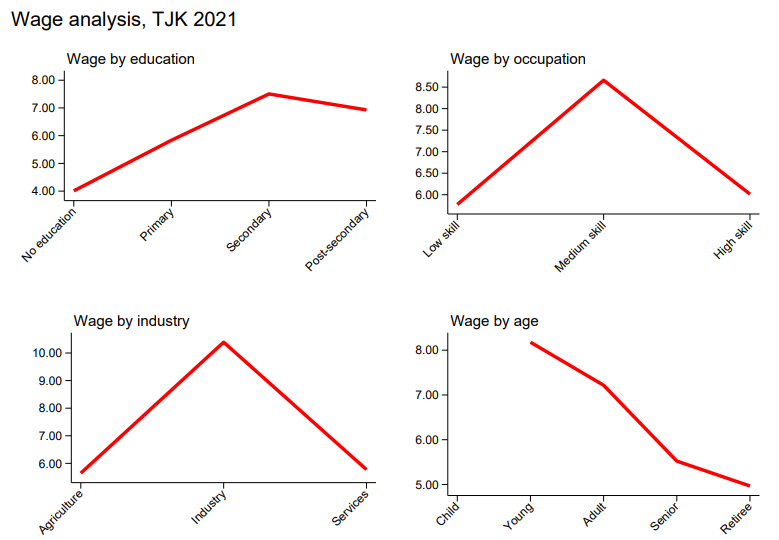
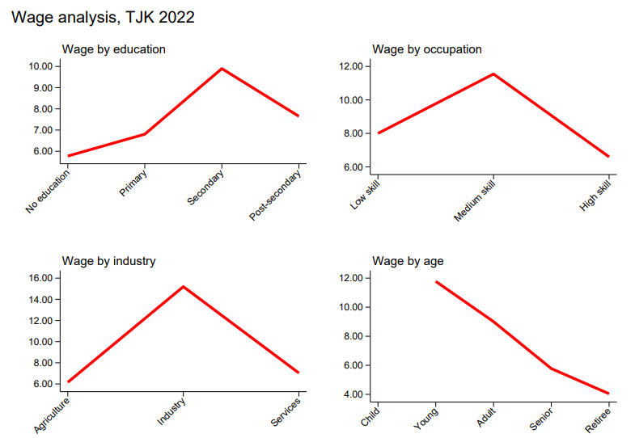
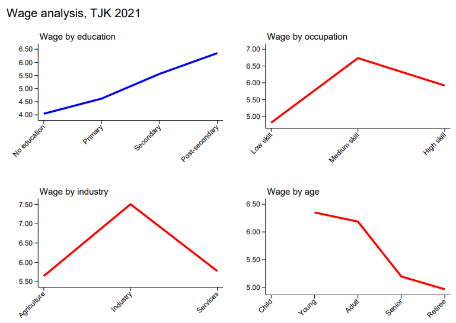

# Relationship between Skill and Wages

### Overview – Unexpected Wage Trends Across Groups
In reviewing the HBS harmonization, a noticeable inversion of expected salary patterns. Both 2021 and 2022 reveal unusual trends (Figure 1). First, wages increase with education level, peaking at the secondary level, but decline slightly among those with post-secondary education—challenging the conventional expectation of steady returns to higher education. Second, while medium-skill occupations show the highest average wages, high-skill occupations appear to earn less than medium-skill ones. Third, wages by sector reveal that the industry sector commands the highest earnings, significantly above both agriculture and services. Additionally, the age gradient shows a clear decline in wages with age after youth: younger workers earn more on average than adults, seniors, and retirees

<strong>Figure 1: HBS Wage Analysis</strong>

| HBS 2021         |  HBS 2022 |
|:-------------------------:|:-------------------------:|
|  |  |

<i>Note: The above graphs show hourly wages for paid employees.</i>

### Possible Reason : Economic Activity 

For HBS 2021, When we examine the predominant economic activities of paid employees (Table 1),two dominant activities are Construction and Commerce. These represent over 35% of all workers.

<strong>Table 1: Predominant Economic Activities workers</strong>

ISIC code   |   ISIC Economic activity description                                   | Percentage|
:-------:|:----------------------------------------------:|:----------------------------------------------:
 F       |     Construction                                          | 27%
 G , I   |     Wholesale and retail trade; repair of motor vehicles and motorcycles . Accommodation and food service activities                                         | 9%

 

An analysis of the share of these activities across all comparison groups suggests a potential positive relation with workers’ wages.
 

<strong>Table 2: Economic Activities per Educational Levels</strong>

|  Economic Activity Description              | No education | Primary | Secondary | Post-secondary |
|:------------------------------------------------|:-------------:|:--------:|:----------:|:----------------:|
| Construction                                    | 6%            | 24%      | 37%        | 11%              |
| Commerce                                        | 13%           | 15%      | 12%        | 6%               |

 

<strong>Table 3: Economic Activities per Skill Occupation</strong>

| Economic Activity Description              | Low-skill | Middle-skill | High-skill |
|:------------------------------------------------|:--------------:|:-----------------:|:---------------:|
| Construction                                    | 20%            | 45%               | 1%              |
| Commerce                                        | 11%            | 15%               | 1%              |

<strong>Table 4: Economic Activities per age groups</strong>

| Economic Activity Description              | Young | Adult | Senior | Retiree |
|:------------------------------------------------|:-------------:|:--------:|:----------:|:----------------:|
| Construction                                    | 35%            | 26%      | 10%        | 0%              |
| Commerce                                        | 14%           | 9%      | 5%        | 0%               |

When excluding these sectors from the analysis, wage patterns across most groups, although still not fully aligned with expectations, show less pronounced disparities. This suggests that the wage differences are likely driven by structural factors in the labor market, such as the distribution of workers across sectors, rather than errors in the survey or inconsistencies in the data.
 
 
<strong>Figure 2: Employee earnings by groups (excluding Construction and Commerce)</strong>

<figure>

</figure>

