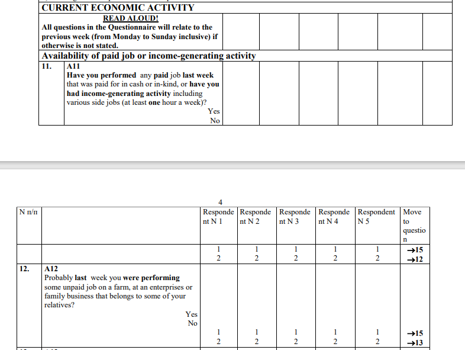
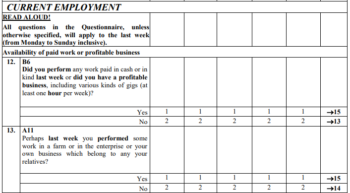
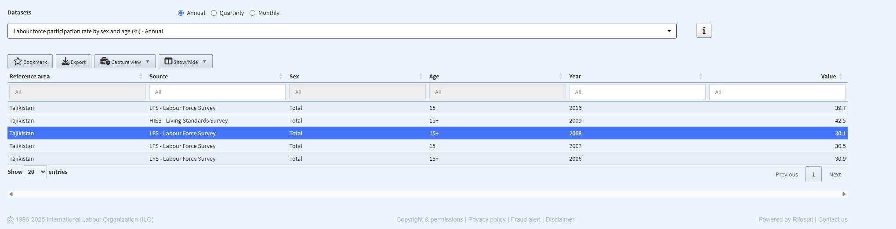
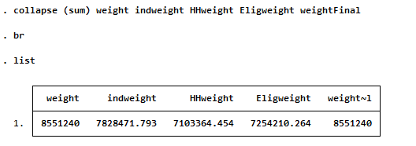
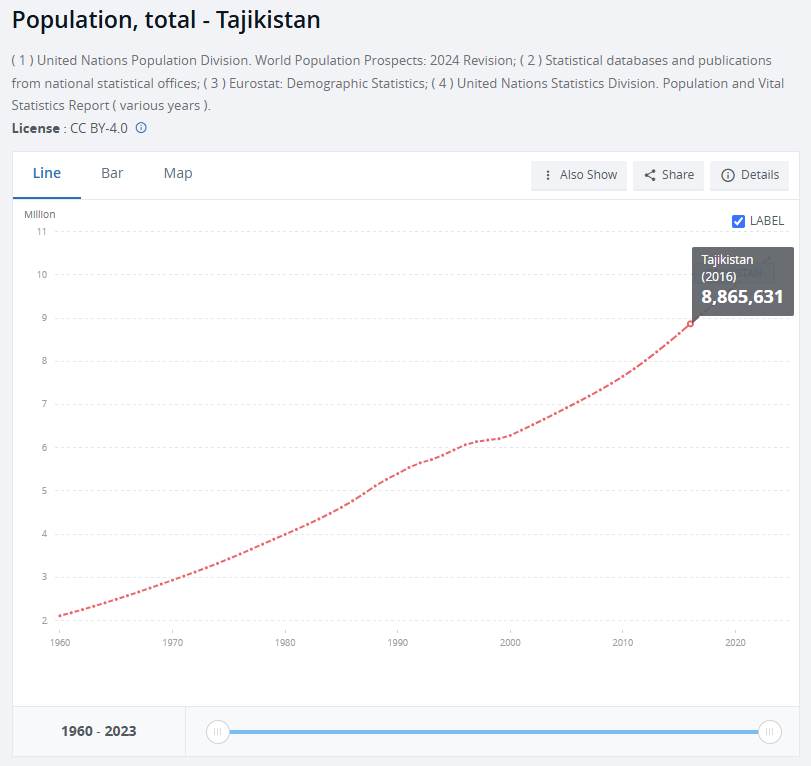
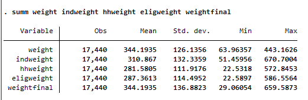
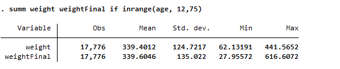

# Annual HouseHold Income and Expenditure Survey (LFS)

- [What is the TJK LFS?](#what-is-the-tjk-lfs)
- [What does the TJK LFS cover?](#what-does-the-tjk-lfs-cover)
- [Where can the data be found?](#where-can-the-data-be-found)
- [What is the sampling procedure?](#what-is-the-sampling-procedure)
- [What is the significance level?](#what-is-the-geographic-significance-level)
- [Other noteworthy aspects](#other-noteworthy-aspects)

## What is the TJK LFS?

The Labour Force Survey (LFS) is a household-based sample survey conducted by the Agency for Statistics of the President of the Republic of Tajikistan (TAJSTAT).There have been three editions of the survey, with the most recent conducted in 2016 in collaboration with the World Bank.

## What does the TJK LFS cover?

The TJK LFS findings provide annual labour market statistical indicators. The LFS targets individuals aged 12 to 75 years (working age population) and collects detailed information on their employment status, job characteristics, and economic activities during a reference week. It provides essential insights into the structure and dynamics of the workforce, including indicators of employment, unemployment, underemployment, and labour force participation.

The survey focuses on private households and excludes collective or institutional households such as retirement homes, military barracks, and prisons. It is conducted through face-to-face interviews based on a household questionnaire.

There are three official versions of the TJK LFS: conducted in 2004, 2009, and 2016. However, the Global Labour Database (GLD) harmonization currently includes only the 2009 and 2016 rounds.Years and their corresponding sample sizes of LFS harmonized are:


| **Year** | **Households Interviewed** | **Individuals Interviewed**  | **Expanded Population**  | **Official Sample Size (Households)** |
|:--------:|:--------------------------:|:----------------------------:|:------------------------:|:-------------------------------------:|
| 2009     | 4,937                      | 17,177                       | 5,228,669                | Not officially specified              |
| 2016     | 4,080                      | 24,997                       | 5,228,669                | 4,080                                 |


## Where can the data be found?

All the data is classified as Official Use Only: it may be used within the World Bank but is not authorized for external distribution.

## What is the sampling procedure?

The TJK LFS employs a two-stage stratified random sampling design. In the first stage, 272 Primary Sampling Units (PSUs) were selected using probability proportional to size, based on the 2010 census enumeration areas. In the second stage, 15 households and 5 replacements were randomly selected within each PSU from an updated household listing. The total sample included 4,080 households (1,440 urban and 2,640 rural), ensuring national and regional representativeness across five administrative regions, with separate coverage for urban and rural areas. The sampling structure was aligned with the 2009 LFS to support temporal comparisons

## What is the geographic significance level?

The LFS is representative at regional level across the five main administrative units, with separate data for urban and rural areas.

## Other noteworthy aspects

### Type of economic activity
To classify economic activity, the Tajikistan Labour Force Survey (LFS TJK) uses the OKVED (Russian Classification of Types of Economic Activity), which is aligned with the NACE (Statistical Classification of Economic Activities in the European Community) up to the 4-digit level. The 5th and 6th digits of OKVED refer to country-specific activities. The following table presents a correspondence between the relevant classification versions (all mappings are at the 4-digit level).

| **OKVED**   | **NACE**   | **ISIC**   |
|:-----------:|:----------:|:----------:|
| Rev 1.1     | Rev 1.1    | Rev 3.1    |
| Rev 2       | Rev 2      | Rev 4      |


### Employment Questions Order and Impact on Results

This survey has a special feature, the order of the questions in the main activity section matters. Figure 1 displays LFS 2009 and 2016 questions related to the activities performed by respondents. If they answer affirmatively to any of these questions, they are directed to the employment-related section under the assumption that this is their main job.


<div align="center"><strong>Figure 1: LFS current Activity questions</strong></div>

| LFS 2009          |  LFS 2016 |
|:-------------------------:|:-------------------------:|
|  |  |


This occurs in all cases. Upon the first affirmative response, the individual is specifically asked about that job. It is not possible to know information about other types of work. Commonly, if the survey determines a person eligible to be asked about employment in various ways (i.e., they have various jobs) the enumerator asks about the job that the respondent devotes the most time to. Here the order determines the selection.

### Origin of the 2009 LFS

Upon reviewing the 2009 data, no official report could be found, as expected. Furthermore, according to ILOSTAT, labor force participation for that year is not reported under a labor force survey (LFS). Instead, the 2008 round is labeled as an LFS, while 2009 is categorized as a [living standards survey](https://rshiny.ilo.org/dataexplorer69/?lang=en&segment=indicator&id=EAP_DWAP_SEX_AGE_RT_A) (see image below). This discrepancy raises questions about the true nature and methodology of the 2009 survey.

<div align="center"><strong>Figure 2: ILO Data Explorer, Tajikistan 2009</strong></div>

<figure>



</figure>

While some annual data are available on the Tajikistan official statistics [website](http://data.stat.tj/Home/index2/14?lang=en), the source and classification of these figures remain unclear. Notably, the values reported on the national site do not match those published by ILO, further highlighting inconsistencies in the data. Given these uncertainties, it is important to acknowledge the lack of clarity regarding the origin and classification of the 2009 survey data.


### Weight Variable Selection – LFS 2016

The LFS 2016 raw data includes several weight variables. To determine the most appropriate one, we conducted the following analysis.

First, we reviewed the dataset that includes all individuals. Figure 2 shows the total population using the weights from the full individual-level datase.

<div align="center"><strong>Figure 3: Total Population - Persons data</strong></div>

<figure>



</figure>

According to the World Development Indicators (WDI), Tajikistan's population in 2016 was approximately 8.8 million (see Figure 3). This suggests that the variables ```weight``` and ```weightFinal``` from the full dataset closely reflect the national population.

<div align="center"><strong>Figure 4: Total Population - WDI</strong></div>

<figure>



</figure>

Next, we analyzed the questionnaire dataset, which only includes individuals aged 12 to 75 (the target population for the LFS). Figure 4 shows the population totals using weights from this dataset. For comparison, Figure 5 shows the same calculation using the full individual-level data restricted to the 12–75 age group. The questionnaire dataset includes slightly more individuals and shows a lower average weight. Also, iIn the full dataset, the average values of ```weight``` and ```weightfinal``` differ slightly. In the questionnaire dataset, their averages are exactly the same.

<div align="center"><strong>Figure 5: Total Population - questionnarie data </strong></div>

<figure>



</figure>


<div align="center"><strong>Figure 6: Total Population - - Persons data (12 to 75 years) </strong></div>

<figure>



</figure>

We selected ```weightfinal``` from the questionnaire dataset as the main weight variable. When individuals were missing from that dataset, we completed the weights using ```weightFinal``` from the full data file.


### How recode to ICLS-19

The 2009 Labour Force Survey follows the ICLS-13 classification, while the 2016 round adopts the updated ICLS-19 standards.For more details on the changes introduced in ICLS-19 [please see here on the ILO website](https://ilostat.ilo.org/methods/concepts-and-definitions/description-work-statistics-icls19/).

Although it is not feasible to revert the 2016 data to the earlier classification, it is possible to align the 2009 data with the ICLS-19 framework. To ensure comparability between both rounds, selected adjustments can be made to the employment coding, supported by the questionnaire structure. The specific harmonization procedures are detailed in a separate [document.](icls13to19.md) 


### Education System in Tajikistan

In tjkna, education is organized into three stages: basic education, secondary education, and tertiary education. The table below illustrates the average duration in years of each stage. This information is useful for creating the variable educy, that codes the number of years spent in education and the variable educat7, that classifies the highest level of education attained by the respondent to seven levels.

| Education Level                                     | Years   | Observations                                   |
|:---------------------------------------------------:|:-------:|:----------------------------------------------:|
| Primary                                            | 6       |                                                |
| Junior High School (JSS1/JHS1)                      | 3       |                                                |
| Middle Secondary                                    | 3       | After primary education (old system), replaced by JHS |
| Senior High School                                  | 4       |                                                |
| Vocational/Technical                                | 2       |                                                |
| Technical Training/Nursing/Polytechnic              | 3       |                                                |
| University                                          | 4       |                                                |
| Other Tertiary                                      | 2       | Assumes Master's and PhD                       |


