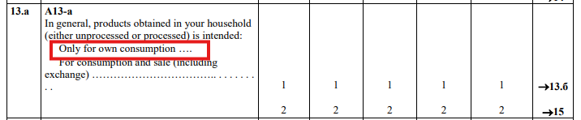
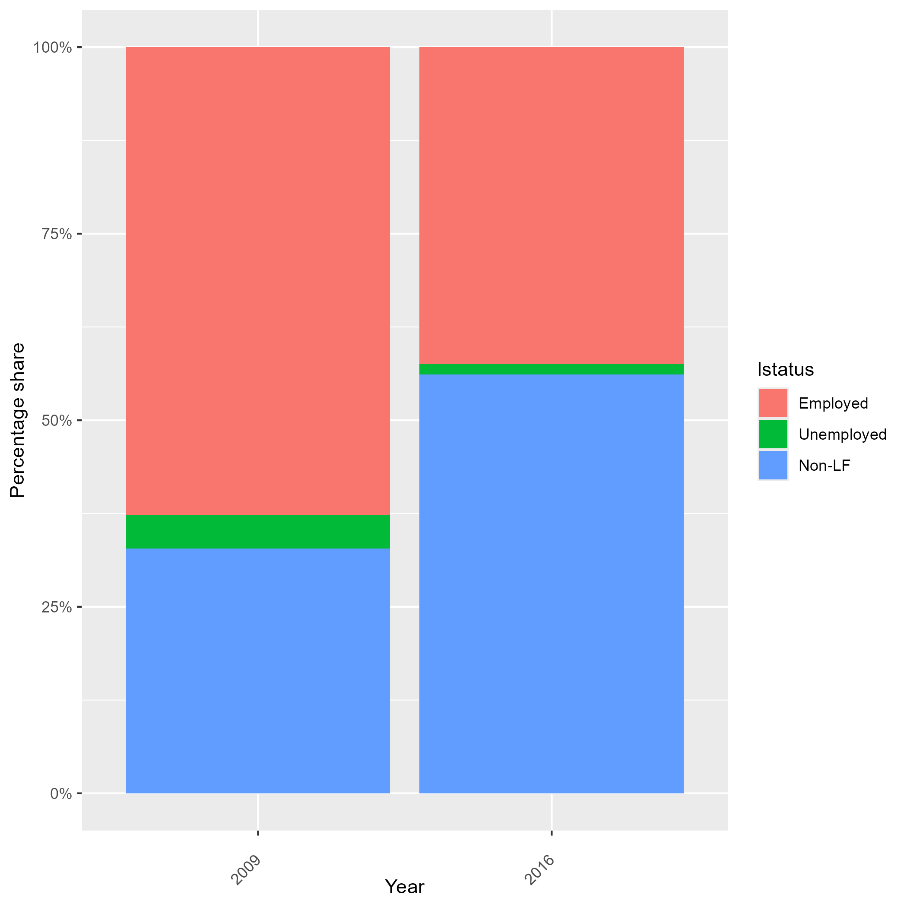
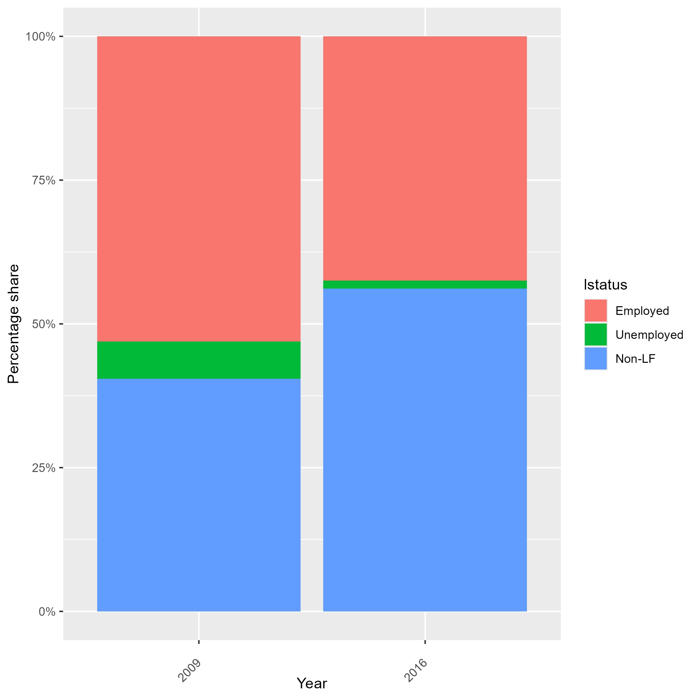

# Introduction

At the 19th ICLS in 2013, a significant development emerged with the adoption of the [Resolution concerning statistics of work, employment, and labor underutilization](https://www.ilo.org/resource/resolution-concerning-statistics-work-employment-and-labour). This led to a change in the concept of employment compared to ICLS-13.

In essence, the ICLS-19 resolution delineates **employment** only as work conducted for pay or profit. Activities performed not in exchange for remuneration, like own-use production work, volunteer work, and unpaid trainee work, are classified as **other forms of work**.

Therefore, in order to compare LFS 2009 with LFS 2016 and other surveys which employ ICLS-19, it is necessary to modify the coding of  variable `lstatus` using the nuances of the questionnaire.

## Framework for identifying employment

The LFS 2009 questionnaire, used information on current activity to define employment through the ***Current Employment*** block.

## Current coding to the ICLS-19 definition

In converting to the new definition, the approach adopted here is to create a variable that identifies those that are engaged in non-market farming. See the Figure 1 below for the relevant parts in the questionnaires.

<figure>

<figcaption><b>Figure 1</b><i> LFS Labour Questions, 2009 </i></figcaption>



</figure>

The code below should be pasted after the code creating the ```lstatus``` variable. Note that this is based on the options available. ILO standard usually excludes work done *mostly* for own consumption from employment, which is not the case here. Hence differences may still arise and users should be aware of these caveats.


```     
*Create an indicator "emp_diff" that identifies the difference between definitions (emp_diff)
	 gen emp_diff = 0 if inlist(lstatus, 1)
	*Add those in non market farming
	 replace emp_diff = 1 if emp_diff == 0 & inlist(a13_a, 1) 
  
  * Use emp_diff to generate ICLS-19 definition
  replace lstatus = . if emp_diff == 1
  
  *Unemployed - updated
  replace lstatus = 2 if passive == 1 & active == 1 & missing(lstatus)
	
	*presently not working but waiting for the start of a new job
	replace lstatus = 2 if prch_bz1 == 1  & missing(lstatus)
 *NLF - updated
	replace lstatus = 3 if (passive == 1 | active == 1) & missing(lstatus)
	replace lstatus = 3 if (psk_bz == 2 | psk_bz == 1) & missing(lstatus)
	
	
	replace lstatus = . if age < minlaborag
```

We can go further an try to overwrite the employment status, occupation sector, industry and occupation of those that we assume would have - under the new definition - been recorded with their own consumption definition under the new employment definition.

```     
	replace empstat = . if emp_diff == 1
	replace industrycat10 = . if emp_diff == 1
	replace occup = . if emp_diff == 1
```
Finally, do the last bits of cleaning up to ensure the other labour variables are in line with what could be expected for own-consumption workers.

```
  * WAGE (send to missing)
  replace wage_no_compen = . if emp_diff == 1 
  
  * WHOURS (send to missing)
  replace whours = . if emp_diff == 1 
  
  * CONTRACT (send to missing)
  replace contract = . if emp_diff == 1 
  
  * SOCIAL SECURITY (send to missing)
  replace socialsec = . if emp_diff == 1
  
  * UNION (send to missing)
  replace union = . if emp_diff == 1 
  
  * FIRMSIZE (send to missing)
  replace firmsize_l = . if emp_diff == 1 
  replace firmsize_u = . if emp_diff == 1
```

The table below shows the changes observed in `lstatus` variable after implementing the code adjustments.

| Before ICLS Adjustment          | After ICLS Adjustment  |
|:-------------------------:|:-------------------------:|
|  |  |