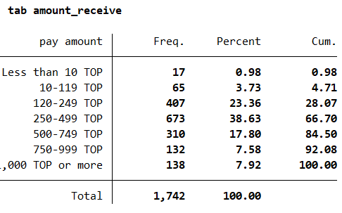

# Introduction to Tonga Labor Force Survey (TON LFS)

- [What is the TON LFS?](#what-is-the-ton-lfs)
- [What does the TON LFS cover?](#what-does-the-ton-lfs-cover)
- [Where can the data be found?](#where-can-the-data-be-found)
- [What is the sampling procedure?](#what-is-the-sampling-procedure)
- [What is the geographic significance level](#what-is-the-geographic-significance-level)
- [Other noteworthy aspects](#other-noteworthy-aspects)

## What is the TON LFS?

The Tonga Labor Force Survey (TON LFS), has been conducted by the Tonga Statistics Department and the Ministry of Trade and Economic Development (MTED). The survey has been conducted in three years: 2003, 2018 and 2023. The 2018 and 2023 versions follow the ILO international guidelines for Labor Force Surveys. The TON LFS primary objective was to provide labor market statistics for development and enhance monitoring and evaluation of the Tonga Strategic Development Framework (TSDF), Ministerial Strategic Plans , Budget briefs and Sustainable Development Goals linked to economic growth and unemployment.

## What does the TON LFS cover?
The TON LFS is a labor force survey with information on household roster characteristics, education, employment, primary and secondary economic activities in the past week, work history and characteristics of the unemployed and household living conditions. The harmonized years and sample sizes used in the GLD harmonization are as follows:

| **Year** | **# of Households** | **# of Individuals** | **Expanded Population** |
| :------: | :-------:		      | :-------:	 	        | :-------:	 	          |
| 2018     | 2,644               | 12,089               | 99,600                  |
| 2023     | 2,239               | 10,091               | 99,856                  |

## Where can the data be found?
The datasets for the years 2018 and 2023 were obtained internally by the World Bank and are not directly available to the public. Data requests may be directed to the Statistics Department of the Tongan Goverment ([link here](https://tongastats.gov.to/statistics/8091-2/)). 

## What is the sampling procedure?
The TON LFS uses stratified multi-stage sampling design. The population is divided into distrinct subgroups (by island) with similar characteristics. The island level information is used as stratification for sampling selection.

## What is the significance level?

The surveys are significant at the national, national urban/rural, and island divisions (Tongatapu, Vavaʻu, Haʻapai, ʻEua, and Ongo Niua) levels. The Tongapatu division is, moreover, also significant itself at the urban/rural level. 

## Other noteworthy aspects

### Coding of labour in the Tonga 2018 LFS

#### ICLS Definition Context

The Tonga 2018 LFS questionnaire and official report reflect a transitional period in international labour statistics standards:

- **ICLS-13 (1982)**: Defined employment broadly to include all work for pay or profit, plus own-use production work such as subsistence farming and food production for own consumption.
- **ICLS-19 (2013)**: Narrowed the employment definition to work performed for others in exchange for pay or profit. Subsistence and own-use production of goods were reclassified as a separate form of work, no longer counted as employment.

#### Questionnaire Structure

The Tonga 2018 LFS captures both frameworks:

- **Section C**: Captures ICLS-19 concepts, focusing on work for pay or profit (including paid employment, own business, and unpaid family work in market-oriented enterprises).
- **Section D**: Collects information on agricultural workers and other production (e.g., handicrafts), reflecting the broader ICLS-13 approach that includes subsistence activities.

#### Our Coding Approach

The official report's labour force participation and employment numbers reflect ICLS-13 definitions. The GLD harmonization maintains consistency with this approach to ensure comparability with published statistics. The labour status variable (lstatus) is coded as follows:

##### Employed (lstatus = 1)
1. **From Section C**: Individuals working for pay or profit (pay_work, own_business, unpaid_work), including those temporarily absent with standard reasons or expecting to return within 3 months. *Exception: seasonal work (code 11) is not classified as employed.*

2. **From Section D**: Individuals engaged in agricultural production (work_farm codes 1-4) or animal husbandry (animal_main_occupation not missing).

   *Note: Section D includes handicraft workers (code 4), which appear to be market-oriented production (likely for tourism), raising questions about why they weren't captured in Section C. We include them as employed following the questionnaire structure.*

##### Unemployed (lstatus = 2)
- Individuals actively looking for work AND available to start
- Future starters who have found a job

##### Not in Labour Force (lstatus = 3)
- All remaining individuals of working age

#### Key Implications

**Broader employment definition**: By following ICLS-13 (via the official report, see Tables 4.1 and 5.1), our employment rate includes subsistence agricultural workers and own-use production, resulting in higher employment and labour force participation rates than would be obtained under ICLS-19.

### Coding of labour in the Tonga 2023 LFS

The 2023 questionnaire and report reflect the ICLS-19 coding. This is incorporated into the GLD harmonization. The numbers do not differ greatly between 2018 and 2023 which denotes that the change in definition does not have a great impact. This is due to the lower presence of subsistence agriculture in the country, but also due to the fact that the 2018 section on household production was capturing handicrafts which in 2023 are correctly being identified as production for market exchange in the questionnaire flow. 

### Migration information across the years

The migration questionnaires for 2018 and 2023 differ in their scope and focus. In 2018, the survey included questions about individuals migrating both internationally and from within Tonga. In contrast, the 2023 questionnaire focused exclusively on international migration to Tonga, so we only coded responses from those who moved to Tonga from abroad.

### Wage information in 2018
The raw microdata in 2018 contains information on wages but it is structured in ranges (e.g., between 10 and 119 Tongan pa'anga). The GLD guidelines indicate that the level of information is not detailed enough to be reported in the GLD datasets. Below is the 2018 questionnaire ranges for wages. 

