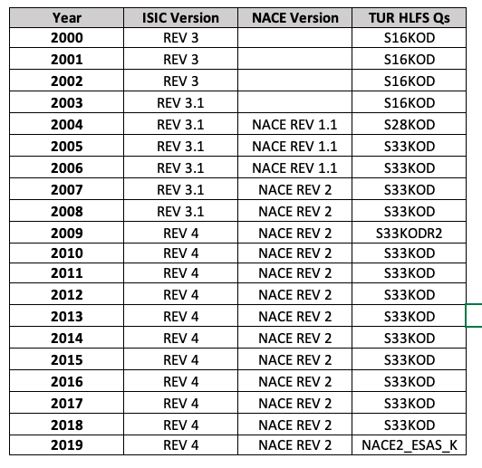

# Correspondence between Turkish Economic Activity Classification and ISIC

Information regarding the industry respondents is coded in the Turkish Household Labour Force Survey (HLFS) using the codes of the [Statistical Classification of Economic Activities in the European Community](https://ec.europa.eu/eurostat/ramon/nomenclatures/index.cfm?TargetUrl=LST_NOM_DTL&StrNom=NACE_REV2&StrLanguageCode=EN&IntPcKey=&StrLayoutCode=HIERARCHIC) (shortened as NACE) since 2004. Previous to that TURKSTAT used the [isic rev 3](https://unstats.un.org/unsd/classifications/Family/Detail/2) economic activity classification. 

## Data as present in survey raw data

The image below shows the answers to the relevant question (`s33kod` asks for the economic activity of the local unit in which persons worked) of the 2010 survey :

  

  

The information is at the two digit level (length of `s33kod` has to be 4), while NACE is structured at a 4 digit level with the first level being a letter from the alphabeth. The information from the raw dataset is coded up to the two-digit numeric level. Thus, If the information is insufficient to make a four-digit classification a higher level classification is done and the two-digit code is padded with a zero so that all answers have the same length.

## Correspondance information available

In the table below we show the from where NACE and ISIC become mappable. For instance, year 2009 is the first year correspondance between the two groups is possible because at the two digit level, the NACE REV 2 has correspondance to the code from ISIC REV 4 where the dataset has a two digit code. 

  

  

The RAMON website from the statitiscal office of the European Union has developed correspondance tables for NACE REV 2. to ISIC 4, the information is available [here](https://ec.europa.eu/eurostat/ramon/relations/index.cfm?TargetUrl=LST_LINK&StrNomRelCode=NACE%20REV.%202%20-%20ISIC%20REV.%204&StrLanguageCode=EN). 

### Overall mapping logic

Following the table below, we grouped the sections of ISIC REV. 4 on a two digit level and then manually looked for the correspondence to the sections in the NACE REV.2  

  

  

The result was used for yeard 2009 onwards to create the variable `industry_isic'.

## Limitations

1. ISIC REV 3 was superseded and there is no correspondance table that validates the correspondance to NACE classifications for the years 2000 to 2003. 

2. ISIC REV 3.1 was also superseded and the classification the highest level follows a numeric order while the NACE 1.1 classification uses letter from the arabic alphabet. There is no direct correspondance between them, to code NACE to ISIC REV 3.1, the raw data does not get to four digits which is the ideal to build a correspondance. 

