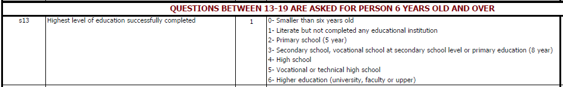
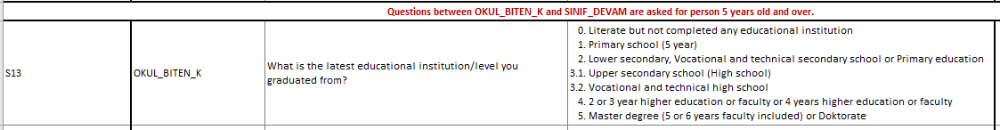
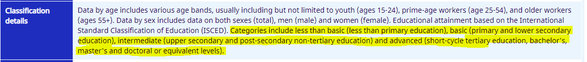

# Relevant information about the education section

The education section of the GLD harmonized dataset provides information to the user on the educational level of the individuals interviewed in the HLFS. Usually this section will resemble fully the documentation from the raw dataset, yet, in this case the user will find useful additional information to understand the decisions made on the harmonized files.

## The education section in the harmonized file

The education section contains variables that explain the concepts of literacy, education achieved and length of stay in formal education. To construct these variables, the harmonization team used the variable age from the dataset and research papers with information about the education system changes in Türkiye, the main external document used can be found [here](Utilities/education_paper.pdf).

## Changes in the Turksish education system

The formal education system in Türkiye is divided into primary education, lower secondary education, upper secondary education and vocational training, and  higher education. Figure 1. shows the formal education system and the total years needed for completing each level.

Figure 1. Turkish education system
<br></br>

<br></br>
Source: OECD Review, Türkiye (accessed January 2022) https://www.oecd-ilibrary.org//sites/71ee93b4-en/index.html?itemId=/content/component/71ee93b4-en#figure-d1e3886


The structure above changed in the past years due to improvements in curricula and definition of years of schooling and aged of pupils. According to Gun and Baskan (2014), different laws were passed between 1997 and 2012 that affected the education system of Türkiye. Table 1 below summarizes the changes and the importance of each. The most dramatic change took place in 2012 with the enactment of the 4+4+4 law that stated 4 years primary, 4 years elementary and 4 years high school to replace the previous law of 8 years of primary education.

Table 1. Pivotal changes in the education system
| Year	    | Relevant Change	                                                                        |
| :-------	| :--------	 	                                                                            |
| Pre 1997	| 5 year primary education                                                                |
| 1997-2012	| Formal implementation of the 8-year primary education system across the country	        |
| 2012	    | Extension of primary education from 8 to 12 years in the form of 4+4+4                  |

With the reform in 2012 the age of entrance to formal education changed to 5,5 years or 6 60-66 months, from the previous 69-80 months.

## Changes in the questionnaire

The changes in the education system are ultimately reflected in the questionnaire. Below, Figures 1 and 2 show the classification of education used in the questionnaires from 2000 to 2013 (Figure 1) and from 2014 onwards (Figure 2)

Figure 1. HLFS education 2000 to 2013:
<br></br>

<br></br>

Figure 2. HLFS education 2014 to 2019:
<br></br>

<br></br>

As a result of the changes and the reduced set of categories, the GLD team only mapped education to the `educat4` level to obtain a consistent time series.

## Comparison with ILO data

The ILOSTAT website also contains information on employment by education level [see here](https://www.ilo.org/shinyapps/bulkexplorer52/?lang=en&segment=indicator&id=EMP_TEMP_SEX_EDU_NB_A). These data were used to validate the GLD education categories. However, the four levels of education at the ILO do not correspond directly to the GLD levels, as the concept of "Basic education" for the ILO includes lower secondary, while GLD/GMD's `educat4` differentiates between "No education", "Primary", "Secondary", "Beyond Secondary". The screenshot below has the ILO category definitions.

Figure 3. ILO education categories:
<br></br>

<br></br>

## Coding beyond four categories, mapping to ILO level

The below codes will allow users to map to `educat7` or the ILO categories if they wish. In the case of 7 categories beware of potential inconsistencies in the time series.

```
* Mapping to educat7
* Assume education variable is called "s13"

* From 2000 to 2013
* -----------------

*<_educat7_>
	gen educat7 = .
	replace educat7 = 1 if inrange(s13, 0, 1)
  * No "primary incomplete"
	replace educat7 = 3 if s13 == 2
  replace educat7 = 4 if s13 == 3
  replace educat7 = 5 if inrange(s13, 4, 5)
	replace educat7 = 7 if s13 == 6
  label var educat7 "Level of education 1"
	la de lbleducat7 1 "No education" 2 "Primary incomplete" 3 "Primary complete" 4 "Secondary incomplete" 5 "Secondary complete" 6 "Higher than secondary but not university" 7 "University incomplete or complete"
	label values educat7 lbleducat7
*</_educat7_>

* From 2014 to 2019
* -----------------

*<_educat7_>
	gen educat7 = .
	replace educat7 = 1 if s13 == 0
  * No "primary incomplete"
	replace educat7 = 3 if s13 == 1
  replace educat7 = 4 if s13 == 2
  replace educat7 = 5 if inrange(s13, 31, 32)
	replace educat7 = 7 if inrange(s13, 4, 5)
  label var educat7 "Level of education 1"
	la de lbleducat7 1 "No education" 2 "Primary incomplete" 3 "Primary complete" 4 "Secondary incomplete" 5 "Secondary complete" 6 "Higher than secondary but not university" 7 "University incomplete or complete"
	label values educat7 lbleducat7
*</_educat7_>

```


```
* Mapping to ILO categories
* Assume education variable is called "s13"

* From 2000 to 2013
* -----------------

*<_educat_ilo_>
	gen byte educat_ilo = .
	replace educat_ilo = 1 if inlist(s13, 0, 1)
	replace educat_ilo = 2 if inlist(s13, 2, 3)
	replace educat_ilo = 3 if inlist(s13, 4, 5)
	replace educat_ilo = 4 if s13 == 6
	label var educat_ilo "ILO levels of education"
	la de lbleducat_ilo 1 "Less than basic" 2 "Basic" 3 "Intermediate" 4 "Advanced", replace
	label values educat_ilo lbleducat_ilo
*</_educat_ilo_>

* From 2014 to 2019
* -----------------

*<_educat_ilo_>
	gen byte educat_ilo = .
	replace educat_ilo = 1 if s13 == 0
	replace educat_ilo = 2 if inlist(s13, 1, 2)
	replace educat_ilo = 3 if inlist(s13, 31, 32)
	replace educat_ilo = 4 if inlist(s13, 4, 5)
	label var educat_ilo "ILO levels of education"
	la de lbleducat_ilo 1 "Less than basic" 2 "Basic" 3 "Intermediate" 4 "Advanced", replace
	label values educat_ilo lbleducat_ilo
*</_educat_ilo_>

```

## References

Feyza Gün, Gülsün Atanur Baskan,
[New Education System in Türkiye (4 +4 +4): A Critical Outlook](Utilities/New_Ed_System_Turkey.pdf),
Procedia - Social and Behavioral Sciences,
Volume 131,
2014,
Pages 229-235.
