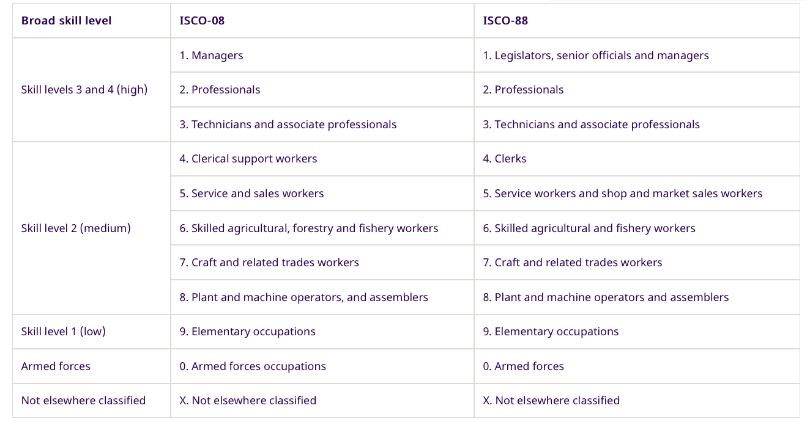

# Correspondence between the Turkish HLFS occupation codes and ISCO

This document first describes the logic of the process and then provides users with the underlying conversions tables as well as the  the harmonization codes.

## Occupation codes used in the Turkish’s HLFS

The Turkish *Labour Force Survey* uses the ISCO system to classify occupation answers of the HLFS. There were three different classification systems between 2000 and 2019. 

In the year 2000, the survey used the first digit of the [ISCO-68](https://www.ilo.org/public/english/bureau/stat/isco/isco68/major.htm) classification as per the ILO categories:
> 1. Scientific, technical, professional and related workers
> 2. Administrative, executive and managerial workers
> 3. Clerial and related workers
> 4. Sales workers
> 5. Service workers
> 6. Agricultural, animal husbandry and forestry workers, fisherman and hunters
> 7. Non-agricultural production and related workers, transport, equipment operators and labourers
> 8. Workers not classifiable by occupation

Between the years 2001-2011 the survey uses the first digit of the [ISCO-88](https://www.ilo.org/public/english/bureau/stat/isco/isco88/major.htm) classification again following the ILO categories. 

> 1. Legislators, senior officials and managers
> 2. Professionals
> 3. Technicians and market sales workers
> 4. Clerks
> 5. Service workers and shop and market sales workers
> 6. Skilled agricultural and fishery workers
> 7. Craft and related trade workers
> 8. Plant and machine operators and assemblers
> 9. Elementary occupations

Finally between the years 2012-2019 the survey used the two digits of the [ISCO-08](https://www.ilo.org/public/english/bureau/stat/isco/isco08/index.htm) classification, below we show the highest level for simplicity yet more information on the different levels can be found in this [links](https://ilostat.ilo.org/resources/concepts-and-definitions/classification-occupation/).

> 1. Managers
> 2. Professionals
> 3. Technicians and Associate Professionals
> 4. Clerical Support Workers
> 5. Services and Sales Workers
> 6. Skilled Agricultural, Forestry and Fishery Workers
> 7. Craft and Related Trades Workers
> 8.  Plant and Machine Operators and Assemblers
> 9. Elementary Occupations
> 0. Armed Forces Occupations

In the Harmonized GLD, skill level variables were developed for only ISCO-88 and ISCO-08 variables at the 1 digit level because the information of correspondance with ISCO-68 is not available in the ILO website. To learn more about skill level tables please visit the following [link](https://ilostat.ilo.org/resources/concepts-and-definitions/classification-occupation/):

  

  

Source: ILO website - ISCO skill Correspondance Table

## Limitations 

In comparison to other surveys the process of mapping is straightforward in the Turkish HLFS but it only reaches the second level (digits) of detail from year 2012 to 2019.

## List of variables per year for occupations harmonized

Below we list the questions that helped in the development of the harmonized occupation variable for all the survey years. 

  

  

Source: TUR HLFS, TURKSTAT
