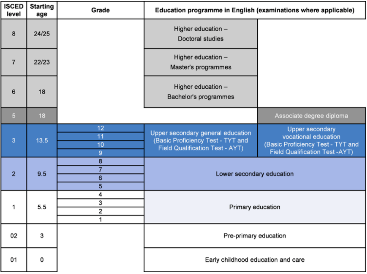
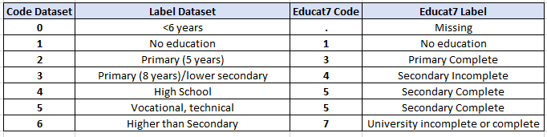
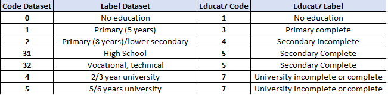
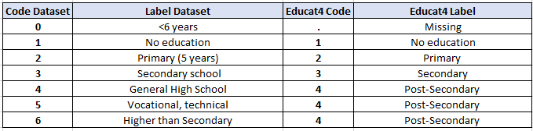

# Relevant information about the education section

The education section of the GLD harmonized dataset provides information to the user on the educational level of the individuals interviewed in the HLFS. Usually this section will ressemble fully the documentation from the raw dataset, yet, in this case the user will find useful addtional information to understand the decisions made on the harmonized files.

## The education section in the harmonized file

The education section contains variables that explain the concepts of literacy, education achieved and lenght of stay in formal education. To contruct these variables, the harmonization team used the variable age from the dataset and research papers with information about the education system changes in Turkey, the main external document used can be found [here](Utilities/education_paper.pdf). 

## Changes in the Turksish education system

The formal education system in turkey is divided into primary education, lower secondary education, upper secondary education and vocational training, and  higher education. Figure 1. shows the formal education system and the total years needed for completing each level. 

Figure 1. Turskish education system
  

  
Source: OECD Review, Turkey (accessed january 2022) https://www.oecd-ilibrary.org//sites/71ee93b4-en/index.html?itemId=/content/component/71ee93b4-en#figure-d1e3886

The structure above changed in the past years due to improvements in curricula and definition of years of schooling and aged of pupils. According to Gun and Baskan (2014), different laws were passed between 1997 and 2012 that affected the education system of turkey. Table 1 below summarizes the changes and the importance of each. The most dramatic change took place in 2012 with the enactment of the 4+4+4 law that stated 4 years primary, 4 years elementary and 4 years high school to replace the previous law of 8 years of primary education.

Table 1. Pivotal changes in the education system
| Year	    | Relevant Change	                                                                        |
| :-------	| :--------	 	                                                                            |
| Pre 1997	| 5 year primary education                                                                |
| 1997-2012	| Formal implementation of the the 8-year primary education system across the country	    |
| 2012	    | Extension of primary education from 8 to 12 years in the form of 4+4+4                  |

With the reform in 2012 the age of entrance to formal education changed to 5,5 years or 6 60-66 months, from the previous 69-80 months.

## Choices made

Between 2000 and 2019, the turkish education went through reforms. In particular, there were changes to the entry age for primary education. The minimum age of entry was set to six years old, this change came from the 4+4+4 to the formal education structure as described in previous sections. As a result of this change, the turkish surveys changed the age limit for education questions.

For the GLD harmonization, the change meant that for certain years the codification for the most dissagregated education variables will follow an structure that was later changed as the years progressed.  As a result, files from 2000 to 2013 have a different structure to those from 2014 to 2019. In Figure 1 and 2 we show how this looks like for the variable educat7 which is the most dissagregated level of education. In practice, educat7 gives the user granular data to work with, but across years it may vary on the quantity of observations per level of education. Thus, the GLD team decided to harmonize the education categories for Turkey at the level of educat4 (see figure 3 below) which is the highest level of dissagregation for levels of education.As a result, the user will find that across years educat4 contains more reliable and stable data to do comparative analysis.

Figure 1 . HLFS 2000 to 2013:

  

  

Figure 2 . HLFS 2014 to 2019:

  

  

Figure 3. HLFS 2000-2019
  

  

## Nature of the data

The data from year 2000 to 2013 contains population from ages 0 to 99 while the files from 2014 to 2019 contain only data for the respondants in the age bracket 15 year plus. As a result, between years 2014 onwards there is little information to clasify the respondants under the categories of primary incomplete or basic education based on age solely. 

## References

Feyza Gün, Gülsün Atanur Baskan,
[New Education System in Turkey (4 +4 +4): A Critical Outlook](Utilities/New_Ed_System_Turkey.pdf),
Procedia - Social and Behavioral Sciences,
Volume 131,
2014,
Pages 229-235.
