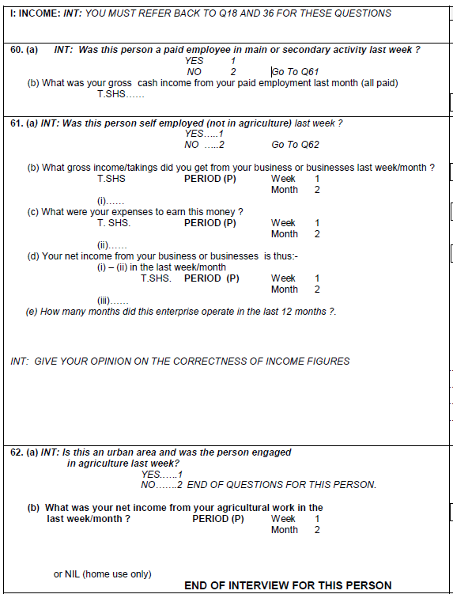

-   [Introduction to Tanzania Integrated Labor Force Survey (TZA ILFS)](#introduction-to-tanzania-integrated-labor-force-survey-tza-ilfs)
    -   [What is the TZA ILFS?](#what-is-the-tza-ilfs)
    -   [What does the TZA ILFS cover?](#what-does-the-tza-ilfs-cover)
    -   [Where can the data be found?](#where-can-the-data-be-found)
    -   [What is the sampling
        procedure?](#what-is-the-sampling-procedure)
    -   [What is the significance
        level?](#what-is-the-significance-level)
    -   [Other noteworthy aspects](#other-noteworthy-aspects)

# Introduction to Tanzania Integrated Labor Force Survey (TZA ILFS)

## What is the TZA ILFS?

The Tanzania (TZA) Integrated Labor Force Survey (ILFS) is a Labor Force Survey conducted by the Tanzania National Bureau of Statistics (NBS). They surveys were conducted in 1990-91, 2000-01, 2006, 2014 and 2020-21. The harmonization begins with the 2000-01 round where separate surveys have been conducted for Mainland Tanzania and the islands of Zanzibar. This has been the practice until 2020 when a unified survey was conducted for both geographic areas.

## What does the TZA ILFS cover?

The TZA ILFS is broader in scope compared to the conventional, periodic LFS. It covers questions on socio-demographic details, disabilities, education, migration, labor market activities in the past 7 days and past 12 months. It also covers questions beyond the scope of the GLD, such as household amenities and asset ownership, health and safety practices, activities in the informal sector, and time use (beginning in 2006). 

The harmonized years and sample sizes used in the GLD harmonization are:

| **Year (Geographic coverage)** | **Households** | **Individuals** |
|--------------------------------|----------------|-----------------|
| 2000-01 (Mainland Tanzania)    | 11,158         | 43,558          |
| 2006 (Mainland Tanzania)       | 16,445         | 72,441          |
| 2006 (Zanzibar)                | 5,479          | 28,277          |
| 2014 (Mainland Tanzania)       | 11,472         | 47,199          |
| 2014 (Zanzibar)                | 6,947          | 36,764          |
| 2020-21 (Unified)              | 15,706         | 74,558          |

## Where can the data be found?

The datasets are not accessible to the public and researchers have to request the data from the National Bureau of Statistics. The World Bank has been granted access to the datasets, if you work or are part of the World Bank Group, kindly contact the Jobs Group with a formal request for access to gld@worldbank.org.

Most of the raw datasets were received in Stata .dta format except for the 2014 (Mainland Tanzania) and 2020 rounds which were received as SPSS .sav files and were converted to Stata .dta files. 

## What is the sampling procedure?

The ILFS rounds adopted a two-stage stratified sampling design. The listing of the villages and enumeration areas constitute the primary sampling units and are taken from the National Master Sample.

The first stage determines the primary sampling units (PSUs) but the strata to which these PSUs are selected differ across the surveys. For Mainland-only surveys in 2006 and 2014, PSUs are stratified by area of residence (i.e., urban or rural). The same strata were used for the unified 2020-21 survey, but Dar-es-Salaam was split from the other urban areas (e.g., three strata in total). The process is more nuanced for the 2000-01 survey where the selection of PSUs in urban areas is further classified by income levels (i.e., high, middle and low-income enumeration areas). Meanwhile, Zanzibar-only surveys in 2006 and 2014 sample the PSUs by region and area of residence (urban v rural). PSU are selected randomly with probability proportional to size.

The second sampling stage are the households, which are selected at random from a fresh household listing.  

## What is the significance level?

The official reports detail results by area of residence. These are:

- Dar es Salaam region
- Other urban areas of Mainland Tanzania
- Rural areas of Mainland Tanzania
- Urban areas of Zanzibar
- Rural areas of Zanzibar

## Other noteworthy aspects

### Definition of concept of employment

Since the passing of the [resolution concerning statistics of work, employment and labour underutilization](https://www.ilo.org/global/statistics-and-databases/standards-and-guidelines/resolutions-adopted-by-international-conferences-of-labour-statisticians/WCMS_230304/lang--en/index.htm) in 2013 at the 19th International Conference of Labour Statisticians (ICLS) surveys are at risk of a series break due to the change in the concept of employment.

In short, the ICLS 19 resolution restricts employment to *work performed for others in exchange for pay or profit*, meaning that own consumption work (e.g., subsistence agriculture or building housing for oneself) are not counted as employment.

The GLD codes the harmonization’s `lstatus’ variable based on the concept used in the survey. In the case of the Tanzanian LFS this change occurs in 2020/21, when the survey switches to new definition. As a result, [time series data](Utilities/01_A_1_LFP_over_years.png) show a decrease in the size of employed and labor force participants for the 2020-21 round. However, the code can be altered to try to match the previous definition. The precise details are covered in a [separate document here](Converting%20between%20ICLS%20Definitions.md)

### Household ID

While a household ID variable is available in all rounds, the hhid variable in the harmonized datasets are constructed by combining information on region, district, ward, enumeration area, household ID and line number. 

### Geographic Information

For the purposes of consistency with official reports in terms of breaking down estimates by geographic levels, we specified the first administrative levels (subnatid1) as follows:

&emsp; **(1)	For Mainland Tanzania-only (2000, 2006 and 2014):** rural, Dar es Salaam, and other urban

&emsp; **(2)	For Zanzibar-only (2006 and 2014):** the whole of Zanzibar (ZNZ)

&emsp; **(3)	Unified survey (2020-21):** Mainland Tanzania (M-TNZ) Dar es Salaam, M-TNZ other urban, M-TNZ rural, ZNZ urban and ZNZ rural.

Meanwhile, changes in the second administrative level (subnatid2) occur as new regions are created from other existing regions. In May 2002, Manyara region in Mainland Tanzania was split from Arusha. In March 2012, 2 new provinces were created: Njombe (from Iringa region), and Katavi (from Rukwa). Also, districts were re-assigned to different regions. Simiyu and Geita each had four districts that were transferred to Shinyanga, a district of Simiyu to Mwanza, and a district of Geita to Kagera.

### Education codes

Tanzania has a complex education system with policy decided autonomously for Mainland Tanzania and Zanzibar. An education reform in 2006 introduced changes in Zanzibar reducing primary education from 7 years to 6 years, but this has not been implemented until 2010. Mainland Tanzania followed suit and began implementation of a similar scheme in 2016. But before 2010, and for the longest time, both Zanzibar and Mainland Tanzania operate under the same scheme. 

These reforms have implications in coding the GLD education variables, specifically for "primary completed." The precise details on coding the education variables are covered in a [separate document here](Education%20system.md)

### Industry and Occupation codes in the ILFS

Industry variables are based on the ISIC version 2 for the 2000-01 round, and version 3 for the 2006 round, and version 4 for the 2014 and 2020-21 rounds. 

Occupation variables are based entirely on the [Tanzanian Standard Classification of Occupations (TASCO)](Utilities/TASCO_CSN_1-10.pdf). The TASCO and ISCO 1988 are equivalent at the 2-digit level with the exception of TASCO codes "5200" and "5300", which are equivalent to ISCO 1988 codes "5100" and "5200", respectively. 

### Minimum age changes for education, labor and migration modules

We defined the minimum age for labor, education and migration modules such that it is consistent with the [ILFS analytical reports](https://www.nbs.go.tz/index.php/en/census-surveys/labour-statistics). In the 2006, 2014, and 2020-21 datasets, the minimum age for all modules is 5 years old. Meanwhile, in 2000-01 round, we set the minimum age to 10 years old to be consistent with the NBS analytical report. It is worth noting that the 2000-01 ILFS has a separate dataset for the child labor module, which covers children aged 5 - 17. 

### Wage variable

**Calculating the wave variable.** The wage variable, *wage_no_compen*, includes both wage income of paid employees and net business income of employers and self-employed. The latter is calculated as the difference between gross income and expenses incurred. The ILFS does not make a distinction between income for primary and secondary activities; hence, the *wage_no_compen* likely to be an aggregated income variable. However, we restricted the income values to align with *empstat*. For example, if individual reports paid employment as primary activity, only the cash income from paid employment is captured by the variable, even if the individual reports self-employment income. We are not able to distinguish income if *empstat* is similar to *empstat_2*, thus we are more likely to encounter aggregate income values for these cases.

**Negative values.**  As the latter is expressed as the difference between gross income and expenses, there are individuals reporting negative income. It is possible that it is a temporary situation, for instance, when activity is seasonal. Hence, extra caution is advised when using this value for this sub-group (e.g., when extrapolating annual income).

**Breakdown of self-employment income.** In the surveys, self-employment income is broken down into agricultural and non-agricultural work. For individuals owning a farm, non-agricultural income is set to missing and only agricultural income is considered. The reverse is true for non-farm owners. 

The ILFS 2000-01 is a special case. As shown below, agricultural income is only considered for urban respondents while self-employment outside agriculture is asked for both rural and urban respondents. Thus, income values are missing for rural residents engaged in agriculture. 

