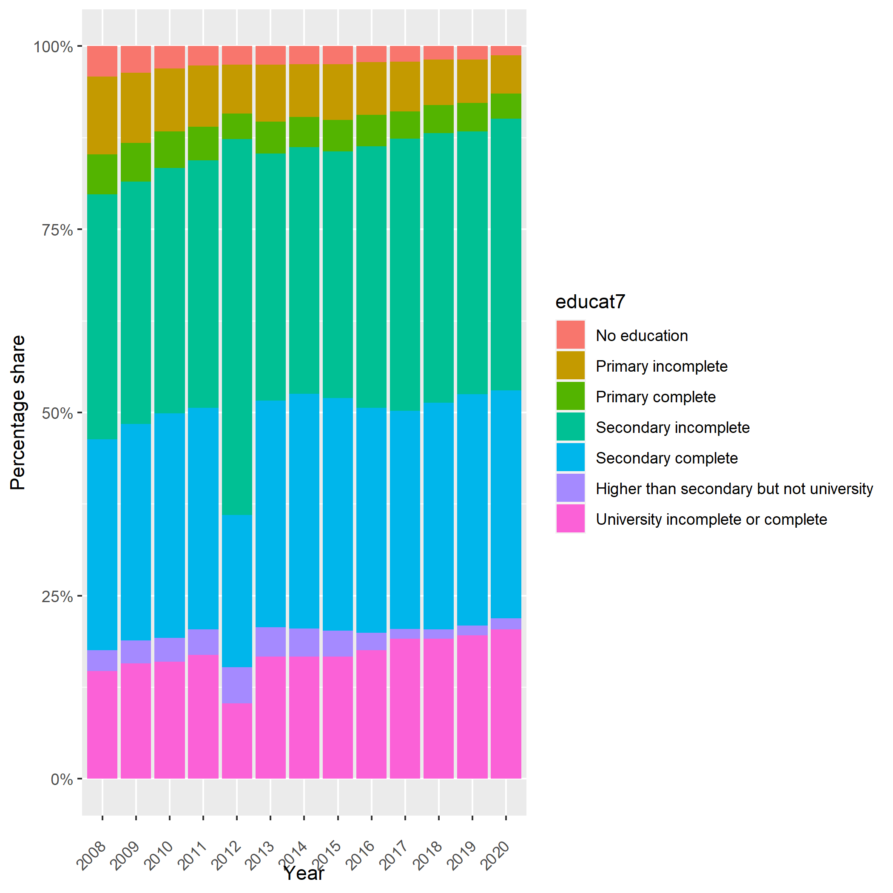

# Details about the education codes in the South African QLFS

## Differences in mapping education in GLD as compared to Stats SA

The survey question 1.7 asks respondents about their highest education level achieved. This variable is available in the harmonization as `educat_orig`. Note that the question's categories changed between 2011 and 2012 and thus `educat_orig` is not directly comparable across all years.

The raw data also includes commonly a variable called `Education_status` (not in the harmonization), derived from question 1.7, which reduces the answers to categories very similar to GLD's `educat7` categories. This mapping is used as a guideline for the harmonization.

However, in comparing the results from the Stats SA classification with the ILO data, the education category was persistently lower for the ILO classification.

Further inspection reveals that the difference lies in the treatment of respondents with the answer

```
  Certificate with Grade 12 / Std 10
```

(code 19 pre 2012, code 21 since). The South African office codes this education degree as tertiary while the ILO does not. In line with the [ISCED mapping for South Africa](utilities/isced_2011_mapping_southafrica.xlsx), the GLD harmonization also does not treat the code as tertiary, but as `educat7`'s code 6 (higher than secondary but not tertiary).

This explains the difference between GLD results and Stats SA results (and align the former with the ILO).

## Reasons for setting education as missing for 2012

As mentioned above, the questionnaire changed the codes for the education question 1.7 in 2012. We can only speculate whether this is the reason, but the results for 2012 do not align with the series over time we can see develp over the QLFS years, as shown below (image below is the educational achievement of the employed working age population).



Following the ILO data website, where there is no information for the employment broken down by education for 2012, yet for all other years, the GLD harmonization has left the education variables - other than `educat_orig`, the raw question 1.7 variable - as missing. This is so that indicators automatically created from GLD do not show unexplainable breaks. Users can recreate `educat7` from `educat_orig` if they please by using the below code.

```
gen byte educat7=.
replace educat7=1 if inlist(educat_orig,0,98)
replace educat7=2 if inrange(educat_orig,1,6)
replace educat7=3 if inrange(educat_orig,7,7)
replace educat7=4 if inrange(educat_orig,8,11)|inlist(educat_orig,13,14,19,20)
replace educat7=5 if inlist(educat_orig,12)|inlist(educat_orig,15)
replace educat7=6 if inrange(educat_orig,16,18)|inlist(educat_orig,21)
replace educat7=7 if inrange(educat_orig,22,28)
replace educat7=. if age<ed_mod_age & age!=.
```
