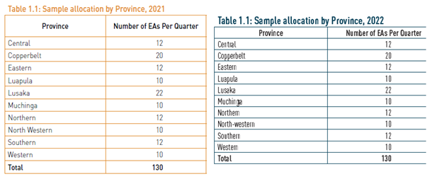

# Introduction to the ZMB Labour Force Survey (ZMB LFS)

- [What is the ZMB LFS?](#what-is-the-zmb-lfs)
- [What does the ZMB LFS cover?](#what-does-the-zmb-lfs-cover)
- [Where can the data be found?](#where-can-the-data-be-found)
- [What is the sampling procedure?](#what-is-the-sampling-procedure)
- [What is the geographic significance level?](#what-is-the-geographic-significance-level)
- [Other noteworthy aspects](#other-noteworthy-aspects)

## What is the ZMB LFS?

The Labour Force Survey is a household-based sample survey conducted by the Zambia Statistics Agency (ZamStats) in collaboration with the Ministry of Labour and Social Security. The LFS collects information on the labour market activities of eligible individuals in selected households.

The major objective of the LFS is to measure the size and characteristics of the labour force, including age, sex, industry, sector of employment, occupation, and education.

## What does the ZMB LFS cover?

The Zambian LFS collects information on demographic characteristics (including age, sex, and location), education and vocational training, labour market activities over a seven-day recall period, and migration, among other topics.

The years and sample sizes of the LFS harmonized for GLD are:

| Year | # of Households | # of Individuals |
| :--- | ---: | ---: |
| 2008 | 29,913 | 156,354 |
| 2012 | 11,480 | 59,274 |
| 2014 | 11,476 | 58,985 |
| 2017 | 9,241 | 45,453 |
| 2018 | 10,289 | 49,551 |
| 2019 | 6,862 | 34,010 |
| 2020 | 9,184 | 45,354 |
| 2021 | 9,774 | 44,115 |
| 2022 | 10,251 | 47,060 |
| 2023 | - | 48,807 |
| 2024 | - | 49,023 |

## Where can the data be found?

The data were shared directly with the World Bank by the Zambia Statistics Agency. They may be shared with World Bank staff but not outside the organization.

## What is the sampling procedure?

The ZMB LFS follows a two-stage stratified cluster sampling design and covers the non-institutionalized population living in private households.

For the more recent surveys, the sampling design is implemented through a split-panel structure. The 2023 and 2024 surveys use the 2022 Census of Population and Housing as the sampling frame. A master sample of 520 Enumeration Areas (EAs) is selected, with EAs serving as the Primary Sampling Units (PSUs). The EAs are selected with Probability Proportional to Estimated Size (PPES), using the number of households as the measure of size. In the second stage, 20 households are selected within each sampled EA using systematic random sampling, giving a planned annual sample of approximately 10,400 households. :contentReference[oaicite:0]{index=0}

The annual sample is divided into four non-overlapping panels, with one panel surveyed in each quarter. For 2023 and 2024, each quarterly panel contains approximately 130 EAs. The quarterly samples are designed to provide estimates at the national and rural/urban levels, while the combined annual sample supports estimates at the provincial level and for other domains. :contentReference[oaicite:1]{index=1} :contentReference[oaicite:2]{index=2}

Survey weights are constructed from the inverse probabilities of selection at the EA and household levels and are subsequently adjusted to population projections. For further details on the sampling design, sample allocation, and weighting procedures across years, please refer to the respective annual survey reports.

## What is the geographic significance level?

The annual surveys are generally representative at the national, urban-rural, and province levels of Zambia, where province is the first and largest subnational administrative level.

For the quarterly LFS from 2023 onward, the individual quarterly samples are intended to provide reliable estimates at the national and rural/urban levels, while the combined annual sample supports estimates at the provincial level. :contentReference[oaicite:3]{index=3}

The above is not true for 2019, when survey implementation was affected by the COVID-19 pandemic. The 2019 data are only representative at the national and urban-rural levels.

## Other noteworthy aspects

### Changes in the labor force concepts in the questionnaire

There are two relevant kinds of changes to note in the questionnaire. The main change is the switch in the employment definition in 2017 to the new concept of employment as work for pay or profit, in line with the 19th International Conference of Labour Statisticians (ICLS) ([more details on the ICLS definition here](https://ilostat.ilo.org/resources/concepts-and-definitions/description-work-statistics-icls19/)). Thus, key indicators cannot be compared directly across all years without taking the change in definition into account.

The other change concerns the wording and skip patterns at the start of the employment section in years prior to 2014, which may also affect the estimates. The detailed history of these changes is [covered here](History%20of%20changes%20to%20employment%20definitions%20in%20the%20ZMB%20LFS.md).

### Duplicate HHID and PID in 2021

The 2021 data contain 1,625 duplicate individual records associated with 217 household identifiers (3.5 percent and 2.2 percent of the individuals and households in the survey, respectively). The GLD team determined that these likely correspond to different households, but the source data do not contain sufficient additional identifiers, such as enumerator IDs or interview timestamps, to distinguish them reliably. Users are therefore requested to take this limitation into account.

### Missing household and related identifiers in the 2023 and 2024 LFS

There are important identifier limitations in the 2023 and 2024 source data.

For 2023, the source data do not contain the variables needed to construct a household identifier (`hhid`), and the urban-rural variable (`urban`) is also unavailable.

For 2024, the variables required to construct `hhid` are likewise missing from the raw data. As a result, related identifiers that depend on `hhid`, including `pid` and `ssu`, cannot be constructed consistently from the available source files.

These limitations originate in the raw data received by the GLD team rather than in the harmonization process. Users should therefore take care when conducting household-level analysis or linking records using household- or person-level identifiers for these years.

### Unusual survey weights for Public Administration employment in 2024

An unusual pattern was identified in the 2024 survey weights for respondents employed in Public Administration. In the unweighted sample, Public Administration accounts for approximately 2.9 percent of employed respondents in 2024, compared with approximately 2.0 percent in 2023. However, after applying the survey weights, its employment share rises to approximately 7.6 percent in 2024.

The pattern is also present in the official 2024 LFS estimates and therefore does not appear to originate from the GLD harmonization. Further checks show that Public Administration respondents in 2024 have substantially higher survey weights than other employed respondents. The mean weight is approximately 1,226 for Public Administration respondents compared with 438 for other employed respondents, whereas in 2023 the corresponding mean weights are approximately 454 and 460.

The difference persists within geographic and demographic groups, including province, rural/urban residence, sex, and age, as well as within occupational and detailed industry categories. It is also observed across all four quarters of 2024. These checks suggest that the difference is not primarily explained by changes in the observable composition of Public Administration employment.

### Changes to the provinces

The province of Muchinga was created in 2011 and is therefore present in all relevant surveys in GLD after its creation. It was formed from four districts previously belonging to Northern Province and Chama District from Eastern Province.

In 2021, Chama District was reassigned to Eastern Province. Similarly, Chirundu and Itezhi-Tezhi districts were moved from Lusaka and Central provinces, respectively, to Southern Province in 2021 (see [newspaper article here](https://www.lusakatimes.com/2021/11/18/president-hichilema-to-give-back-chirundu-and-itezhi-districts-to-southern-province/)).

The GLD team could not establish whether these changes were fully reflected in the 2022 data. The number of EAs in the sample allocation appears not to have changed between 2021 and 2022 (see screenshots below).

  
*<small>Comparison of sample sizes (from respective survey reports)</small>*

  

### Lack of `empstat` information in the 2012 LFS

The data received by the GLD team do not contain the questionnaire variable denoting the employment status of workers in 2012. Only paid employees (code `1` of `empstat`) could be classified by identifying respondents who answered a separate section reserved for paid employees. Thus, the 2012 `empstat` variable is equal to `1` for identified paid employees and missing for all other workers, including other respondents for whom `lstatus == 1`.

### Re-denomination of the Kwacha

The Zambian Kwacha is the currency of Zambia, and wage information in the GLD harmonization is recorded in Kwacha. The Kwacha was redenominated in 2013 ([link](https://www.parliament.gov.zm/sites/default/files/documents/acts/Redomination%20of%20Currency.PDF)), such that one new Kwacha was equal to 1,000 old Kwacha. Thus, when comparing monetary values from 2012 with later years, the 2012 values should be divided by 1,000.

