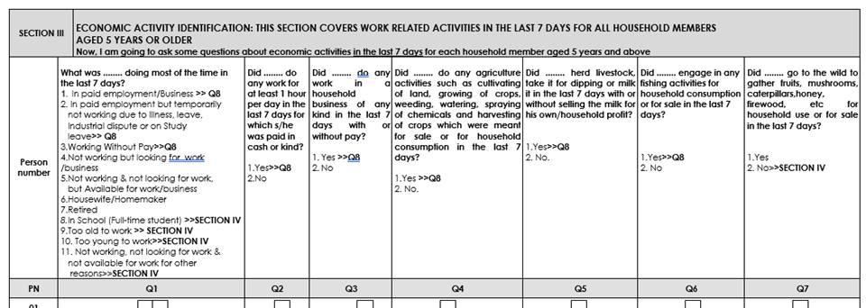
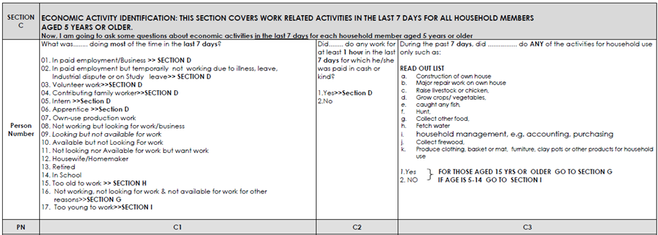
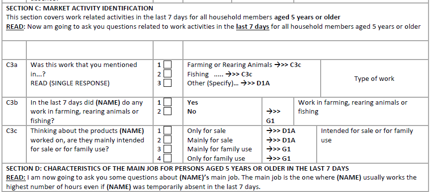
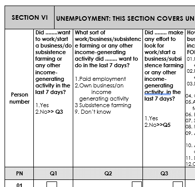
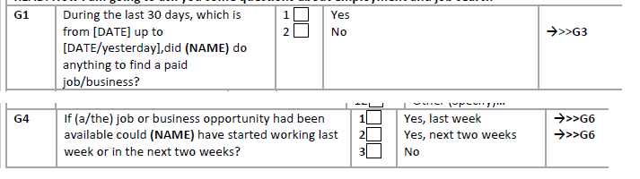
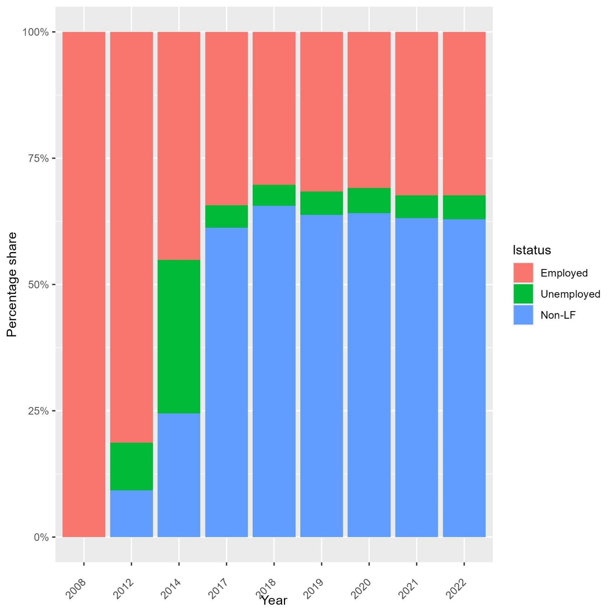

# Changes in the labor force concepts in the questionnaire

This document describes (1) the general change in employment definition enacted by the International Labour Organisation’s (ILO) International Conference of Labour Statisticians (ICLS) and details the changes in the formulation of the questions to determine the identification of (2) the employed as well as (3) the unemployed. Additionally, it explains (4) how these choices impacted the harmonization and provides (5) an alternative to coding surveys since 2014 according to the older employment definition.

## Change to the ICLS definition of employment

-- Nick from some other section

## Identification of the employed

In this subsection, we look at the questions in ZMB questionnaire that determine whether a person is employed or not over the 7-day recall period.

The 2008 questionnaire, shown below, sends anyone who has answered Q1 with codes 1-3 or said yes to Q2 to Q7 to the questions about their main job and are thus seen as employed. Note further that code 8 in Q1 has a direct skip to the section on unemployment (Section IV) even though a full-time student may be doing work (e.g., a higher-ed student with a part-time job).
<br></br>
*<small>image caption</small>*

<br></br>

The 2012 questionnaire (below)has kept the first two questions the same, though dropped the direct skip pattern for those in school to go around further labor questions. What were questions 3 to 7 in 2008 has been summarized into a single question in 2012. The results should be roughly the same except for the inclusion of people in education who work on the side.

<br></br>
*<small>image caption</small>*

<br></br>


The 2014 questionnaire (below) seems on first sight to be equal to 2012, but there is a major change in the third question. While those who replied yes to any of the activities in 2012 are treated as employed, in 2014 none of the options leads to employment, but rather all options are regarded as not employment. Note that this aiming at the ICLS 19 concept of coding employment only as work for market exchange, but there is no evaluation of the degree of market exchange. The question predefines the activities as “for household use” instead of probing whether most is for household consumption or for exchange. 

<br></br>
*<small>image caption</small>*

<br></br>

From 2017 onwards, the questionnaire follows the ICLS guidelines more strictly. As shown below, the questionnaire prompts those in fishing, farming, or animal rearing to evaluate the intended use (question C3C), depending on which the respondent continues to questions on their main job (section D) or is asked to determine whether they are unemployed or out of the labor force (section G).

<br></br>
*<small>image caption</small>*

<br></br>


## Identification of the unemployed

Unfortunately, it is not possible to determine the unemployment status over the 7-day recall period in 2008. Even though section VI of the questionnaire asks about this (see image below), the section is only answered by those who are not in employment over the 12-month recall (section IV and section V). Thus, the recall periods do not align.

<br></br>
*<small>image caption</small>*

<br></br>


In 2012 the skip pattern of the questionnaire does request those who are not employed over the 7-day recall to respond to the unemployment questions. The questions are shown below:

<br></br>
*<small>image caption</small>*

<br></br>

Unfortunately, the questions do not align with the standard definitions of unemployment. The standard is to ask whether a person has (a) been looking for work opportunities (over the past 7 or sometimes 30 days) and whether they (b) would be willing to start a job if offered. This describes the active search for a job and the passive willingness to work (i.e., take up employment if it came to you). Both need to be true to classify unemployment but the skip pattern avoids asking those who would accept employment if offered (passive element) whether they had been looking for a job (active element asked in question G3). Section G is repeated in 2014, equally impeding a correct measurement of unemployment.

From 2017 onwards these issues are corrected and respondents are asked first about their efforts to look for a job (question G1, below) and then asked – regardless of their choice in G1 – whether they would take up employment if it were available (question G4).

<br></br>
*<small>image caption</small>*

<br></br>


## Coding of labour status in GLD 

As a result of the wording of the questions and the skip patterns in place, the concepts underlying the `lstatus` variable cannot be neatly coded. In the case of 2008, since there are no questions regarding unemployment, respondents are only classified as employed (lstatus == 1) or missing. 
In 2012 employment follows the questionnaire in assigning all those with responses that lead to the main job questions as employed. This includes the activities described as for household use only (see question C3 in FigureX). Regarding unemployment, given the questions (see FigureX), the harmonization codes any person who was willing to start a job as unemployed. This is an overestimate and should be seen as an upper bound of unemployment. Unfortunately, no better coding choices was available.
For 2014, the questionnaire rules are followed again, meaning that the coding of employed does not include anyone who has done any of the tasks listed in question C3 in FigureX above. As a consequence, more respondents are asked the unemployed section questions, where we will still code using the passive unemployment question as an upper estimate.

From 2017 onwards, the questionnaire fully aligns with the ICLS-19 definition of employment. The time series of the `lstatus` questions (for people aged 15-64) for ZMB looks as follows:

<br></br>
*<small>image caption</small>*

<br></br>

The data from 2008 looks as if there are only employed people, but this is not the case. However, there are no codes except for employed as we cannot code either unemployed or Non-LF. Hence, the figure shows that 100% *of the cases with data* are employed. In 2012 data look more as could be expected, especially if own consumption work is seen as employment: about 80% of people aged 15-64 are employed. The share of unemployed is large as a consequence of the way the unemployment questions are asked.
In 2014 the share of employed people retreats as a consequence of no longer coding household activities as employment. Of the people not in employment more than half are classified as unemployed since most people claim they would take up employment if offered (and if they do skip the question on actively looking for employment opportunities).
Since 2017 the trend stabilizes. The ICLS-19 compliant questions lead to a further decrease in employment (despite allowing for some own-consumption work to count as employment). The share of unemployed can be identified more correctly and is significantly reduced – and remains stable throughout the time period.

## Alternative coding since 2014 to emulate old employment definition

If users wish to update the coding to include own-consumption workers according to the older employment definition (ICLS-13), the GLD team proposes the following coding options. Note that the additional lines (compared to the standard harmonization) are between lines starting and ending with `//-->`.
Recoding of 2014 harmonization to include own consumption workers as employed
```
*<_lstatus_>
/* <_lstatus_note>
The numbers from the report are based on the concept of employed, labour force we see in the derived variables.
It looks from reconstructing these, that they are not counting as employed those who are most of the time in the past week in school (see tab c1 employed if c3 == 1 & age > 14,m).
That is not the employment concept we work with, hence the numbers may disagree.
</_lstatus_note> */
	gen byte lstatus = .
	
	* Emplyed are those that are deemed to work by C1
	replace lstatus = 1 if inrange(c1, 1, 6)
	
	* Additionaly, since C1 is on most time, all those in C2
	replace lstatus = 1 if c2 == 1
	
	* As opposed to previous years, question C3 does not lead to main employment but to
	* section G directly, not considered employment here.
	
	* \\--> Trying to recreate old definition, count C3 
	replace lstatus = 1 if c3 == 1
* End of addendum to code olde employment definition <--//

	* Unemployed are those who would be willing to accept a job and are looking. Unfortunately, those who say yes to accepting a job or starting a business (g1) skip the question on looking. The recall periods are also
	* different, with only 7 days for taking a job, 30 (standard) for start 
	* Assume that those who would take on if available (passive) are looking.
	replace lstatus = 2 if g1==1 & mi(lstatus)

	* Remainder is NLF. Note that there are some small issues. We had 306 people who are not employed by the above definitions and g1 is missing (and are 15 or above). NLF by default, not by assertion.
	replace lstatus = 3 if missing(lstatus)
	replace lstatus = . if age < minlaborage
	label var lstatus "Labor status"
	la de lbllstatus 1 "Employed" 2 "Unemployed" 3 "Non-LF", replace
	label values lstatus lbllstatus
*</_lstatus_>
```

Recoding of 2017 harmonization to include own consumption workers as employed
```
*<_lstatus_>
	gen lstatus = .
	* First all cases that lead straigh to D1
	replace lstatus = 1 if c1a == 1
	replace lstatus = 1 if c2d == 1
	replace lstatus = 1 if c2e == 1
	replace lstatus = 1 if c3a == 3
	
	* Then add those in farming or agriculture with 50%+ market exchange
	replace lstatus = 1 if inlist(c3c,1,2)
	
	* //--> Trying to recreate old definition, count work with under 50% market exchange
	replace lstatus = 1 if inlist(c3c,3,4)
	* End of addendum to code olde employment definition <--//

	* We proceed with purely the survey
	replace lstatus = 2 if g1==1 & inrange(g4,1,2) & missing(lstatus)
	replace lstatus = 3 if missing(lstatus)
	replace lstatus = . if age < minlaborage
	label var lstatus "Labor status"
	la de lbllstatus 1 "Employed" 2 "Unemployed" 3 "Non-LF"
	label values lstatus lbllstatus
*</_lstatus_>
```

Unfortunately, the series is still not consistent, as FigureX shows below. Labor force participation expands in 2014 and surpasses 2012 if home consumption work is included, but 2017 and onwards data never reaches 60% employment, significantly below previous years.  Thus, despite our efforts the series does still contain a significant break.
*<small>Table</small>*
| `lstatus` series as coded             |  `lstatus` series emulating old ICLS definition |
:-------------------------:|:-------------------------:
  |  
