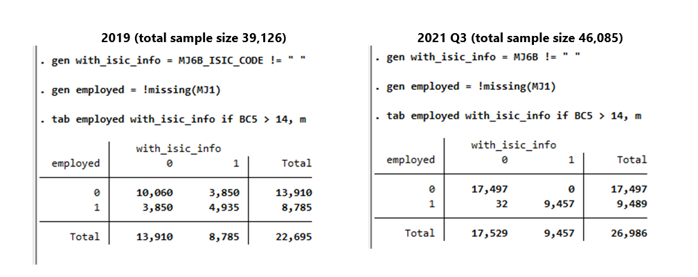

# Introduction to Zimbabwe (ZWE) Labour Force Survey

- [What is the ZWE LFS survey?](#what-is-the-zwe-lfs-survey)
- [What does the ZWE LFS survey cover?](#what-does-the-zwe-lfs-survey-cover)
- [Where can the data be found?](#where-can-the-data-be-found)
- [What is the sampling procedure?](#what-is-the-sampling-procedure)
- [What is the significance level?](#what-is-the-geographic-significance-level)

## What is the ZWE LFS survey?

The official name of the labour force survey of Zimbabwe is Labour Force and Child Labour Survey (LFCLS). For simplicity, the LFCLS will be called Labour Force Survey (LFS) in the rest of the text. The ZWE LFS provides socioeconomic indicators useful in monitoring living conditions and details in-depth information about the labour force in Zimbabwe. The survey focuses on social and economic characteristics status in employment, industry, occupation, place of work and social security. The survey periodicity is five years. The primary objectives are to provide information on the number of people classified according to their activity status, the size, and characteristics of the economically active population, that is, the employed and the unemployed, the informal sector employment and informal employment, retrenchments, the number of working children, the detrimental effects of work on children, and the living conditions in general. 

## What does the ZWE LFS survey cover?

The ZWE LFS is nationally representative. The sampling frame used for the LFS was the Zimbabwe Master Sample developed by the then Central Statistical Office after the 2002 Population Census. Except for Harare and Bulawayo, each of the other eight provinces was stratified into four strata according to land use: Communal Lands, Large Scale Commercial Farming Areas (LSCFA), Urban and Semi-Urban Areas, and Small-Scale Commercial Farming Areas (SSCFA) and Resettlement Areas.  Harare and Bulawayo formed one urban stratum which gave a total of 34 strata.

| Year	| # of Households	| # of Individuals|
| :-------	| :--------		| :--------	|
| 2011	| 9359	| 39,798 |
| 2014	| 9759	| 40,527 |
| 2019	| N/A*	| 39,126 |

*The data used by GLD does not allows us currently to establish a household ID and thus the number of HHs is not given.

## Where can the data be found?

The microdata from 2014 and 2019 LFS is available through the ZWE statistics [bureau catalogue](https://nada.zimstat.co.zw/index.php/catalog) along with the documentation. The data for 2011 was shared internally with the GLD and can only be distributed within the World Bank. 

## What is the sampling procedure?
The survey used a two-stage sample design with EAs as the first and households as the second-stage sampling units. In total 400 EAs were selected with probability proportional to size (PPS), the measure of size being the number of households enumerated in the 2002 Population Census. The selection of the EAs was a systematic one-stage operation, carried out independently for each of the 34 strata.

## What is the geographic significance level?
The survey is significant at the province level for the years 2011 to 2019. Information in the report is at times disaggregated by province and sex, but never by province and urban/rural area.

## Other Noteworthy aspects

### Change in ICLS definition

The concept of what constitutes employment has been affected by the definition changes implemented by the International Labour Organisation ([see more here](https://ilostat.ilo.org/resources/concepts-and-definitions/description-work-statistics-icls19/)). The change in the definition, which implies changes in the questionnaire was first introduced in Zimbabwe during the 2019 LFS. The following [page](ICLS_change.md) describes this in more detail.

### No Household IDs in 2019

The data received for 2019 does not permit us to link the Household level file (containing the HH IDs) to the individual file. Hence no HH ID is created for 2019.

### Highest level of education

Please see this [page](Education.md) for a complete explanation on the education levels in ZWE and how these were coded to the GLD standard variables.

### Missing Industry and Occupation variables in 2019

In the year 2019, the public data available to the GMD team has only ISIC and ISCO information for a subsection fo those employed. The screenshot below shows the comparison between the 2019 LFS and Q3 of 2021 which are both based on the same questionnaire. On the right-hand side we see the expected (nearly) diagonal matrix. Those who are employed have ISIC information, those who are not don't. The same applies to ISCO (not shown). 

In the case of 2019 (left-hand side) the information is not as expected. There are (oddly enough) exactly as employed people without ISIC information as there are people without employment who have an ISIC code recorded. The original information as recorded in the survey is accessible to users via the `industry_orig` and `occup_orig` variables. However, since the information may be skewed if we use the seemingly incorrectly coded variables, no further variables for industry or occupation are harmonised for 2019.

  

  

We are hoping to receive an updated version that will allow us to code information. If you have updated data, please let us know by reaching out to gld@worldbank.org.
