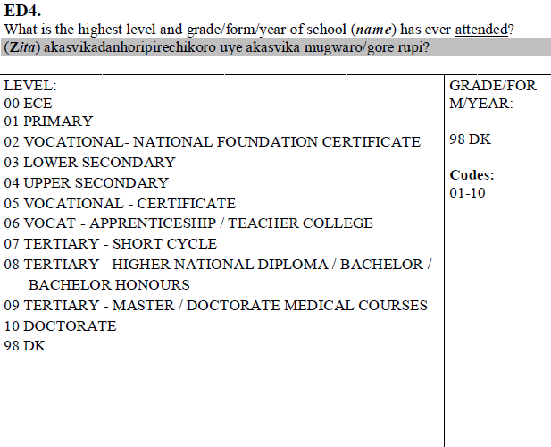
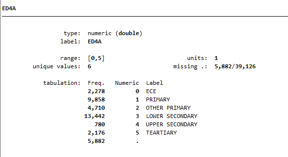
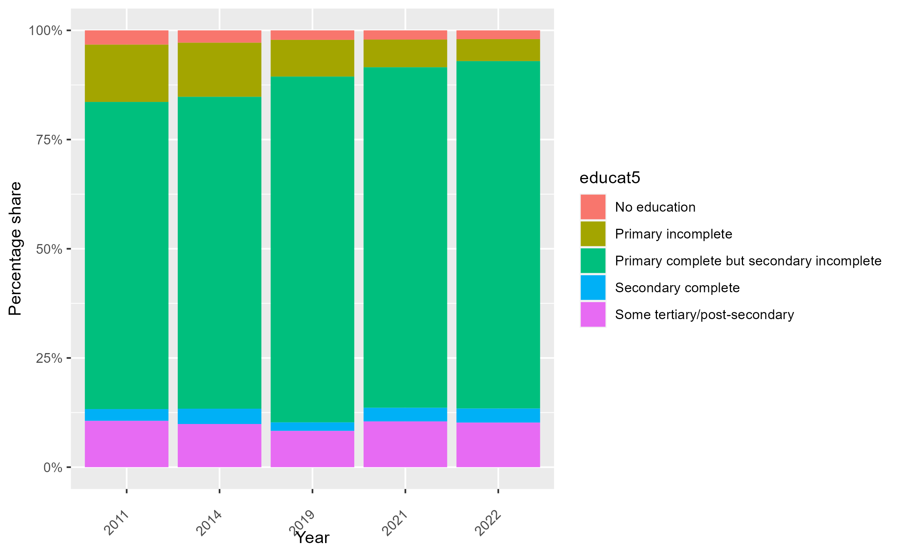

# Education information in the ZWE LFS / QLFS
This document describes the coding of education in LFS (years 2011, 2014, and 2019) and the QLFS (from 2021) for ZWE.

## Information at most coded as `educat5` except for 2014

The information in the harmonization is, except for 2014, only coded up to five categories in `educat5`. This is because of the difference between information in the questionnaire and the raw data the GLD team has access to.

The image below shows how the education information is requested of respondents in the 2019 questionnaire. It indeed should allow us to code information up to `educat7`.

  

  

However, in the data we have access to (see image below) all nuance from codes 6 to 10 is coalesced into a single code 5 which states the information merely as “tertiary” (except for 2014, where the questionnaire and the data have the same categories).

  

  

Information is thus coded only as `educat5`. Following the Zimbabwean education system (shown in graphical form below), primary complete covers grades 1 through 6, while grades 7 and Form 1 to 4 are coded as primary complete yet secondary incomplete. Only grades Form 5 and 6, representing upper secondary, are treated as secondary complete. The codes beyond Form 6 can only be coded in the catch-all "tertiary" category.

  

  

Using `educat5` the information coded seems to be stable (see graph below).

  

  

The reader may find there to be a dip around 2019. Validating this information, without access to the completely disaggregated codes is difficult, especially since the reports (which are written with access to this detail) vary the way they report.

Below are the distribution of employed people aged 5 and above in 2011 by education (first) and the distribution of those aged 3 and above in 2019 by education (second)

  

  

  

  

In the first instance for 2011, the reported 7% and 712,138 people are the same in the harmonized data. For 2019 we cannot differentiate as deep as the report and only aggregate everything from “Vocational Certificate” to “Doctorate”. That is 5% for men and 4.5% for women – but of a population starting that does include 3 and 4 year olds. Looking at the absolute numbers this represents 619,500 people (311,557 women and 307,943 men). Thus, as far as the GLD team can observe, the information is coded accurately even though it is not to the level the questionnaire and reports would have the user believe is feasible.

The GLD team aims to update the harmonization as soon as newer surveys are available.
