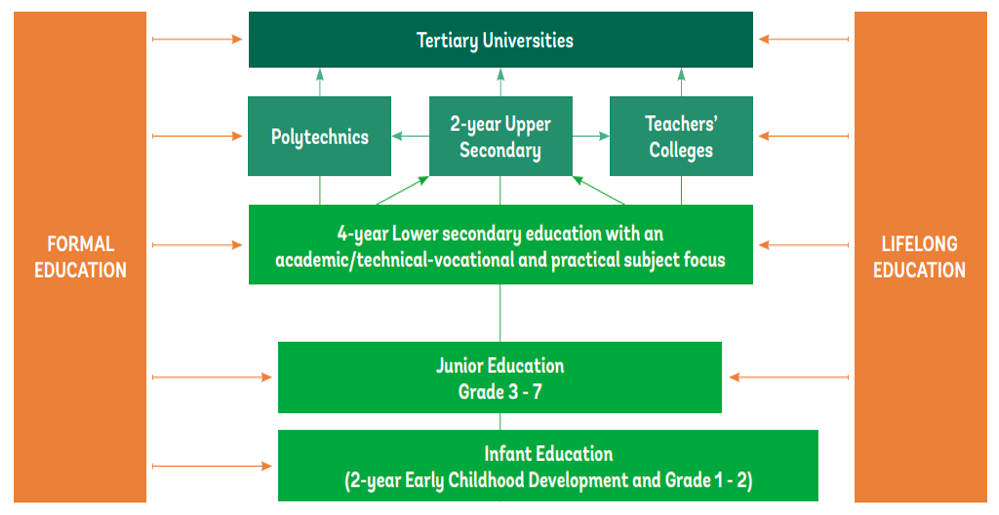
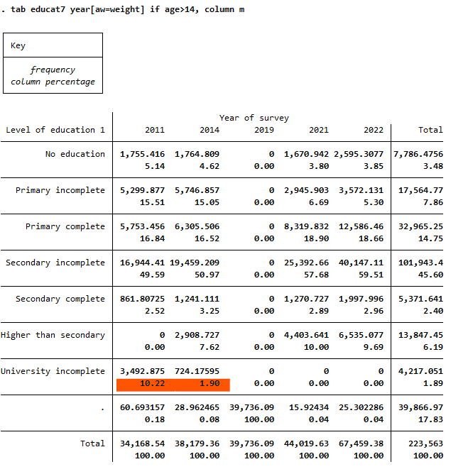
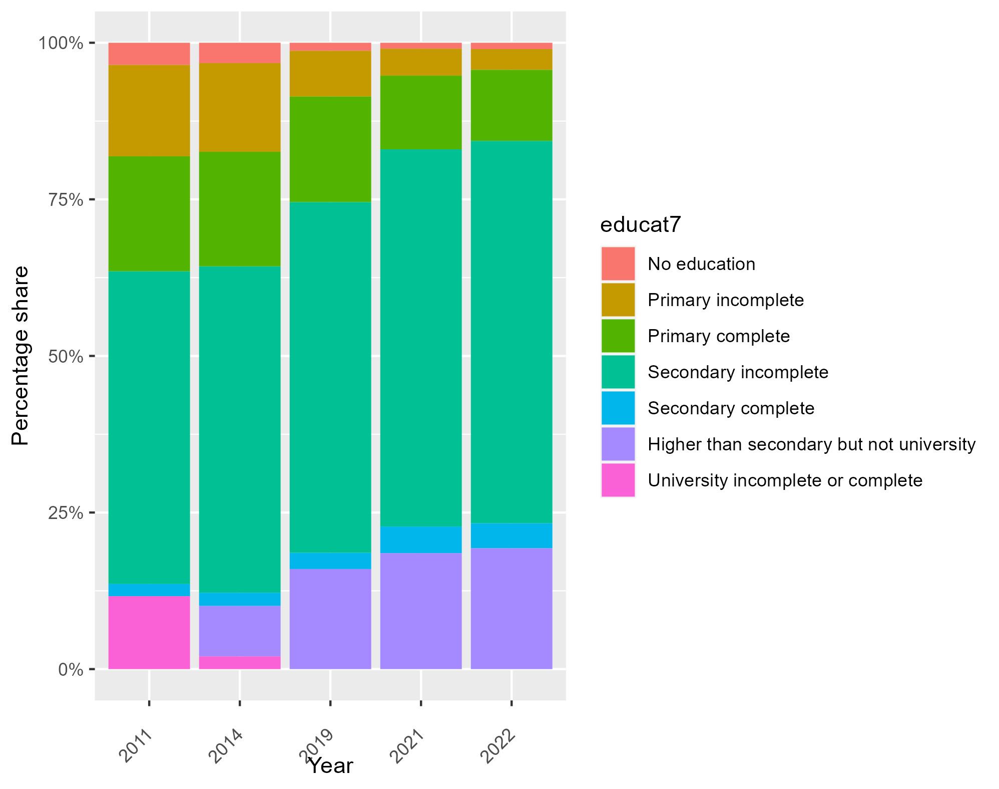
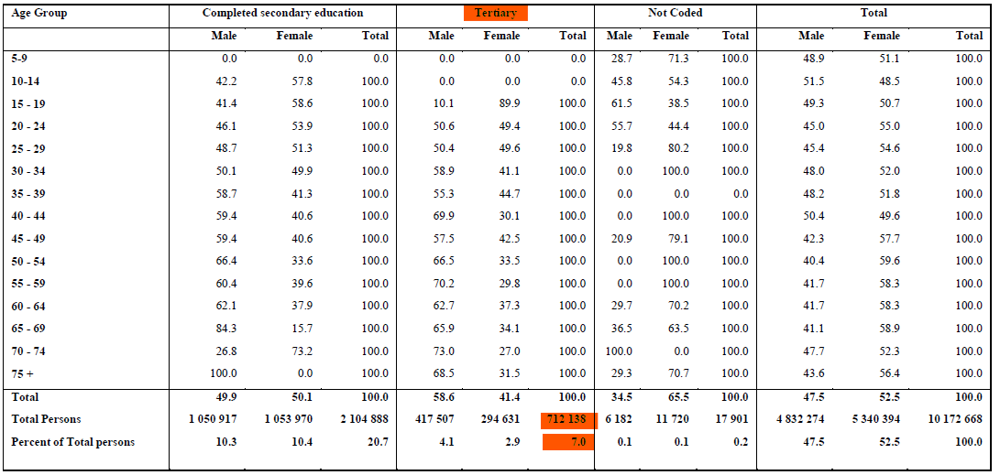
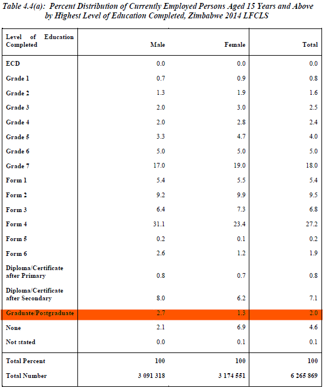
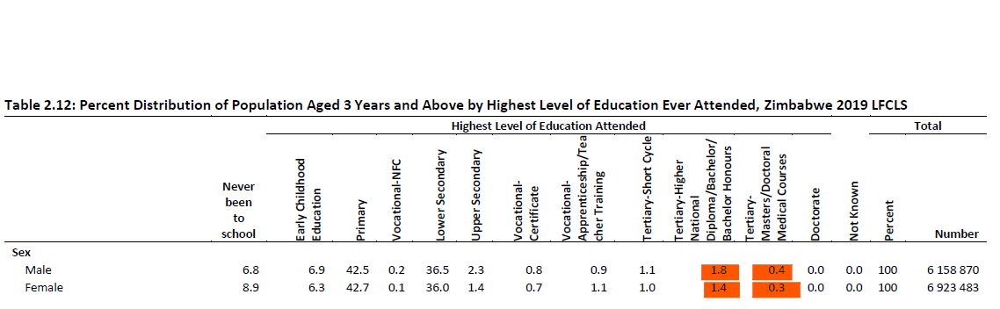

# Education information in the ZWE LFS

The user should note that the highest level of education jumps considerably between 2011 and 2019. The main reason is the categories assigned in the questionnaire and the way the data was recorded in the raw data. 

The questionnaire gives the possible options for the question of highest level of education.

```
 What is (name’s) highest level of education completed? 
 88.None
 00.ECD
 01-07.Grade 1 to 7
 11-16. Form 1 to 6
 20.Diploma/ Certificate after Primary
 21.Diploma/ Certificate after Secondary
 22.Graduate/Postgrad
 ```

See below descriptions for each education level: 

<br></br>

<br></br>

ECD - The first two years of school in Zimbabwe which  are separated into ECD A & B for 1st and 2nd  year respectively with ECD A being 3-4 years and ECD B being 4-5 years, students start Grade 1 at 6 years.

Grade 1-7 - These are the formal years of primary school, and they span over 7 years with learners writing the Grade 7 national examination which is the primary leaving examination. Dropouts in primary tend to get higher as you move to upper grades with about 8% dropping out during the transition from Grade 6 to 7.

Form 1  to 6 - these are the 6 years of secondary which are split into two phases (1-4 & 5-6). 

Form 1 to 4 (Lower Secondary) - This is the lower secondary phase which takes 4 years and finishes with the country's major examination, the Ordinary Level exam, which is a high-stake examination that determines whether one proceeds to upper secondary, college or directly join labour. 

Form 5 - 6 (Upper Secondary) - Transition to Form 5 is very competitive and only students with a minimum of 5 O-level subjects can transition to upper secondary. Learners transition to this phase which completes with public examinations in Form 6, with a pass in these examinations being a pre-requisite for University (undergrad) admission in the country. 

Diploma/Certificate after Primary - These are certificates and diplomas that are offered mostly by Technical and Vocational training centres. For some study areas, secondary education is not a must - but such programs are very few - as such, someone who dropped out at primary can embark on these studies provided they meet the entry age which is normally 16. Subjects covered here examples like carpentry, hairdressing etc. 

Diploma/Certificate after Secondary - These are certificates and diplomas offered by Teachers' Colleges, Polytechnical Colleges and Agricultural colleges. Entry requirements into most of these colleges is a minimum of 5 O-levels, and students who decide not to pursue Form 5 & 6 (A-level) after their Form 4, are the ones who normally pursue this avenue.

Graduate/Post Grad - Typical undergrad and post-grad qualifications that are offered through normal university channels. 

## Raw data issue with tertiary education

As mentioned in the very beginning, people with tertiary degree's share of total sample who have answered the highest level education question (i.e. respondents aged 3 or 5 depending on the year of interest) plunges from 2011 to 2014, with a weighted share from 10.22% to 1.9% of total people who are 15 and above. 


(_*Note that only 2011 and 2014 have `educat7` because other years do not have consistant categorization of post-secondary and tertiary education._)



And this issue results from the raw data itself which is also shown in Zimbabwe's official annual survey reports. 
The screenshots listed below are from annual report of 2011, 2014, and 2019: 

**2011 Percent Disrtibution of Population Aged 5 Years and Above by Age Group**


**2014 Percent Distribution of Currently Employed Persons Aged 15 Years and Above**


**2019 Percent Distribution of Currently Employed Persons Aged 15 Years and Above**



