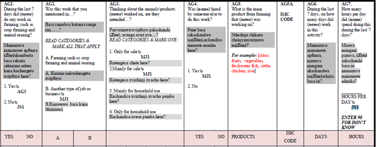

# ICLS Change

The international conference labour statistics classification or ICLS is followed in the ZWE LFS Section AG on “Agricultural work and Market Orientation”  starting 2019. The 19th International Conference of Labour Statisticians (ICLS) changed the concept of work to refer only to work for pay or profit. In particular, the change affects individuals that work to produce goods entirely or mostly for their own consumption. In the new classification these individuals are not to be considered employed anymore. 

  

  

