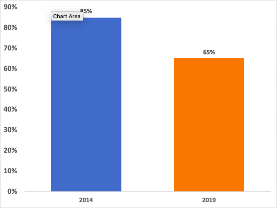

# ICLS Change

The international conference labour statistics classification or ICLS is followed in the ZWE LFS Section AG on “Agricultural work and Market Orientation”  starting 2019. The 19th International Conference of Labour Statisticians (ICLS) changed the concept of work to refer only to work for pay or profit. In particular, the change affects individuals that work to produce goods entirely or mostly for their own consumption. In the new classification these individuals are not to be considered employed anymore. Below, the figure shows the new AG section in the ZWE questionnaire.

<br></br>

<br></br>

Individuals who work on their own business if it is not in the field of crop farming or animal rearing are understood to be in a business for pay or profit. If they work in agriculture, they are subsequently asked whether their produce is mostly for household consumption or mostly for the market (AG3). If produce is for the market, they are asked questions on this employment in the main job section (AG3 leads to MJ1). If produce is mostly for household consumption, they are additionally asked whether this work was done as a worker for hire. In case the work is purely subsistence farming a few more questions are asked, but these individuals would skip the sections on employment completely: the question flow leads to AG7, where the enumerator is instructed to skip to the Job Search (JS) section. This contrasts with previous ICLS definitions and previous surveys (e.g., the LFS from 2014 and before) wehere any work would have been considered employment. 

## GLD approach 

For consistency, the GLD team decided to change the 2019 ICLS definitions from the survey data to match previous definitions and codify subsistence agriculture workers as employed. The cases where production is mostly for household consumption (AG3 codes 3 and 4) and not for hire (AG4 code 2) are identified whenever they would otherwise be unemployed or out of the labour force by the survey. Individuals who replied to as having a main job already and additionally have own consumption production are not recoded as agriculture workers.

To fill in the labour variables, the household consumption agriculture workers are assumed to be self-employed (for variable empstat) and to be working in the private sector (for variable ocusec). Codes from AG5 are used to codify the industry, while for occupation individuals are classified with ICSO-08 sub-major group code 63 ("Subsistence Farmers, Fishers, Hunters and Gatherers") (variable occup_isco). Therefore, they are code 6 (“Skilled agriculture workers”) for variable occup and of medium skill level for variable occup_skill. The information from AG7 is used to code the hours worked.

Below we share a code for the users that prefer to change the definition for previous years to resemble the ICLS 2019. However, the user should note that the harmonization did not follow this process.

```
```

## ILO figures

According to official statistics from ILO for ZWE, the change of definition signifies a significant fall on the Labour Force Participation of around 20%. See figure below prepared from the [ILO data](https://www.ilo.org/shinyapps/bulkexplorer57/?lang=en&id=POP_XWAP_SEX_AGE_LMS_NB_A).


<br></br>

<br></br>


